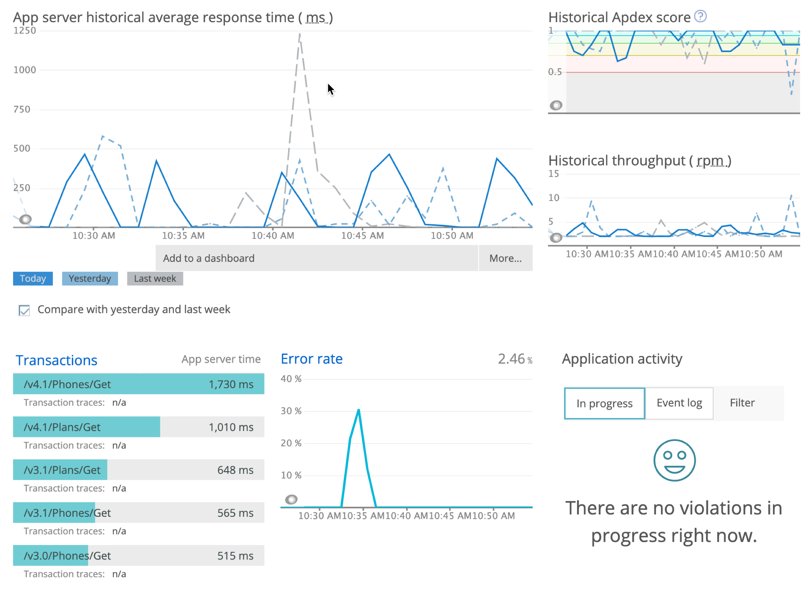

<LandingPageHero>
  <HeroContent>
    New Relic's .NET agent monitors your .NET app, giving you an end-to-end view of your app's performance. New Relic's .NET Framework agent works with all .NET compatible languages, such as VB.NET, C#, and CLI. The .NET Core agent takes advantage of the compatibility, speed, expanded API features, and cross-platform capabilities available with Microsoft's .NET Core.

    To keep your agent up to date and ensure you have access to the latest features, see the [.NET agent release notes](/docs/release-notes/agent-release-notes/net-release-notes).

    <ButtonGroup>
      <ButtonLink
      role="button"
      to="https://newrelic.com/signup"
      variant="primary"
      >
        Sign up for free
      </ButtonLink>
    </ButtonGroup>

  No credit card required. Already have an account? [Login](http://one.newrelic.com/).
  </HeroContent>

  

  <figcaption>
    **[one.newrelic.com/apm](https://one.newrelic.com/apm) > APM > (select an app)**: After installing the .NET agent, view a summary of your app's performance.
  </figcaption>
</LandingPageHero>

<LandingPageTileGrid>
  <LandingPageTile
    title="Introduction to New Relic for .NET."
    href="/docs/agents/net-agent/getting-started/introduction-new-relic-net"
    icon="fe-terminal"
  >
    Learn what you can do with the .NET agent and how to get started.
  </LandingPageTile>

  <LandingPageTile
    title="Install the .NET agent."
    href="/docs/agents/net-agent/installation/install-enable-new-relic-net-agent"
    icon="fe-list"
  >
    See the [install documentation](/docs/agents/net-agent/installation/install-enable-new-relic-net-agent).
  </LandingPageTile>

  <LandingPageTile
    title=".NET agent configuration."
    href="/docs/agents/net-agent/installation-configuration/net-agent-configuration"
    icon="fe-settings"
  >
    Use options to fine-tune your installation. Also, be sure to [name your .NET app](/docs/agents/net-agent/installation-and-configuration/naming-your-net-application).
  </LandingPageTile>

  <LandingPageTile
    title="API"
    href="/docs/agents/net-agent/net-agent-api"
    icon="fe-tool"
  >
    **[API](/docs/agents/net-agent/net-agent-api)** and **[custom instrumentation](/docs/agents/net-agent/custom-instrumentation/introduction-net-custom-instrumentation)**. Control the agent or extend your instrumentation.
  </LandingPageTile>

  <LandingPageTile
    title="Compatibility and requirements."
    icon="fe-database"
  >
    View supported frameworks, OS versions, and instrumentation for the .NET [Core agent](/docs/agents/net-agent/getting-started/compatibility-requirements-net-core-20-agent) and [Framework agent](/docs/agents/net-agent/getting-started/compatibility-requirements-net-framework-agent).
  </LandingPageTile>

  <LandingPageTile
    title="Troubleshoot."
    href="/docs/agents/net-agent/troubleshooting/no-data-appears-net"
    icon="fe-life-buoy"
  >
    What to do if the agent fails to report to New Relic.
  </LandingPageTile>
</LandingPageTileGrid>

<ButtonLink
  to="/docs/apm/agents/net-agent/table-of-contents"
  variant="primary"
>
  View all .NET agent docs
</ButtonLink>
