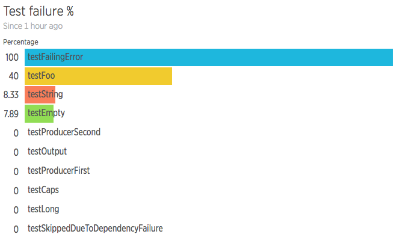
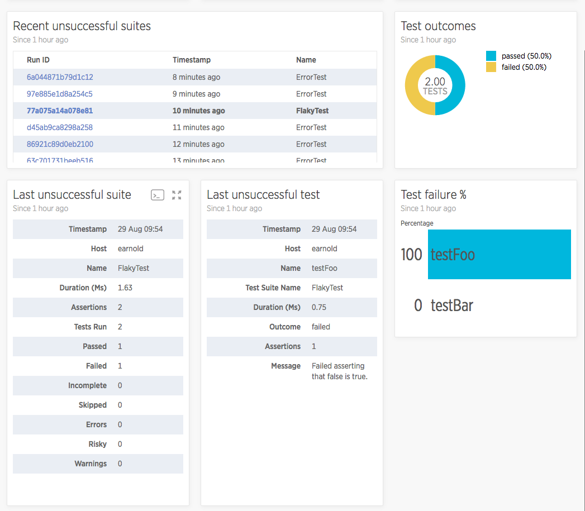

If you use [PHPUnit](https://phpunit.de/) to manage and run your unit tests, the New Relic PHP agent can automatically capture the test summary results and send them to [New Relic](/docs/insights/new-relic-insights/understanding-insights/new-relic-insights) as an [event](/docs/insights/new-relic-insights/understanding-insights/new-relic-insights#database) where you can query and visualize test data at a glance. This feature was released in version **6.7.0** of the PHP Agent and supports PHPUnit versions **3.7** to **8.x**

## Enable PHPUnit test events [#phpunit-enable]

To enable PHPUnit test events:

1. Find or add the `newrelic.phpunit_events.enabled` setting in your `newrelic.ini` file and set it to `true`.
2. Restart your web server (apache, PHP-FPM, Nginx, etc) for the setting change to take effect.

<Callout variant="tip">
  Exception messages are collected and sent with events. Also, if you use PHPUnit's `--disallow-test-output` option, which flags tests that print output as "risky," the test event will include the offending output.
</Callout>

## View available attributes [#phpunit-view-attributes]

When [enabled](#phpunit-enable), the PHP Agent detects PHPUnit commands and populates New Relic with two event types that contain data for the test suite (named [`TestSuite`](#testsuite-event-attributes)) and individual tests (named [`Test`](#test-event-attributes)). You can query the data with [NRQL queries](/docs/insights/new-relic-insights/using-new-relic-query-language/using-nrql) and [build a dashboard](/docs/insights/new-relic-insights/managing-dashboards-data/building-insights-dashboards) of information important to you.

To query your test events, use `FROM TestSuite` and `FROM Test` when specifying your `SELECT` statements:

```
SELECT uniqueCount(name) FROM TestSuite
```


<figcaption>
  Example of a PHPUnit test dashboard created by querying `TestSuite` and `Test` events.
</figcaption>

## Example queries

A dashboard of test summary data allows you to quickly see a snapshot of overall test success as well as dig into failing suites to determine their cause. These examples illustrate the kinds of widgets you can create with both `TestSuite` and `Test` event types.

<CollapserGroup>
  <Collapser
    id="percent-success"
    title="Percent success"
  >
    What percent of suites or tests are passing?

    ```
    SELECT percentage(count(*), WHERE successful IS true) FROM TestSuite
    ```

    ```
    SELECT percentage(count(*), WHERE outcome = 'passed') FROM Test
    ```

    

    <figcaption>
      What percent of suites and tests are passing?
    </figcaption>
  </Collapser>

  <Collapser
    id="test-outcome"
    title="Test outcome"
  >
    What is the breakdown of test outcomes?

    ```
    SELECT count(*) FROM Test FACET outcome
    ```

    

    <figcaption>
      What is the breakdown of test outcomes?
    </figcaption>
  </Collapser>

  <Collapser
    id="test-failures"
    title="Test failures"
  >
    What percent of the time does each test pass?

    ```
    SELECT percentage(count(*), WHERE outcome = 'failed') FROM Test FACET name
    ```

    

    <figcaption>
      What percent of the time does each test pass?
    </figcaption>
  </Collapser>

  <Collapser
    id="suite-failures"
    title="Test suite failures"
  >
    What percent of the time does each suite pass, and is that consistent over time?

    ```
    SELECT histogram((passedCount / testCount)*100, 100, 10) FROM TestSuite FACET name
    ```

    

    <figcaption>
      What percent of the time does each suite pass, and is that consistent over time?
    </figcaption>
  </Collapser>

  <Collapser
    id="duration"
    title="Duration"
  >
    How long does each test suite take to run, and is that consistent over time?

    ```
    SELECT histogram(duration*1000, 10, 20) FROM TestSuite FACET name
    ```

    

    <figcaption>
      How long does each test suite take to run, and is that consistent over time?
    </figcaption>
  </Collapser>
</CollapserGroup>

## Linked facets

Because a PHPUnit test suite is linked to individual tests via its run ID, you can use [`FACET` widgets to filter results](/docs/insights/new-relic-insights/managing-dashboards-data/editing-insights-dashboards#facet-linking) for a specific test run.

For example, if you created a widget with the most recent failing test suites and linked it to the current dashboard, you could click on a test and the surrounding widgets would update with information for only that test suite run.



<figcaption>
  FACET widget (top-left) linked to the current dashboard allows you to drill into failing test suites.
</figcaption>

In the above example, you can see that by clicking on run `5bb37ccee2a1dbc7`, we learn that one of two tests, `testFoo`, failed. Here are the NRQL queries that made up this example:

**Recent unsuccessful suites:**

```
SELECT latest(timestamp), latest(name) FROM TestSuite WHERE successful IS false FACET runId
```

**Last unsuccessful suite:**

```
SELECT host, name, duration * 1000 AS 'duration (ms)', assertionCount, testCount, passedCount, failedCount, incompleteCount, skippedCount, errorCount, riskyCount, warningCount FROM TestSuite WHERE successful IS false LIMIT 1
```

**Last unsuccessful test:**

```
SELECT host, name, testSuiteName, duration * 1000 AS 'duration (ms)', outcome, assertionCount, message FROM Test WHERE outcome != 'passed' LIMIT 1
```

## PHPUnit event attributes

`TestSuite` and `Test` events contain the following attributes you can query against:

<CollapserGroup>
  <Collapser
    id="testsuite-event-attributes"
    title={<><InlineCode>TestSuite</InlineCode> event attributes</>}
  >
    **TestSuite** events include the following attributes:

    <table>
      <thead>
        <tr>
          <th width={200}>
            Attribute
          </th>

          <th>
            Description
          </th>
        </tr>
      </thead>

      <tbody>
        <tr id="testsuite-duration_secs">
          <td>
            `duration`
          </td>

          <td>
            The number of seconds it took for the test suite to run.
          </td>
        </tr>

        <tr id="testsuite-num_assertions">
          <td>
            `assertionCount`
          </td>

          <td>
            The total number of assertions the test suite made.
          </td>
        </tr>

        <tr id="testsuite-num_error">
          <td>
            `errorCount`
          </td>

          <td>
            The number of errors reported.
          </td>
        </tr>

        <tr>
          <td>
            `warningCount`
          </td>

          <td>
            The number of tests with warnings. _Note that PHPUnit includes these in the `passedCount` as well._
          </td>
        </tr>

        <tr>
          <td>
            `failedCount`
          </td>

          <td>
            The number of failed tests.
          </td>
        </tr>

        <tr id="testsuite-num_incomplete">
          <td>
            `incompleteCount`
          </td>

          <td>
            The number of incomplete tests.
          </td>
        </tr>

        <tr id="testsuite-num_passed">
          <td>
            `passedCount`
          </td>

          <td>
            The number of passed tests.
          </td>
        </tr>

        <tr id="testsuite-num_risky">
          <td>
            `riskyCount`
          </td>

          <td>
            The number of tests [marked by PHPUnit as risky](https://phpunit.de/manual/current/en/risky-tests.html).
          </td>
        </tr>

        <tr id="testsuite-num_skipped">
          <td>
            `skippedCount`
          </td>

          <td>
            The number of tests that were skipped.
          </td>
        </tr>

        <tr id="testsuite-num_tests">
          <td>
            `testCount`
          </td>

          <td>
            The number of tests that ran.
          </td>
        </tr>

        <tr id="testsuite-run_id">
          <td>
            `runId`
          </td>

          <td>
            A unique identifier that ties the test suite to the individual tests. For example, `861d12cea0d5b923`.
          </td>
        </tr>

        <tr id="testsuite-successful">
          <td>
            `successful`
          </td>

          <td>
            A boolean that is `true` if there were no failures or errors during the test suite run.
          </td>
        </tr>

        <tr id="testsuite-suite">
          <td>
            `name`
          </td>

          <td>
            The name of the test suite.
          </td>
        </tr>
      </tbody>
    </table>
  </Collapser>

  <Collapser
    id="test-event-attributes"
    title={<><InlineCode>Test</InlineCode> event attributes</>}
  >
    **Test** events include the following attributes:

    <table>
      <thead>
        <tr>
          <th width={200}>
            Attribute
          </th>

          <th>
            Description
          </th>
        </tr>
      </thead>

      <tbody>
        <tr id="test-duration_secs">
          <td>
            `duration`
          </td>

          <td>
            The number of seconds it took for the test to run.
          </td>
        </tr>

        <tr id="test-message">
          <td>
            `message`
          </td>

          <td>
            Any message associated with the test outcome. For example: **Failed asserting that false is true** or **This test depends on 'StackTest::testFailure' to pass.**.
          </td>
        </tr>

        <tr id="test-num_assertions">
          <td>
            `assertionCount`
          </td>

          <td>
            The number of assertions the test made.
          </td>
        </tr>

        <tr id="test-outcome">
          <td>
            `outcome`
          </td>

          <td>
            The outcome of the test. Options include **passed**, **failed**, **skipped**, **risky**, **warning**, and **incomplete**.
          </td>
        </tr>

        <tr id="test-run_id">
          <td>
            `runId`
          </td>

          <td>
            A unique identifier that ties the test to its test suite. For example: `861d12cea0d5b923`.
          </td>
        </tr>

        <tr id="test-test">
          <td>
            `name`
          </td>

          <td>
            The name of the test.
          </td>
        </tr>

        <tr>
          <td>
            `testSuiteName`
          </td>

          <td>
            The name of the parent test suite.
          </td>
        </tr>
      </tbody>
    </table>
  </Collapser>
</CollapserGroup>

## For more help [#more_help]

* Suggest a change and learn how to [contribute](https://github.com/newrelic/newrelic-php-agent/issues) to our PHP agent open source repository.

Additional documentation resources include:

* [Building dashboards](/docs/insights/new-relic-insights/managing-dashboards-data/building-insights-dashboards) (how to build and view customized dashboards)
* [Using NRQL](/docs/insights/new-relic-insights/decorating-events/insights-attributes) (how to use NRQL to explore your data)
