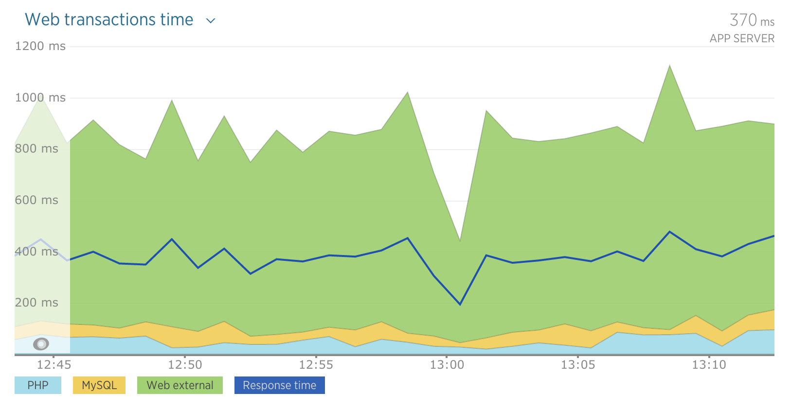

New Relic supports versions 3, 4, 5, and 6 of the **Guzzle HTTP client library** with [New Relic PHP agent version 5.4](/docs/release-notes/agent-release-notes/php-release-notes) or higher.

The Guzzle library allows both sequential and parallel requests. This page describes how each type of request will appear in the [**Summary** page](/docs/apm/applications-menu/monitoring/apm-overview-page) in the New Relic UI. To discover which call was the slowest, view the [External Services page](/docs/apm/applications-menu/monitoring/external-services-page) which displays timing for individual external calls.

## Sequential requests [#more_help]

This PHP code makes multiple sequential requests with Guzzle:

```
$client = new \GuzzleHttp\Client;
$response = $client->get('http://<var>YOUR_SITE</var>.com/api/foo');
$client->delete('http://<var>YOUR_SITE</var>.com/api/foo/'.$response->getBody());
```

This code would appear in the New Relic UI as:


<figcaption>
  [**one.newrelic.com**](http://one.newrelic.com/) **> APM > (selected app) > Overview > Web transactions time**: Sequential requests with Guzzle in the New Relic UI.
</figcaption>

[Response time](/docs/data-analysis/user-interface-functions/response-time) is shown as the dark blue line. The green **web external time** represents time spent in the Guzzle library. Because the requests were made sequentially, the response time is **equal** to the [total time](/docs/data-analysis/user-interface-functions/response-time#response-time-total-time) spent in PHP, MySQL, and web external activities.

## Parallel requests [#more_help]

This PHP code makes multiple requests in parallel by unwrapping an array of promises:

```
$client = new \GuzzleHttp\Client;

$promises = [
  $client->getAsync('http://<var>YOUR_SITE</var>.com/api/foo'),
  $client->getAsync('http://<var>YOUR_SITE</var>.com/api/bar'),
  $client->getAsync('http://<var>YOUR_SITE</var>.com/api/quux'),
];

\GuzzleHttp\Promise\unwrap($promises);
```

This code would appear in the New Relic UI as:



<figcaption>
  [**one.newrelic.com**](http://one.newrelic.com/) **> APM > (selected app) > Summary > Web transactions time**: Parallel requests with Guzzle in the New Relic UI
</figcaption>

The green **web external time** represents time spent in the Guzzle library. Because the requests were performed asynchronously, the [total time](/docs/data-analysis/user-interface-functions/response-time#response-time-total-time) spent in PHP, MySQL, and web external is **greater** than the response time.

## Timing with Guzzle 6 [#timing]

Unlike previous versions, Guzzle 6 does not generate an event when a request is sent. Instead, the agent begins timing a request when the request object is created. If a request object is created and additional work is done before sending, New Relic may report that the request took longer than it actually did.

## Disable Guzzle support

To disable Guzzle support:

1. Add `newrelic.guzzle.enabled = false` to your `newrelic.ini` file.
2. [Restart your web server](/docs/agents/php-agent/troubleshooting/why-when-restart-your-web-server-php) (Apache, Nginx, PHP-FPM, etc.).