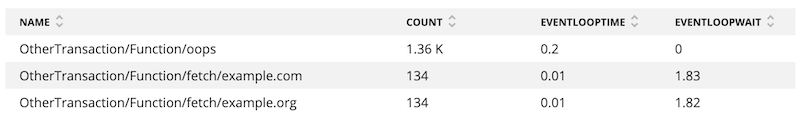

The [Python agent](/docs/agents/python-agent/getting-started/introduction-new-relic-python) supports [asyncio](https://docs.python.org/3/library/asyncio.html) event loop diagnostics. When there are transactions blocking or delaying an event loop, the agent is able to generate diagnostics to help find and resolve them.

## Requirements

Requires [Python agent version 5.0.0.124 or higher](/docs/release-notes/agent-release-notes/python-release-notes).

## View in New Relic UI

In APM, your event loop transaction data will be in the transaction breakdown table and the trace details page.

Event loop metrics will appear in the transaction **Breakdown table**:

<figcaption>
  **[one.newrelic.com](https://one.newrelic.com/) > APM > (select an app) > Monitoring > Transactions > (select a transaction):** The transaction’s **Breakdown table** flags event loops with asyncio.
</figcaption>

Time spent waiting on other transactions will be shown in the transaction **Trace details** page:

<figcaption>
  **[one.newrelic.com](https://one.newrelic.com/) > APM > (select an app) > Transactions > (select a transaction trace) > Trace details:** The **Trace details** page contains a table with breakdowns for each segment (method or function call) in a transaction trace.
</figcaption>

## Event Loop NRQL Queries

`eventLoopTime` and `eventLoopWait` attributes will be available via NRQL query. An example query might be:

`SELECT count(*) as 'count', average(eventLoopTime) as 'loopTime', average(eventLoopWait) as 'loopWait' FROM Transaction facet name`

In New Relic One, you might see results like this:

<figcaption>
  **[one.newrelic.com](https://one.newrelic.com) > Query your data > Advanced (NRQL)**: Use advanced (NRQL) to write a query to find event loops.
</figcaption>

## Where to diagnose event loops

Event loop diagnostics will be available by default through our existing aiohttp, sanic, and Tornado instrumentation frameworks. Coroutines using the Python agent API [background_task](/docs/agents/python-agent/python-agent-api/background_task) and [web_transaction](/docs/agents/python-agent/python-agent-api/webtransaction) decorator APIs also support asyncio's event loops.
