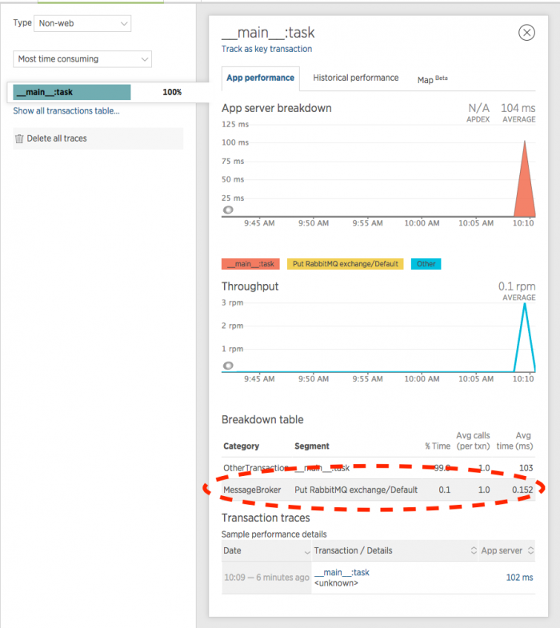

The Python agent supports the [Pika RabbitMQ client library](https://pypi.python.org/pypi/pika), giving you visibility into the performance of your message processing, for both incoming and outgoing messages.

The New Relic UI will show transactions initiated via RabbitMQ message receipt (subscribe/consume messages) as **Message** background tasks. Message creation via RabbitMQ also appears in transaction traces.

## Requirements

Requires [Python agent version 2.88.0.72 or higher](/docs/release-notes/agent-release-notes/python-release-notes).

<Callout variant="caution">
  Message tasks are not started for consumers using [TornadoConnection](https://pika.readthedocs.io/en/latest/modules/adapters/tornado.html#pika.adapters.tornado_connection.TornadoConnection).
</Callout>

## Performance improvements with background tasks [#background]

One way to increase responsiveness of web applications is to delegate work to background processes. Message queues are commonly used for this inter-process communication.

In the context of message queuing systems, applications typically interact with message brokers to send and receive messages. The RabbitMQ Pika client library allows Python applications to interface with message brokers that implement the Advanced Message Queueing Protocol (AMQP) 0.9 or higher.

The Python agent shows messages sent and received using the RabbitMQ client library. With this visibility, you can see details including:

* Number of messages produced by your app
* Time your app spends publishing messages
* Time your app spends processing "consumed" messages

[APM](#view-queue) conveniently groups and reports operations that interact with queues. By analyzing this information, you can more easily identify bottlenecks and areas for performance improvement in your message passing architecture.

## Queue operations [#queue-ops]

Supported entry points for queue operations appear as `Put` (publish a message) or `Take` (receive a message) in APM's user interface.

<table>
  <thead>
    <tr>
      <th width={150}>
        **Queue operations**
      </th>

      <th>
        **Publish a message (`Put` in UI)**
      </th>

      <th>
        **Receive a message (`Take` in UI)**
      </th>
    </tr>
  </thead>

  <tbody>
    <tr>
      <td>
        RabbitMQ
      </td>

      <td>
        `basic_publish`
      </td>

      <td>
        `basic_get`

        `basic_consume (callback)`
      </td>
    </tr>
  </tbody>
</table>

## View in New Relic UI [#view-queue]

Queue operations appear on APM's [**Transactions** page](/docs/apm/applications-menu/monitoring/transactions-dashboard) for the selected app. The `Put` and `Take` metrics appear in the **Breakdown table** and are categorized as `MessageBroker` metrics. Here is an example:

<figcaption>
  **[one.newrelic.com](https://one.newrelic.com/) > APM > (select an app) > Monitoring > Transactions > (select a transaction):** The transaction’s **Breakdown table** categorizes queue operations as `MessageBroker` metrics and labels them as `Put` (publish a message) or `Take` (receive a message).
</figcaption>

[Transaction traces](/docs/apm/transactions/transaction-traces/transaction-traces) also provide additional details for messages.

<Callout variant="tip">
  You can [select transaction traces](/docs/apm/transactions/transaction-traces/viewing-transaction-traces) from the app's **Summary** or **Transactions** pages in APM.
</Callout>

The [**Transaction trace summary** page](/docs/apm/transactions/transaction-traces/transaction-trace-summary) may show `Put` and `Take` operations in the **Slowest components** section. For example:

<figcaption>
  **[one.newrelic.com](https://one.newrelic.com/) > APM > (select an app) > (select a transaction trace):** In this example, the selected transaction trace's **Summary** shows RabbitMQ operations in the colored bar chart. The **Slowest components** section also lists the RabbitMQ `Put` and `Take` results.
</figcaption>

The **Transaction trace** page includes a dedicated **Messages** tab that shows a summary of the message activity that occurred as part of the transaction. Here is an example:

<figcaption>
  **[one.newrelic.com](https://one.newrelic.com/) > APM > (select an app) > (select a transaction trace):** In this example, the selected transaction trace's **Messages** tab lists the RabbitMQ message details.
</figcaption>
