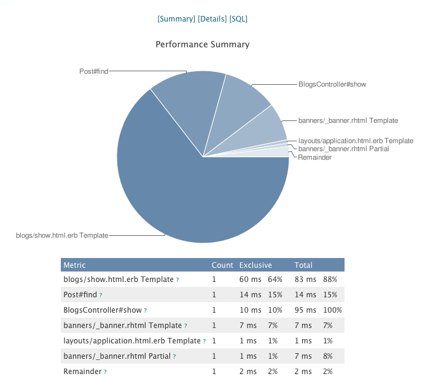

<Callout variant="caution">
  Developer mode is **deprecated** and no longer supported as of [Ruby agent version 4.1.0](/docs/release-notes/agent-release-notes/ruby-release-notes/ruby-agent-410333).
</Callout>

The New Relic Ruby agent includes Developer mode, a built-in UI for examining details about web transactions in your application. With Developer mode, you can examine the library and database calls made by the controller actions as they are invoked on the Rails instance.

The free Developer mode gives you some of the same in-depth transaction visibility you get with New Relic's [transaction traces](/docs/apm/transactions/transaction-traces/introduction-transaction-traces) feature. However, it works only in a single Rails instance, and it has much higher overhead than the production version. It is not recommended for use beyond a developer's desktop sandbox.

## Security considerations [#security]

The Ruby agent's Developer mode, which is on by default when the `RAILS_ENV == "development"`, does not communicate with the New Relic collector in any way. Pie charts are rendered using Google Charts, which involves an HTTP post of aggregate data.

<Callout variant="tip">
  The Ruby agent's Production mode, which is on by default when the `RAILS_ENV == "production"` and `RAILS_ENV == "staging"`, does communicate with the New Relic site. For more information, see [Security](/docs/subscriptions/security).
</Callout>

## Installation

To install Developer mode, [install Ruby agent](/docs/ruby/ruby-agent-installation) as a plugin or gem. You may also need to set [`developer_mode`](/docs/agents/ruby-agent/installation-configuration/ruby-agent-configuration#developer_mode) to true in your **newrelic.yml** for the `RAILS_ENV` in which you are working. Developer mode is on by default only when `RAILS_ENV` = `development`.

While a **newrelic.yml** file will be created as part of the installation, it is not necessary to have a valid [license key](/docs/apis/intro-apis/new-relic-api-keys/#ingest-license-key).

## Known issues [#known_issues]

Known issues with Developer mode include:

<CollapserGroup>
  <Collapser
    id="rails-23"
    title="Requires Rails 2.3 or higher"
  >
    Developer mode in recent agents only works on Rails 2.3 or higher. It is rack based, and earlier versions of the framework did not incorporate rack.

    The developer edition installs a middleware in your app that responds to any URL prepended with `/newrelic`; for example, `/newrelic`, `/newrelic/files/images/foo.png`, etc.

    In some cases the `/newrelic` URL gets captured by an earlier middleware. In this situation, disable the Developer mode route and include the middleware yourself:

    At the beginning of the file, in `config.ru`:

    ```
    require 'newrelic_rpm'
    require 'new_relic/rack/developer_mode'
    use NewRelic::Rack::DeveloperMode
    ```
  </Collapser>

  <Collapser
    id="pow-compatibility"
    title="Incompatible with Pow"
  >
    Developer mode is not supported from [Pow](http://pow.cx/), a zero-config Rack server for Mac OS X.
  </Collapser>
</CollapserGroup>

## Using Developer mode [#using_devmode]

If you run your application on your desktop using thin, WEBrick, or something similar, open the URL `/newrelic` on your server to see the Developer mode user interface.

<Callout variant="caution">
  If you are using Passenger, Unicorn, or other forking application servers on your desktop, you may notice some odd behavior with disappearing data if your application server launches multiple instances. Refer to the **Troubleshooting** tips, which follow.
</Callout>



**Developer Mode Breakdown Chart**

## Troubleshooting

Troubleshooting tips for Developer mode:

<CollapserGroup>
  <Collapser
    id="disappearing-request"
    title="Disappearing requests"
  >
    If you have this problem with Unicorn or other multi-worker dispatchers, try limiting the number of workers to 1.
  </Collapser>

  <Collapser
    id="undefined-method-rack-request"
    title="Undefined method path for Rack::Request"
  >
    Some users may see an undefined method `path` for `#<Rack::Request>`. If you are using Rails version 2.3.2, then you are mostly likely running into a problem with the way the Rack dependency was defined in the Rails package. Either upgrade to 2.3.3 (or higher), or define Rack version 1.0.1 as a dependency in your Gemfile.
  </Collapser>

  <Collapser
    id="activerecord-reloads"
    title="ActiveRecord reloads"
  >
    Developer mode reloads ActiveRecord method definitions for every reload and reports the time spent defining the methods (such as `define_attribute_method)`. This does not happen in production. To get real results to compare, add the following to the development environment:

    ```
    config.cache_classes = true
    ```
  </Collapser>
</CollapserGroup>
