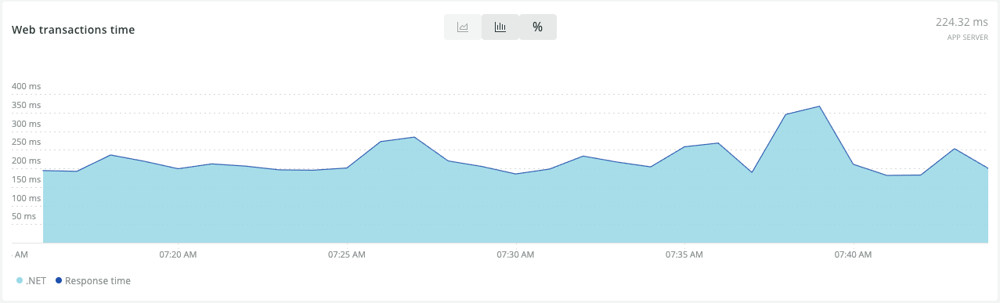

The Ruby agent automatically instruments [Rack](http://rack.github.io/) middlewares. If you are unfamiliar with the basics of Rack middlewares, review the [resources linked by the Rails on Rack guide](http://guides.rubyonrails.org/rails_on_rack.html#resources). Additionally, the Ruby agent provides some features via Rack middlewares:

* [Distributed traces](/docs/distributed-tracing/enable-configure/language-agents-enable-distributed-tracing/)
* Auto-instrumentation for [browser monitoring](/docs/agents/ruby-agent/features/page-load-timing-ruby)

New Relic automatically installs these middlewares for Rails and Sinatra.

## Rack instrumentation [#instrumentation]

The two most common ways to configure Rack middlewares are the `Rack::Builder` API (most often from **config.ru**) and Rails' middleware stack configuration:

<CollapserGroup>
  <Collapser
    id="rack_builder"
    title="Rack::Builder"
  >
    Middlewares in your **config.ru** file are configured using `Rack::Builder`. For the Ruby agent to instrument middlewares from `Rack::Builder`, your app must run version 1.1.0 or higher of the `rack` gem. This is the most common use of middlewares with Sinatra or pure-rack applications.
  </Collapser>

  <Collapser
    id="rails_middlewares"
    title="Rails middlewares"
  >
    Rails uses its own class (`ActionDispatch::MiddlewareStack`) instead of `Rack::Builder` to configure middlewares. Even if you haven't explicitly added middlewares to your Rails application, many components of Rails itself are implemented as middleware, so middleware data will appear by default.

    The Ruby agent automatically instruments middlewares added via `ActionDispatch::MiddlewareStack` on **Rails 3.0 or higher**. For more information about configuring middlewares with Rails, see the [Ruby on Rails guide](http://guides.rubyonrails.org/rails_on_rack.html).
  </Collapser>
</CollapserGroup>

## Viewing middleware data [#viewing_middleware_data]

You can view middleware data in APM.

<CollapserGroup>
  <Collapser
    id="apm-overview"
    title="In the APM Summary page"
  >
    The main chart on your app's [APM **Summary** page](/docs/apm/applications-menu/monitoring/applications-overview-dashboard) includes a purple bar that shows average time per request spent in all Rack middlewares for your application.

    

    <figcaption>
      **APM > (selected application) > Summary:** Middleware time appears in purple on your app's main Overview chart.
    </figcaption>
  </Collapser>

  <Collapser
    id="apm-transactions"
    title="In the APM Transactions page"
  >
    You can also see time for individual middlewares for a specific transaction name from your app's APM [**Transactions** page](/docs/apm/applications-menu/monitoring/transactions-page).

    

    <figcaption>
      **APM > (selected application) > Monitor > Transactions > (selected transaction) > Trace details:** Here is an example of middleware time for a selected transaction for your app.
    </figcaption>
  </Collapser>

  <Collapser
    id="apm-trace"
    title="In APM transaction trace summary"
  >
    Transaction traces also capture detailed middleware call information.

    

    <figcaption>
      **APM > (selected application) > Monitor > Transactions > (selected transaction trace):** Here is an example of middleware details in a transaction trace.
    </figcaption>
  </Collapser>
</CollapserGroup>

## Disabling Rack instrumentation [#disabling]

If you do not want to instrument Rack middlewares, you may disable Rack middleware instrumentation with the [`disable_middleware_instrumentation`](/docs/agents/ruby-agent/installation-configuration/ruby-agent-configuration) setting. You can also [ignore specific transactions](/docs/agents/ruby-agent/installation-configuration/ignoring-specific-transactions).

## Installing Ruby agent middlewares manually [#manual]

The Ruby agent's implementation of New Relic's [cross application tracing](/docs/apm/traces/cross-application-traces/cross-application-tracing) feature uses Rack middleware instrumentation to read and write HTTP headers that are necessary to pass information between monitored applications. If you are using Sinatra, have disabled middleware instrumentation as described above, and want to use cross application tracing, you must manually add the `NewRelic::Rack::AgentHooks` middleware to your middleware stack.

<Callout variant="important">
  As of version 8.0.0, cross application tracing is deprecated in favor of [distributed tracing](/docs/distributed-tracing/enable-configure/language-agents-enable-distributed-tracing/). When enabled, distributed tracing is automatically configured for all rack-based apps without the need for an additional middleware.

  If you would like to continue using cross application tracing, you will need to [update your configuration](/docs/agents/ruby-agent/features/cross-application-tracing-ruby#configuration).
</Callout>

## Manual Rack instrumentation [#manual_instrumentation]

Earlier versions of the Ruby agent supported manually instrumenting Rack middlewares via the `NewRelic::Agent::Instrumentation::Rack` module. This instrumentation is deprecated in Ruby agent versions 3.9.0 or higher, because it is unnecessary with automatic middleware instrumentation. New Relic recommends that you remove references to this module from your code after upgrading to 3.9.0 or higher.
