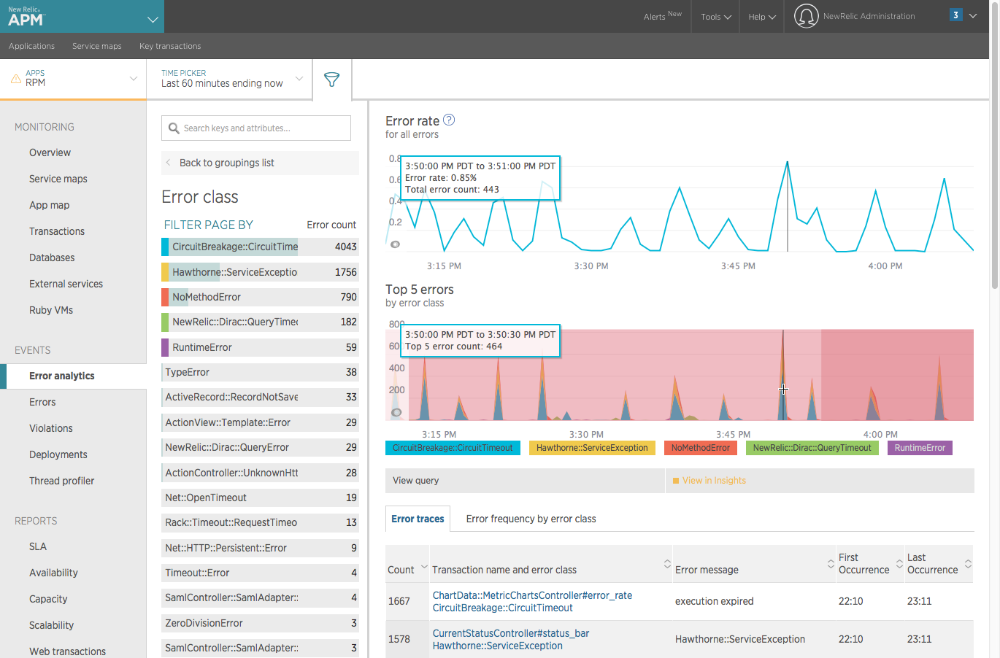
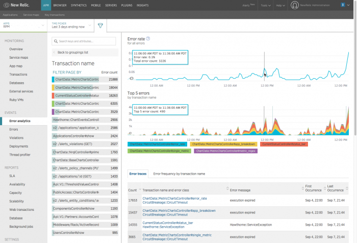
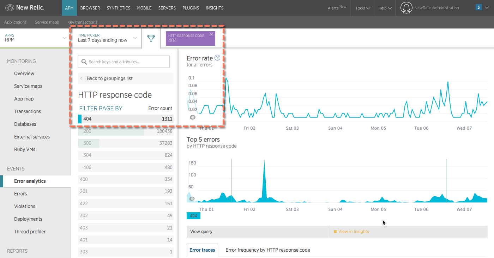
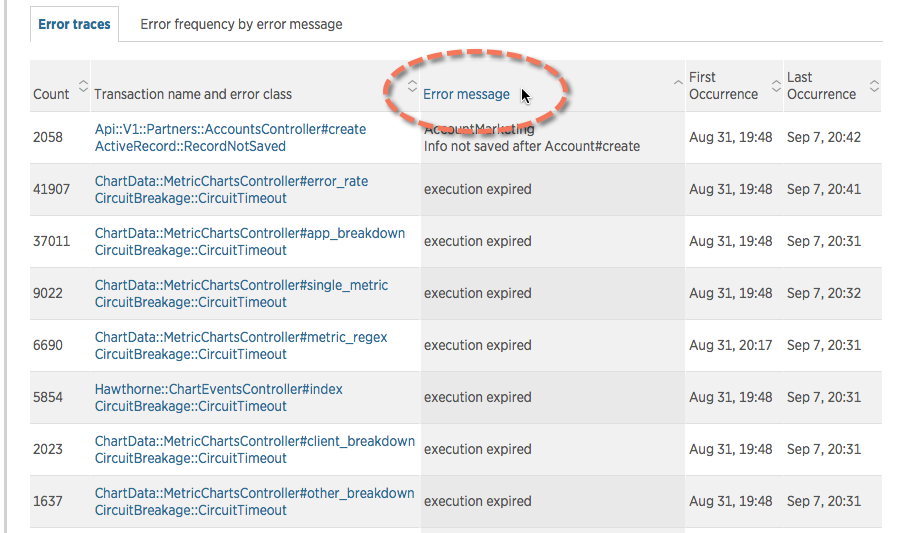
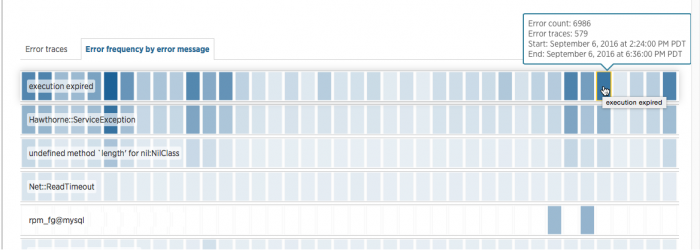

Depending on your [New Relic APM agent version](/docs/apm/applications-menu/error-analytics/error-analytics-compatibility-requirements#error-views) and the [time period you select](/docs/data-analysis/user-interface-functions/view-your-data/time-picker-setting-time-periods-view-data), New Relic APM's **Error analytics** feature provides a data that helps you investigate error information within the past eight days through grouping and filtering.

## Add, ignore, mark errors as expected

You can add new errors to New Relic APM and prevent certain errors from being reported to the New Relic [collector](/docs/accounts-partnerships/education/getting-started-new-relic/glossary#collector). For more information, see [Manage errors in APM](/docs/agents/manage-apm-agents/agent-data/manage-errors-apm-collect-ignore-mark-expected).

In addition, the Java and Ruby agents allow you to configure expected errors. For more information, see [Expected errors](/docs/agents/manage-apm-agents/agent-data/manage-errors-apm-collect-ignore-or-mark-expected#expected).

## View the error analytics page

To view the **Error analytics** UI page:

* Go to **[one.newrelic.com](https://one.newrelic.com) > Entity explorer > (select an app)**, then click the **Error rate** table's title for your selected app.

  OR
* Go to **[one.newrelic.com](https://one.newrelic.com) > Entity explorer > (select an app) > Explore performance > Error analytics**.

For more information, see the documentation about [navigating core UI components](/docs/new-relic-one/use-new-relic-one/get-started/new-relic-one-core-ui-components) in New Relic One.

**APM error analytics:** The **Error rate** chart always shows the rate and count for all errors. To drill down further, use grouping and filter options for the **Top 5 errors** chart. Here is an example of an app in an alert state. (The chart background changes to light pink at the **Warning** threshold and to dark pink for a **Critical** condition.) In addition, use the **Error traces** table and **Error frequency** heatmap to explore specific error details and trends over time.

## Caps on error reporting

New Relic caps error reporting at 100 events per minute per agent instance. This prevents error reporting from negatively impacting application performance.

**Examples:**

* App running across five hosts: New Relic caps error reporting at 100 events per minute x 5 instances = 500 events per minute.
* App running on one host with ten instances: New Relic caps error reporting at 100 events per minute x 10 instances = 1000 events per minute.

## Select the time period for error data

With the **Error analytics** events view and the [time picker](/docs/data-analysis/user-interface-functions/view-your-data/time-picker-setting-time-periods-view-data), you can examine details of [error events](/docs/insights/new-relic-insights/decorating-events/error-event-default-attributes-insights) over the past week. The error events view is available for up to a seven-day window of data collected over the last eight days.

You may notice slight differences in count if your time window is **ending now**. This occurs because the counts for the list and table may be requested at slightly different times as the page auto-refreshes.

## Use the error events view workflow

Here is a basic workflow describing how to get the most out of the information you see from the **Error analytics** events view.

1. Start with the [**Error rate** chart](#error-rate-chart) to see at a glance whether there are any unexpected spikes, dips, or patterns with errors in general.
2. Correlate any general patterns on the [**Top 5 errors** chart](#top5-errors-chart) to alerts occurring during the same time period. Use the groups and filters to examine the error events and attributes in more detail, and look for patterns with error messages or transaction names.
3. Explore and share [**Error trace** table](#traces-table) information, including specific stack trace details: associated host, user, framework code, custom attributes, etc.
4. Identify error patterns on the [**Error frequency** heatmap](#frequency-time) for a selected grouping (host, error message, custom attributes, etc.) within a time range.
5. Also review the [**Error profiles** page](docs/apm/applications-menu/error-analytics/apm-error-profiles-troubleshoot-trends) to get visual details about significant differences in the frequency of different values for the events.

<CollapserGroup>
  <Collapser
    id="error-rate-chart"
    title="Error rate chart: See patterns immediately"
  >
    Start with the **Error rate** chart to see at a glance whether there are any unexpected spikes, dips, or patterns with errors in general. For example, are there any spikes near a recent deployment? You may want to change the [selected time period](#time-period) to look for other historical patterns.

    This chart always shows the overall error rate and count for the selected time period, even when you filter the rest of the page. If you want to focus your investigation on a particular type of error, use the [**Top 5 errors** chart](#top5-errors-chart) or the [**Error traces** table](#traces-table).

    

    **Error analytics:** Here is an example of the events view. The **Error rate** chart always shows the rate and count for all errors. To drill down further, use grouping and filter options for the **Top 5 errors** chart, or examine the **Error traces** and **Error frequency** data.
  </Collapser>

  <Collapser
    id="top5-errors-chart"
    title="Top five errors: Correlate to alerts or Insights events"
  >
    Use the **Top 5 errors** chart to identify what error types and how many of those errors occurred during the same time period as the **Error rate** chart. For example:

    * Is the error spike related to a specific class?
    * Do the top errors point to a new host that recently got moved into production?
    * Are the top error messages repeatedly about failed connections by hosts that you know are in a specific region of your organization?
    * Have the chart backgrounds changed color to indicate an [alert condition](/docs/alerts/new-relic-alerts/configuring-alert-policies/define-thresholds-trigger-alert)? (Light pink indicates the alert condition's **Warning** threshold, and dark pink indicates the **Critical** threshold.)

    

    **Error analytics:** Here is an example of grouping by HTTP response codes, then selecting 404 from the list of HTTP response codes to filter and look for trends related to 404 errors. The **Error rate** chart still shows all errors, but the **Top 5 errors** chart now shows only 404 errors during the same time period.

    <Table>
      <thead>
        <tr>
          <th style={{ width: "200px" }}>
            **If you want to...**
          </th>

          <th>
            **Do this...**
          </th>
        </tr>
      </thead>

      <tbody>
        <tr>
          <td>
            Change the "top 5" selection
          </td>

          <td>
            By default, **Top 5 errors** chart shows the top five errors by class. To filter or group by other attributes, such as error message, host, or transaction name, or to select any of your custom attributes, use the search window, or select **Back to groupings list**.
          </td>
        </tr>

        <tr>
          <td>
            Explore or share the error data in Insights
          </td>

          <td>
            The **Top 5 errors** chart uses New Relic [Insights error event default attributes](/docs/insights/new-relic-insights/decorating-events/error-event-default-attributes-insights) along with any custom attributes you have added to this event type. To examine the **Top 5 errors** data in more detail, or to share it with others, select the **View query** or **View in Insights** links that appear when you hover below the chart.
          </td>
        </tr>
      </tbody>
    </Table>
  </Collapser>

  <Collapser
    id="traces-table"
    title="Error traces: Dive deeper into stack traces, framework code, and more"
  >
    Supplementing the two charts, the **Error traces** table groups errors by the transaction name and error class, and links them to relevant error traces.

    

    **Error analytics:** Changing the sort order on any **Error traces** table column can help surface patterns more quickly. Here is an example of changing the sort order by error message, which immediately identifies a pattern with the `execution expired` message.

    Each row helps you find answers to questions such as:

    * How many of this transaction/class occurred within the selected time period?
    * What is the most recent error message?
    * When did it first and last occur?

    Sometimes it may be more useful to examine error trace data from lowest to highest. For example:

    * Which error has the fewest number of occurrences?
    * When did a particular error stop (**Last occurrence**)?

    You can change the sort order or filter options to focus on just the types of errors that matter the most to you and your teams. In addition, from the **Error traces** table, you can drill down into the [stack trace and framework code, explore the related transaction, file a ticket, and more](/docs/apm/applications-menu/error-analytics/error-analytics-manage-error-traces).
  </Collapser>

  <Collapser
    id="frequency-time"
    title="Error frequency: Compare counts over time"
  >
    To examine error counts and traces by a particular category within a specific time period, select any of the available attributes from the **Back to groupings list**. For example, to compare error counts between hosts, select **Host** as the grouping, and then filter by an individual host to see only the error traces for it.

    

    Here is an example of the **Error frequency** heatmap with grouping by error messages over the past seven days. The darker the color, the more errors that occurred during that period.

    The shaded heatmap immediately helps you identify patterns; the darker the color, the more errors that occurred during that period. To explore even deeper, select any area on the heatmap to see details including:

    * Total count
    * Number of traces created
    * Time period
    * Error trace details
  </Collapser>
</CollapserGroup>
