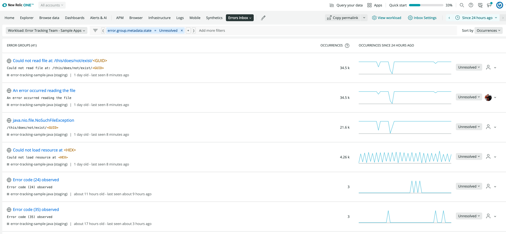
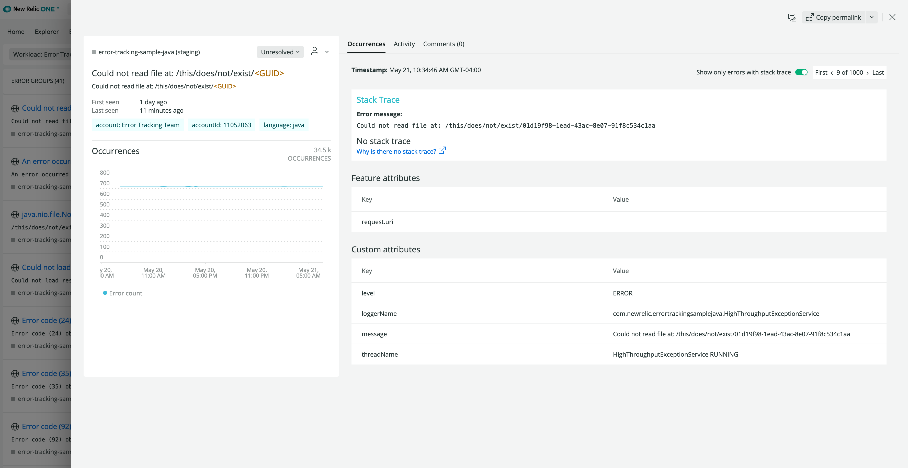

New Relic Errors Inbox is a single place to proactively detect, prioritize, and take action on all the errors before they impact customers. Receive alerts whenever a critical, customer-impacting error arises right in Slack or your preferred communication channel.

Resolve errors faster with errors from across your stack, including all APM, RUM, Mobile, and Serverless data, displayed on one screen. Errors are grouped to cut down on noise and make collaborating with other teams easy. 

## Why it matters [#matters]

Errors Inbox provides a unified error tracking experience to detect and triage errors:

- View and triage issues across entities and services that your team cares about.
- Proactive notifications with detailed error information  (Slack, email, webhooks).
- Error profiles to show similarities between error events.
- Analyze errors in context of the full stack, down to the stack traces so you can resolve errors with precision.
- Beyond RUM data: Triage and tackle errors across the application stack (APM, RUM, Mobile, Serverless).
- Integrations with Slack to fit within teams existing workflows.

## Set up Errors inbox [#get-started]

To enable Errors inbox, follow these steps below. Afterwards, errors should start to appear in your inbox.

1. From [one.newrelic.com](one.newrelic.com) select **More** in the top right and click **Errors Inbox** from the dropdown.
2. If this is your first time accessing errors inbox, you will be prompted to select a [workload](/docs/new-relic-one/use-new-relic-one/workloads/workloads-isolate-resolve-incidents-faster/) in the top left. 

Once you select your workload, your inbox should populate with error groups.

## Proactively monitor your errors [#monitor]

<figcaption>[one.newrelic.com](one.newrelic.com) > **More** > ** Errors Inbox**</figcaption>

Once you've set up your Inbox, you can begin to proactively monitor all errors on your stack:

1. **Error groups**: Your inbox automatically groups your error, so you can easily review all the unique errors within your system.
2. **Occurrences**: Your inbox displays the total number of occurences within the selected timeframe. The corresponding chart displays the total number of occurences over the selected timeframe.
3. **Status**: You can set the status of an error by selecting the dropdown and choosing either **Unresolved**, **Resolve**, or **Ignore**. You can ignore errors to reduce noise, leave it unresolved, or proactively resolve the error.
4. **Assign errors**: Assign errors directly to teams or individuals. 

## Dive deeper with error details [#error-details]

Clicking on a specific error group takes you to the error details page, where you will find full context of the issue. This context can assist in triaging the error and assigning it to the correct team or individual. This includes details like:
- Offending account
- Stack trace
- Error attributes
- Number and frequency of occurrences

The detailed view also allows you to view specific errors. In the top right, you can navigate between the first instance of the error, the last, and any instance inbetween.

## Collaborate on errors [#collaborate]

WIP. This was bad, so I'm just rewriting this. 

