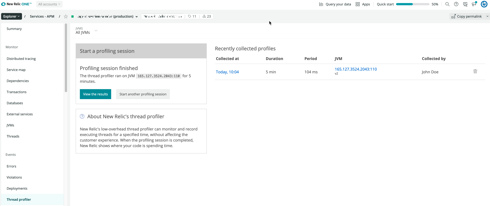

The thread profiler is a low-impact profiling tool that can be used in production to identify bottlenecks in an application. It works by periodically (100ms) capturing the stack trace of each thread for a specified duration. At the end of the specified duration, the stack traces are aggregated to build a tree. The call count in the tree corresponds to the number of times that function was present in the stack traces under the same context.

Although the call tree cannot capture the entire execution, a large enough sample can be a good representation of the application behavior. This provides insights into the "hot" functions of the app where most of the time is spent. With this scope, entries sampled less than 0.05% are omitted.

## Supported agents [#agents]

This feature is available only for specific agents and versions:

* Java: Agent versions 1.2.004.6 or higher
* .NET:
  * Framework: Agent versions 2.12.146.0 or higher
  * .NET Core 2.0: Agent versions 8.3.360.0 or higher (Windows only)
  * Linux: .NET Core 3.0 or higher and agent versions 8.23 or higher
* Python: Agent versions 1.7.0 or higher
* Ruby: Agent versions 3.5.5 or higher

## Start the profiler [#starting]

The thread profiler feature is enabled by default. You also may be able to turn it on or off in your agent configuration file:

* Java: `thread_profiler.enabled`
* NET: You **cannot** disable the thread profiler with .NET apps.
* Python: `thread_profiler.enabled`
* Ruby: `thread_profiler.enabled`

When enabled, you can view the thread profiler from our user interface:

1. Go to **[one.newrelic.com](https://one.newrelic.com) > APM > (select an app) > Events > Thread profiler**.
2. Select the host you want to run the profiler on.
3. Set the duration for the profiling session.
4. Select **Start profiler**.

This triggers the agent to start the thread profiler during the next harvest cycle (every one minute) and capture data for the specified duration. We record thread backtraces whether or not they are in a runnable state at the time the sample is taken. Threads that are sleeping or blocked on IO may appear in the call tree.

<figcaption>
  **[one.newrelic.com](https://one.newrelic.com) > APM > (select an app) > Events > Thread profiler**: Use this page to define the settings for the thread profiler duration and to view the results.
</figcaption>

## View profile data [#viewing]

After the profiler finishes running, the agent will report the profile data. The call tree automatically appears on the **Thread profiler** page. The percentages in the call tree represent the percentage of thread backtrace samples in which each call path appeared during the profiling session. The data collection started at the PROFILE COLLECTED time.

The page color-codes the tree results:

* Red: Percentages greater than 30%
* Yellow: Percentages greater than 10%
* Black: Percentages less than 10%

<table>
  <thead>
    <tr>
      <th width={200}>
        **If you want to...**
      </th>

      <th>
        **Do this...**
      </th>
    </tr>
  </thead>

  <tbody>
    <tr>
      <td>
        Change how the thread profile information appears
      </td>

      <td>
        Select your choices of available options in the **Tree settings**, and select **Refresh tree**.
      </td>
    </tr>

    <tr>
      <td>
        Change how much information appears
      </td>

      <td>
        Select the **Expand** or **Collapse** options above the call tree, or select the name or arrow on any line in the call tree.
      </td>
    </tr>

    <tr>
      <td>
        View summary information about any line in the call tree
      </td>

      <td>
        Mouse over the line.
      </td>
    </tr>

    <tr>
      <td>
        Email the thread profile results to others
      </td>

      <td>
        Select **Share this profile**.
      </td>
    </tr>

    <tr>
      <td>
        Start another session or view a different thread profile
      </td>

      <td>
        Select **Back to all profiles**.
      </td>
    </tr>
  </tbody>
</table>

## Agent considerations [#agent-requirements]

Depending on which agent you use, the thread profiling feature has additional considerations.

<CollapserGroup>
  <Collapser
    id="net"
    title=".NET-specific notes"
  >
    When using thread profiling with the .NET Framework agent, be aware of the following.

    <table>
      <thead>
        <tr>
          <th width={200}>
            **.NET agent**
          </th>

          <th>
            **Thread profiler notes**
          </th>
        </tr>
      </thead>

      <tbody>
        <tr>
          <td>
            Supported on **Linux**
          </td>

          <td>
            Thread profiling on **Linux** is supported on .NET Core 3.0 or later applications when running .NET agent version 8.23 or later.
          </td>
        </tr>

        <tr>
          <td>
            Managed threads only
          </td>

          <td>
            For .NET agents, the thread profiler only captures stack traces on managed threads. It does not capture stack traces on unmanaged threads. If a call to an unmanaged function occurs on a managed thread, the thread profiler will show `Native:Function Call` in the call tree.
          </td>
        </tr>

        <tr>
          <td>
            No line numbers
          </td>

          <td>
            A .NET thread profile does not include line numbers in the call tree. The **Show line numbers** checkbox in the Tree Settings does not have any effect.
          </td>
        </tr>

        <tr>
          <td>
            Bug with 64-bit v4.0 .NET CLR
          </td>

          <td>
            There is a bug in the 64-bit version 4.0 .NET Common Language Runtime (CLR) that interferes with the agent's ability to retrieve managed stack traces. If your app experiences this bug, APM will show empty thread profiles. This bug does not affect 32-bit applications.

            The bug is fixed in the CLR releases for .NET 4.5. To verify whether your 64-bit application has the fixed version, look at the full version of the `mscorlib.dll` in the **C:\\Windows\\Microsoft.NET\\Framework64\\v4.0.30319** directory. The fix is in versions 4.0.30319.17379 or higher.
          </td>
        </tr>

        <tr>
          <td>
            **Other** category only
          </td>

          <td>
            All threads are put in the **Other** category. The **Web Request** and **Background** categories are not supported.
          </td>
        </tr>
      </tbody>
    </table>
  </Collapser>

  <Collapser
    id="agent-thread-profiling"
    title="Python-specific notes"
  >
    When using thread profiling with the Python agent, be aware of the following.

    <table>
      <thead>
        <tr>
          <th width={200}>
            **Python agent**
          </th>

          <th>
            **Thread profiler notes**
          </th>
        </tr>
      </thead>

      <tbody>
        <tr>
          <td>
            Co-routine based systems
          </td>

          <td>
            There are limits to capturing details when a co-routine based system is being used, such as gevent or eventlet modes of gunicorn. If creating a new thread, the Python agent will actually create a greenlet instead of a thread profiler background thread. Therefore, the thread profiler will not capture any web request and background transactions on the thread profiler page.
          </td>
        </tr>

        <tr>
          <td>
            Greenlets
          </td>

          <td>
            A greenlet can run only when other greenlets explicitly yield control, such as when they block. For example, if the thread sampler does get to run, it will only sample the stack for other greenlets at a point where they are blocked. It will not sample them when they are executing arbitrary code. It can completely miss execution within a greenlet if it never blocked or otherwise yielded to another greenlet.
          </td>
        </tr>

        <tr>
          <td>
            Time in Python code
          </td>

          <td>
            Time spent in pure Python code that isn't blocking requests will not be picked up, and no information will be recorded or reported. This is because results are misleading when co-routines are used.
          </td>
        </tr>
      </tbody>
    </table>
  </Collapser>

  <Collapser
    id="ruby"
    title="Ruby-specific notes"
  >
    When using thread profiling with the Ruby agent, be aware of the following.

    <table>
      <thead>
        <tr>
          <th width={200}>
            **Ruby agent**
          </th>

          <th>
            **Thread profiler notes**
          </th>
        </tr>
      </thead>

      <tbody>
        <tr>
          <td>
            Backtraces
          </td>

          <td>
            The thread profiler depends on the ability to capture thread backtraces from within your Ruby application. For this reason, it requires **MRI 1.9.2 or higher** (for the `Thread#backtrace` method).
          </td>
        </tr>

        <tr>
          <td>
            Resque
          </td>

          <td>
            The Ruby agent does not currently support thread profiles with Resque background jobs. A thread profiling session initiated against Resque will only capture traces from the parent process, not the job processes.
          </td>
        </tr>

        <tr>
          <td>
            JRuby
          </td>

          <td>
            JRuby support is considered experimental at this time. There are known issues with JRuby's `Thread#backtrace` implementation that will affect the accuracy of and reliability of backtraces collected under JRuby.
          </td>
        </tr>
      </tbody>
    </table>
  </Collapser>
</CollapserGroup>
