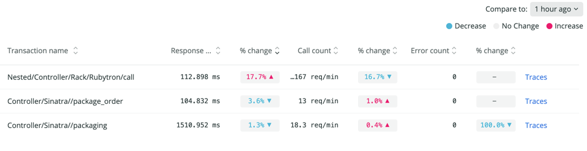
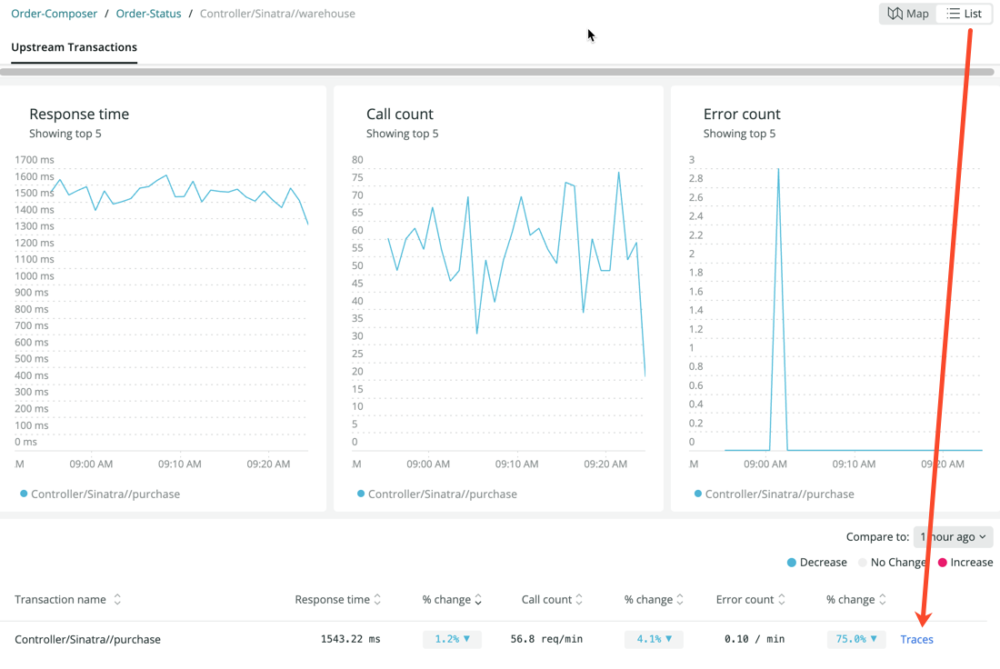

The UI for external services is a great place to analyze a single service along with its upstream and downstream services. The UI starts you off with a map of your selected service, along with performance metric charts showing the top five results for response time, throughput, and error rate. If you prefer, you can also see the same map details represented in a [table format](#table-view).

## How to find the external services feature [#where-externals]

The external services feature is available from the left navigation pane once you select a service in Explorer. Do one of the following:

   * New Relic Explorer: Go to **[one.newrelic.com](https://one.newrelic.com) > Explorer > (select an app) > Monitor > External services**.
   * APM: Go to **[one.newrelic.com](https://one.newrelic.com) > APM > (select an app) > Monitor > External services**.

## The external services map [#use-the-map]

The opening map displays your selected service as a vertex (hexagonal shape) with rectangles around the upstream or downstream services. The initial view is the downstream service, so the **Downstream entities** tab is selected by default. When you're on that tab, the performance metrics (**Response time**, **Throughput**, and **Error rate**) apply to the downstream services. You can click **Upstream entities** to switch to those performance metrics.

### View transaction details [#drill-down]

On the initial page for external services, each of the rectangles contains vertices that represent the upstream or downstream services. The vertices are connected across services by edges (lines). When you drill into a particular service, the vertices on those drill-down pages become the service endpoints so you can see transaction detail.

The thickness of the lines represents the throughput for the service, and the darkness of the line is time consumed (throughput times duration).

### Map legend [#map-legend]

In the map legend, you have the option to select two types of services:

  * **Services**: These are services you own and have instrumented.
  * **Uninstrumented externals**: These are uninstrumented services that you may or may not own.

## How performance metric charts work [#understand-data]

On the opening page of external services, you see these performance metric charts: **Response time**, **Throughput**, and **Error rate**. For APM agents, these initial performance charts are populated by metric data, while for OpenTelemetry, the initial values are populated by sampled data. As you drill below the initial page–whether it's OpenTelemetry or APM agents–each child page is populated by sampled data. This means that if you're not seeing the data you expect on pages that show sampled data, you may need to increase your [sampling](/docs/apm/apm-ui-pages/monitoring/external-services/external-services-setup#adjust-sampling).

The performance metric charts always reflect the data from the page you're viewing, but the set of metrics displayed changes as you drill below the opening page. Here's what you need to know about these metrics:

<table>
  <thead>
    <tr>
      <th style={{ width: "200px" }}>
        Metric
      </th>
      <th>
        Screen
      </th>
      <th>
        Description
      </th>
    </tr>
  </thead>
    <tbody>
      <tr>
        <td>
          Response Time
        </td>
        <td>
          All screens
        </td>
        <td>
          The average duration of sampled calls between two services in the initial view, or between transactions in the other views. How well this represents actual system performance depends on the effective sample rate. This metric is displayed on each level as you drill down.
        </td>
      </tr>
      <tr>
        <td>
          Throughput
        </td>
        <td>
          Opening screen
        </td>
        <td>
          ??
        </td>
      </tr>
      <tr>
        <td>
          Error rate
        </td>
        <td>
          Opening screen
        </td>
        <td>
          ??
        </td>
      </tr>
      <tr>
        <td>
          Traced call count
        </td>
        <td>
          Drill-down pages
        </td>
        <td>
          Represents the number of sampled calls we have for a given path between two services or transactions. This is lower than the total throughput, unless you are sampling 100% of your requests.
        </td>
      </tr>
      <tr>
        <td>
          Traced error count
        </td>
        <td>
          Drill-down pages
        </td>
        <td>
          The number of sampled calls between two services or transactions that had errors.
        </td>
      </tr>
  </tbody>
</table>

## The external services table [#table-view]

As a companion to the map view, the table view lists all the related services in a columnar format. When you click **List** in the upper right of the page, you see the same services from the map view:

Similar to the map view, you can click on specific entities (services) to see transactions in the drill-down tables. As you drill down and find an interesting endpoint, you can click on **Traces** to switch over to distributed tracing details.

To the right of each performance metric column is a corresponding **% change** (percentage change) column. The percentage change calculation is based on the time frame you choose in the main time picker and the comparison time picker (**Compare to**). The comparison time picker indicates how much before the main time window the comparison should start. 

Here's an example with **Response time**: If the current time is 11 a.m. and the main time picker is **last 30 minutes** and the **Compare to** time picker is **1 hour ago**:

  * The duration is the average from 10:30-11:00 a.m.
  * The **% change** compares that to the average from 9:30-10:00 a.m.

## Workflow example [#workflow-example]

Here is a typical map workflow:

1. Look for the thickest and darkest line on the map and follow it to its upstream or downstream service.
2. Click on the upstream or downstream vertex.
3. View a breakdown of transactions between the two services.

<figcaption>In this example, one of the thicker edges (lines) goes from the Order-Composer service to the warehouse endpoint in the Order Status service.</figcaption>
4. If you decide that a particular transaction is taking the most time, click on that transaction to focus specifically on its dependencies.

<figcaption>In this drill-down view, you can see the transaction between the Order-Composer service and the warehouse endpoint in the Order-Status service.</figcaption>
5. From any point in this flow, consult the supporting performance metrics, which show changes over time.
6. If you reach a point in the drill-down where you want to see distributed tracing, click **List** in the upper right, and then click **Traces** in the table.
  

## How to view classic external services [#classic-toggle]

The classic external services view is still available if you are monitoring existing services that use cross application tracing. Since the default view is the expanded external services, you need to click the toggle **Show new view** to switch to the classic view. 
