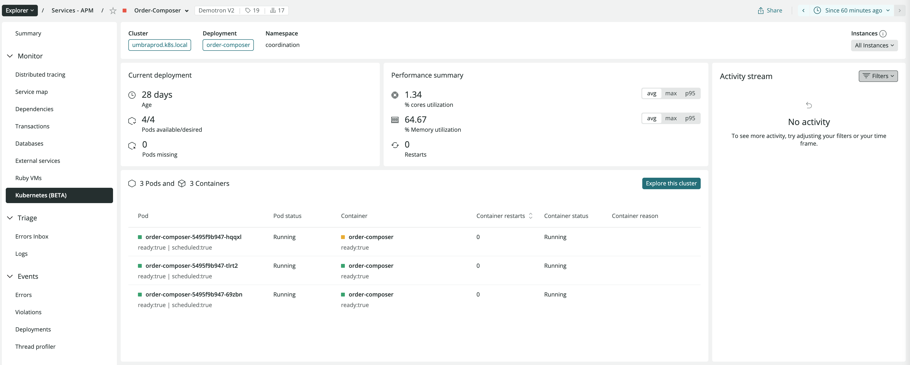
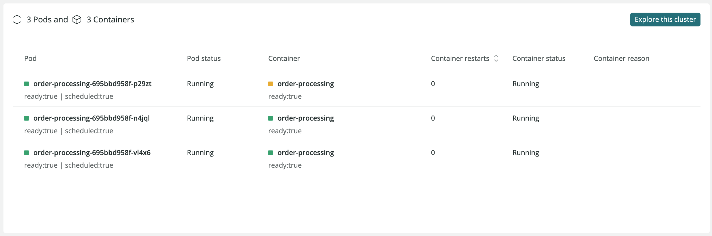

The Kubernetes APM **Summary** page provides general information about the selected application, including the age of the current deployment, the number of pods available, CPU and memory usage, pod logs, and metric comparison.

<figcaption>[one.newrelic.com](one.newrelic.com) > **Explorer** > Select your cluster > **Kubernetes**</figcaption>

<Callout variant="tip">
  To get a high-level overview of all your applications and services, use the [New Relic Explorer](/docs/new-relic-one/use-new-relic-one/ui-data/new-relic-one-entity-explorer).
</Callout>

## Monitor the deployment of your Kubernetes cluster [#monitor-kubernetes]

The Kubernetes page in APM offers the following information about your application:

<CollapserGroup>
    <Collapser
    id="deployment-summary"
    title="Deployment summary"
    >
    You can see your cluster name, deployment, and namespace that it's running in. If you click the cluster name and the deployment, you'll get details about each of them in a slide-out panel.

    In the **Instances** drop-down, you can select a single pod instance of your service.   

    

    </Collapser>
    <Collapser
    id="current-deployment"
    title="Current deployment"
    >
    You can check how many pods are available or desired, the pods that are missing, and the age of the kubernetes deployment, which is the date when the deployment was first created.

    

    </Collapser>
    <Collapser
    id="performance-summary"
    title="Performance summary for the deployment"
    >
    You can see the CPU and memory utilization, as well as the number of pod restarts.

    

    </Collapser>
    <Collapser
    id="pods-containers"
    title="Pods and Containers"
    >
    You can check pod and their related containers details. If you click the pod or container name, you'll get some details about it in a slide-out panel.
    
    In addition, with the **Logs** button, you can see the logs in context to that pod.

    

    </Collapser>
    <Collapser
    id="activity-stream"
    title="Activity stream"
    >
    You can see the stream of Kubernetes events related to that deployment and its pods.

    

    </Collapser>
    <Collapser
    id="metrics-comparison"
    title="Metrics Comparison"
    >
    These widgets let you compare a static list of metrics related to the pods-containers in the deployment, as well as other metrics such as CPU, network, storage.

    

    The following metrics are available:
    - CPU usage (cores)
    - CPU utilization (%)
    - CPU throttling (%)
    - Memory usage (bytes)
    - Memory utilization (%)
    - Network received (KBps)
    - Network transmitted (KBps)
    - Network errors (per second)
    - Storage usage (bytes)
    - Storage utilization (%)
    - Container restart count
    </Collapser>
</CollapserGroup>

## Link your applications to Kubernetes [#link-app]

You can surface Kubernetes metadata and link it to your APM agents. The `MutatingAdmissionWebhook` is used to add the required environment variables to Pods. APM uses injected environment variables to display the specific Kubernetes deployment information related to that APM application.  

New Relic's metadata injection is automatically added during the installation of New Relic's Kubernetes integration through the `newrelic-metadata-injection` label. For more information, see how to [link your applications to Kubernetes](/docs/kubernetes-pixie/kubernetes-integration/advanced-configuration/link-your-applications-kubernetes/).
