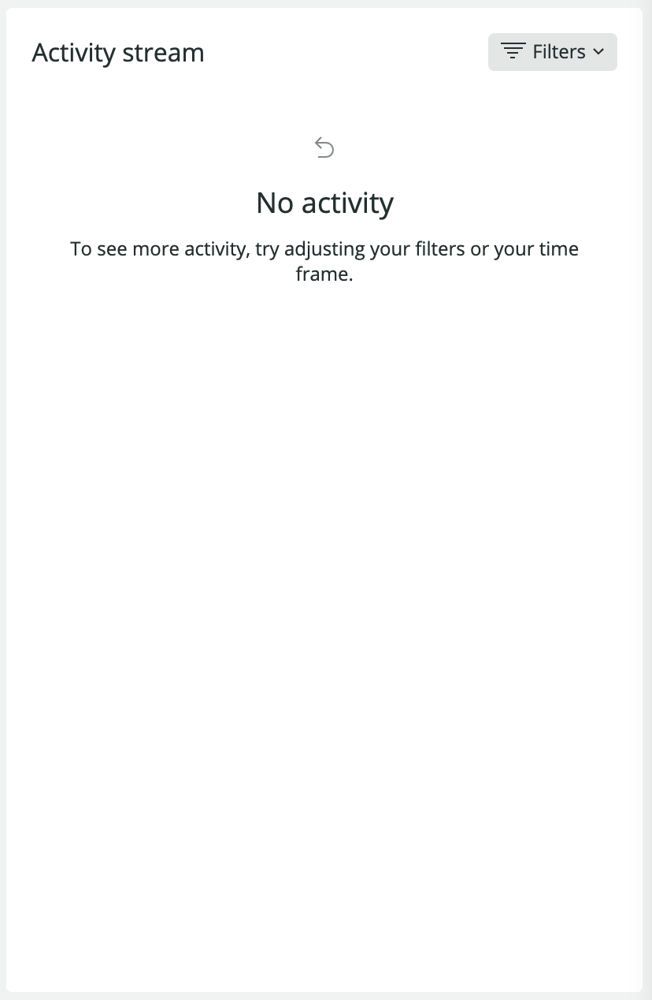

The Kubernetes APM **Summary** page provides general information about the selected cluster, including the age of the current deployment, the number of pods available, CPU and memory usage, pod logs, and metric comparison.

<figcaption>[one.newrelic.com](one.newrelic.com) > **Explorer** > Select your cluster > **Kubernetes**</figcaption>

<Callout variant="tip">
  To get a high-level overview of all your applications and services, use the [New Relic explorer](/docs/new-relic-one/use-new-relic-one/ui-data/new-relic-one-entity-explorer).
</Callout>

## Requirements [#requirements]

Are there any requirements?

## Monitor your Kubernetes cluster [#monitor-kubernetes]

You can check the following information about your Kubernetes cluster:

### Header [#header]

You can see your cluster name, deployment, and namespace. If you click the cluster name and the deployment, you'll get some details about each of them in a pop-up window.

In the **Instances** drop-down, you can select a single pod instance of your service.   

### Current deployment [#current-deployment]

You can check the age of the kubernetes deployment, how many pods are available or desired, and the pods that are missing.

### Performance summary for the deployment [#performance-summary]

You can see the CPU and memory utilization, as well as the number of pod restarts.

### Pods and Containers [#pods-and-containers]

You can check pod and their related containers details. In addition, with the **Logs** button, you can see the logs in context to that pod.

### Activity stream [#activity-stream]

You can see the stream of Kubernetes events related to that deployment and its pods.

### Metrics Comparison [#metrics-comparison]

These widgets let you compare a static list of metrics related to the pods-containers in the deployment, as well as other metrics such as CPU, network, storage.

