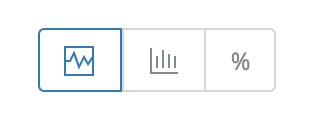

APM and browser monitoring have different types of charts available, including:

* [Response time charts](#time)
* [Histograms](#histogram)
* [Percentile line graphs](#percent)

For example, on the APM summary UI page, the chart types are represented with these icons:

## Response time charts [#time]

Response time charts are color-coded stacked bar charts. Response time is the duration of a [transaction](/docs/apm/transactions/intro-transactions/transactions-new-relic-apm) from the perspective of the requester, and not necessarily the total sum of all time spent within a transaction.

The relationship between response time and total amount of time reflects how much concurrency is taking place within the instrumented code in your application.

<table>
  <thead>
    <tr>
      <th style={{ width: "100px" }}>
        Response time
      </th>

      <th>
        Compared to total time
      </th>
    </tr>
  </thead>

  <tbody>
    <tr>
      <td style={{ textAlign: "center" }}>
        **&lt;**
      </td>

      <td>
        If response time is **less than** the total time spent, you are taking advantage of concurrency with a non-blocking or asynchronous computing model. It's important to note that just a single asynchronous method running concurrently can cause this scenario to occur.
      </td>
    </tr>

    <tr>
      <td style={{ textAlign: "center" }}>
        **\\=**
      </td>

      <td>
        If response time is **equal to** the total time spent, you may be using a blocking or synchronous computing model.
      </td>
    </tr>

    <tr>
      <td style={{ textAlign: "center" }}>
        **>**
      </td>

      <td>
        If response time is **greater than** the total time spent, this may be due to resource contention. For example, if the response work runs in a highly contended thread pool, other jobs must finish before the response can complete. (The agent does not track time spent waiting for resources.)
      </td>
    </tr>
  </tbody>
</table>

## Histogram charts [#histogram]

Histogram charts show the response time distribution for a selected time period.

Large outliers and long "tails" are common on browser charts showing histograms. To help provide data in meaningful buckets, we intentionally cut off histogram data at the 95th percentile. Otherwise the histogram might need to be twice its size or more to accommodate a small percentage of outliers. End user response time in browser monitoring also is clamped.

## Percentile charts [#percent]

For features that provide percentile charts (like APM and browser monitoring), we provide several percentile values to help you better understand response times:

* 99%: indicates that 99% of the response times occurred below this line. This is useful to find outliers.
* 95%: indicates that 95% of the response times occurred below this line. This is useful for setting standards.
* Median: indicates where half of the response times are higher than this value, and half are lower.
* Average: average of all responses

The percentile chart shows data for the selected app, not multiple apps that may be monitored by a single agent.
