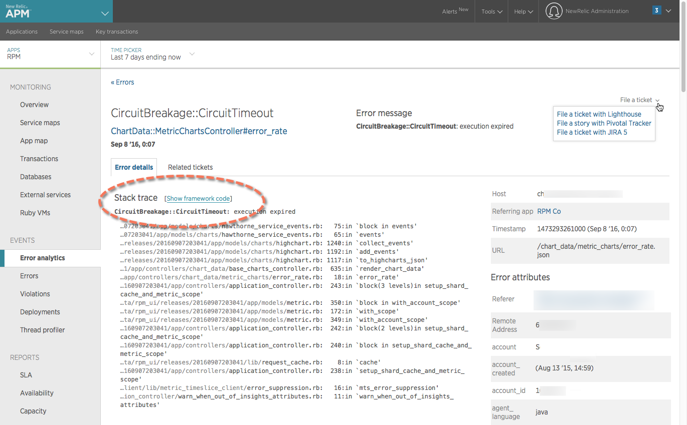

New Relic APM's [**Error analytics** page](/docs/apm/applications-menu/error-analytics/error-analytics-explore-events-behind-errors) includes detailed information about error traces. By default, the **Error traces** table shows the most recent error traces, grouped by transaction name and error class. You can also filter traces, change the sort order, and drill down into more detailed error information for a selected trace, including:

* Stack trace details
* Framework code underlying the stack trace
* [Default attributes](/docs/insights/new-relic-insights/decorating-events/error-event-default-attributes-insights) and [custom attributes](/docs/traces/collecting-custom-attributes) from New Relic Insights that relate to the specific occurrence of the error
* The related transaction (via the link to [New Relic APM's **Transactions** page](/docs/apm/applications-menu/monitoring/transactions-page))

If you have [integrated your ticketing system with New Relic](/docs/data-analysis/user-interface-functions/share-your-data/ticketing-integrations-jira-lighthouse-pivotal-tracker), you can also view related tickets or stories, or file a new ticket or story with that system.

<Callout variant="tip">
  Access to this feature depends on your [subscription level](https://newrelic.com/application-monitoring/features/edition).
</Callout>

## View error trace details

<Callout variant="tip">
  To get a high-level overview of all your applications and services, use the [entity explorer](/docs/new-relic-one/use-new-relic-one/ui-data/new-relic-one-entity-explorer) in New Relic One.
</Callout>

**[rpm.newrelic.com/apm](https://rpm.newrelic.com/apm) > (select an app) > Events > Error analytics > (selected trace):** From the **Error traces** table, select any error trace. To drill down even further from the selected error's **Stack trace** details, select **Show framework code**.

To examine and act on details about an error trace:

1. Go to New Relic APM's **Error analytics** page.

   <CollapserGroup>
     <Collapser
       id="in-nrone"
       title="In New Relic One"
     >
       * Go to **[one.newrelic.com](https://one.newrelic.com) > Entity explorer > (select an app)**, then click the **Error rate** table's title for your selected app.

         OR
       * Go to **[one.newrelic.com](https://one.newrelic.com) > Entity explorer > (select an app) > Explore performance > Error analytics**.

       For more information, see the documentation about [navigating core UI components](/docs/new-relic-one/use-new-relic-one/get-started/new-relic-one-core-ui-components) in New Relic One.
     </Collapser>

     <Collapser
       id="in-apm"
       title="In New Relic APM"
     >
       * Go to **[rpm.newrelic.com/apm](https://rpm.newrelic.com/apm) > (select an app) > Events > Error analytics**.

         OR
       * Go to **[rpm.newrelic.com/apm](https://rpm.newrelic.com/apm) > (select an app) > Monitoring > Overview**, then click the **Error rate** table's title for your selected app.

       Use any of New Relic's [standard page functions](/docs/accounts-partnerships/education/getting-started-new-relic/standard-page-functions) to drill down into detailed information.
     </Collapser>
   </CollapserGroup>
2. From the [**Error traces** table](/docs/apm/applications-menu/error-analytics/error-analytics-explore-events-behind-errors#traces-table), review the list of error traces for the selected time period.
3. To change the sort order, select any column header.
4. To view details about a specific trace, including stack trace and framework code, host, timestamp, URL, and [default attributes](/docs/insights/new-relic-insights/decorating-events/error-event-default-attributes-insights) or [custom attributes](/docs/traces/collecting-custom-attributes) from New Relic Insights: From the [**Error traces** table](/docs/apm/applications-menu/error-analytics/error-analytics-explore-events-behind-errors#traces-table), select the transaction name.
5. To view [related transaction details](/docs/apm/applications-menu/monitoring/transactions-page): Below the trace detail's error trace name, select the transaction name.
6. To share the error trace details, select the [ticketing integration](https://docs.newrelic.com/docs/using-new-relic/user-interface-functions/share-your-data/ticketing-integrations-lighthouse-pivotal-tracker) link. Or, to view any tickets already filed from the ticketing integration, select **Related tickets**.
7. To return to the [**Error analytics** page](/docs/apm/applications-menu/error-analytics/error-analytics-explore-events-behind-errors), select **Errors**.

<Callout variant="tip">
  If the error category does not have any associated trace detail during the time period, the category will appear gray, and you cannot select it. Try removing some error filters or expanding your time window.
</Callout>

## Disable error traces

To prevent certain errors from being reported to New Relic, disable them in your agent's configuration file. For most agents, you can ignore certain error codes or disable errors completely. For more information, see your specific agent's configuration documentation:

* [C SDK](https://github.com/newrelic/c-sdk/blob/master/GUIDE.md#error-instrumentation)
* Go (not applicable; the agent only reports errors when configured to do so)
* [Java](/docs/agents/java-agent/configuration/java-agent-configuration-config-file#Error_Collector)
* [.NET](/docs/agents/net-agent/installation-configuration/net-agent-configuration#error_collector)
* [Node.js](/docs/agents/nodejs-agent/installation-configuration/nodejs-agent-configuration#error_config)
* [PHP](/docs/agents/php-agent/configuration/php-agent-configuration#inivar-misctt-settings)
* [Python](/docs/agents/python-agent/installation-configuration/python-agent-configuration#error-collector-settings)
* [Ruby](/docs/agents/ruby-agent/installation-configuration/ruby-agent-configuration#error_collector)

## Delete error traces

<Callout variant="caution">
  You cannot recover error traces after you delete them.
</Callout>

<Table>
  <thead>
    <tr>
      <th style={{ width: "200px" }}>
        **If you want to...**
      </th>

      <th>
        **Do this...**
      </th>
    </tr>
  </thead>

  <tbody>
    <tr>
      <td>
        Delete all error traces for your app
      </td>

      <td>
        <Callout variant="tip">
          **Owner, Admins, or [add-on managers](/docs/accounts-partnerships/accounts/account-setup/add-roles-permissions)**
        </Callout>

        To delete all error traces for an app:

        1. Go to **[rpm.newrelic.com/apm](https://rpm.newrelic.com/apm) > (select an app) > Events > Error analytics**.
        2. Select <Icon name="trash-2"/>
           **Delete all errors**.
      </td>
    </tr>

    <tr>
      <td>
        Delete all error traces for your account
      </td>

      <td>
        To delete all error traces for your New Relic account, get support at [support.newrelic.com](https://support.newrelic.com).
      </td>
    </tr>

    <tr>
      <td>
        Delete individual error traces
      </td>

      <td>
        To [delete individual error traces](/docs/apm/applications-menu/events/viewing-apm-errors-error-traces#deleting), use New Relic APM's **Errors** page.
      </td>
    </tr>
  </tbody>
</Table>

In addition to deleting error traces, you may also want to delete [transaction traces](/docs/traces/deleting-transaction-traces) or [database/slow SQL traces](/docs/applications-menu/database-and-slow-sql#db_deleting). This will remove potentially sensitive data while retaining your other application data (such as Apdex, deployment information, etc.).
