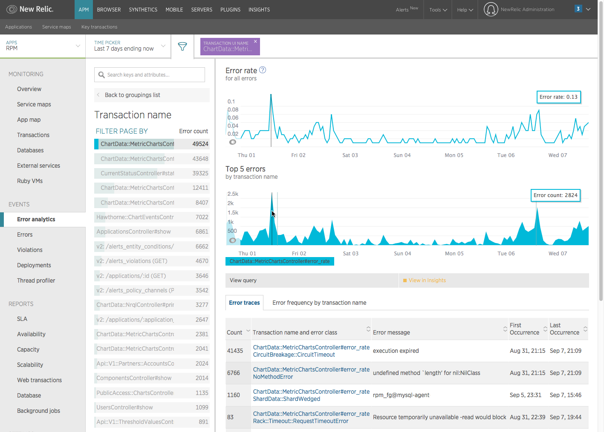

The APM error analytics feature gives you useful tools to analyze and resolve errors being reported by your applications. For example, DevOps teams can:

* Assess the health of your applications with fine-grained data on error events over the past eight days.
* Select which parameters to use to group and show error information in the UI; for example, error class, error message, host, transaction name, etc.
* Drill down into stack trace details to diagnose and resolve specific errors.
* Identify continuing trends in error rates for periods longer than eight days.

<Callout variant="tip">
  Access to this feature depends on your [subscription level](https://newrelic.com/application-monitoring/features/edition).
</Callout>

## Analyze and share errors

The error analytics feature automatically groups errors by their class so you can immediately see where to focus your attention. You can also apply filters and use the **Group by** function to help pinpoint the underlying problems or patterns according to criteria most important to you.

You can also use links in the **Error analytics** UI to share error data through [New Relic Insights](/docs/insights/new-relic-insights/understanding-insights/new-relic-insights) dashboards or through [your organization's ticketing system](/docs/data-analysis/user-interface-functions/share-your-data/ticketing-integrations-jira-lighthouse-pivotal-tracker). Sharing actionable data will allow you to coordinate your resources and resolve errors more quickly.

## View options

<Callout variant="tip">
  To get a high-level overview of all your applications and services, use the [entity explorer](/docs/new-relic-one/use-new-relic-one/ui-data/new-relic-one-entity-explorer) in New Relic One.
</Callout>

Depending on your account level, New Relic agent, and time window, New Relic APM's [**Error analytics** page](/docs/apm/applications-menu/error-analytics/error-analytics-explore-events-behind-errors) provides two different data views with different [data retention](/docs/accounts-partnerships/accounts/account-billing-usage/data-retention#product-apm) periods. Both views include error traces.

<Table>
  <thead>
    <tr>
      <th style={{ width: "200px" }}>
        **Data view**
      </th>

      <th>
        **Comments**
      </th>
    </tr>
  </thead>

  <tbody>
    <tr>
      <td>
        [Error events](/docs/apm/applications-menu/error-analytics/error-analytics-explore-events-behind-errors#error_event)
      </td>

      <td>
        The comprehensive error events view is available for New Relic agents with the [supported agent version](#error-views) for time periods within the past eight days.

        <Callout variant="tip">
          Access to this feature depends on your [subscription level](http://newrelic.com/application-monitoring/pricing).
        </Callout>
      </td>
    </tr>

    <tr>
      <td>
        [Error metrics](/docs/apm/applications-menu/error-analytics/error-analytics-explore-events-behind-errors#error_metric)
      </td>

      <td>
        New Relic APM provides the basic error metrics view to:

        * All account types
        * Any time period that falls outside or extends beyond the past eight days
        * Every New Relic agent that does not support error events
      </td>
    </tr>
  </tbody>
</Table>

**[rpm.newrelic.com/apm](https://rpm.newrelic.com/apm) > (select an app) > Events > Error analytics:** Here is an example of the error events view, grouping by transactions and filtering to a specific transaction name. Both the error events and error metrics views include error traces.

The **Error analytics** events view includes these features:

<Table>
  <thead>
    <tr>
      <th style={{ width: "200px" }}>
        **Error analytics UI**
      </th>

      <th>
        **Features**
      </th>
    </tr>
  </thead>

  <tbody>
    <tr>
      <td>
        [**Error rate**](/docs/apm/applications-menu/error-analytics/error-analytics-explore-events-behind-errors#error-rate-chart) chart
      </td>

      <td>
        The first chart, **Error rate**, shows the overall error rate to provide context.
      </td>
    </tr>

    <tr>
      <td>
        [**Top 5 errors**](/docs/apm/applications-menu/error-analytics/error-analytics-explore-events-behind-errors#top5-errors-chart) chart
      </td>

      <td>
        The second chart, **Top 5 errors**, shows error counts. Error counts reflect the totals for the selected group based on the current filters.

        By default, these are grouped by error class, but you can change the grouping option by selecting **Back to groupings list**.
      </td>
    </tr>

    <tr>
      <td>
        [**Error traces** table](/docs/apm/applications-menu/error-analytics/error-analytics-explore-events-behind-errors#traces-table)
      </td>

      <td>
        The **Error traces** table includes links to individual traces with additional details. When grouping by error class and filtering by transaction name, the counts match those listed in the **Error traces** table.
      </td>
    </tr>

    <tr>
      <td>
        [**Error frequency** heatmap](/docs/apm/applications-menu/error-analytics/error-analytics-explore-events-behind-errors#frequency-time)
      </td>

      <td>
        The **Error frequency** heatmap uses shades of color to help you immediately see increasing severity levels of problems in time blocks.
      </td>
    </tr>
  </tbody>
</Table>

## Event and metric view compatibility

The ability to view error events, error metrics, and detailed error traces from the **Error analytics** page depends on your New Relic agent version. For more information, search your APM language agent's [release notes](/docs/release-notes/agent-release-notes). However, regardless of which agent version you have, you still have the ability to view error rate and error trace information from New Relic APM's [legacy **Errors** page](/docs/apm/applications-menu/events/viewing-apm-errors-error-traces).

What the New Relic agent defines as an error will depend on the agent. For example, HTTP errors are unhandled exceptions thrown by the application and are not related to HTTP error code. In most cases, the HTTP errors are neither sent nor received by the application. Instead, HTTP errors typically will match a `400` or `500` error response.
