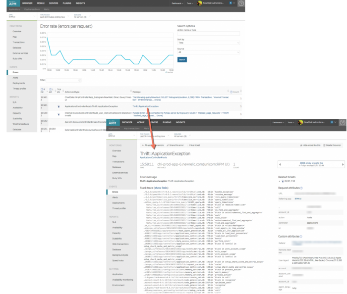

Legacy

<Callout variant="caution">
  On December 1, 2015, New Relic released a [new **Error analytics** page](/docs/apm/applications-menu/error-analytics/introduction-error-analyticss) in APM for customers using the most recent agent versions for Java, Node.js, PHP, Python, and Ruby. Error analytics support was added to the .NET agent in [March of 2017](https://discuss.newrelic.com/t/net-agent-adds-support-for-error-analytics-and-error-events/46657).

  This document is for the legacy **Errors** page. This page will be retired in favor of the Error analytics experience in the future.
</Callout>

New Relic APM's **Errors** page shows a chart with the error rate percentage for the selected time period. It also shows a list of error messages. You can view and drill down details, use search and sort options, hide or delete the error, share it with others, or file a ticket about it.

The **Errors** chart also appears on the selected app's [Overview](/docs/applications-menu/applications-overview) page. If the chart shows errors, you can select its **Error rate** title to go directly to this Errors page.

<Video
  type="wistia"
  id="lch8ml2qn0"
/>

<i className="fa fa-play-circle-o">
  \[video link]
</i>

To learn about using transaction traces and traced errors to troubleshoot your app, watch this video (approximately 16 minutes).

## View the Errors page

**APM > (selected app) > Events > Errors**: Here is an example of the Errors page and message details for the selected error.

To view, use search options, or delete errors:

1. Go to **[rpm.newrelic.com/apm](https://rpm.newrelic.com) > (select an app) > Events > Errors**.
2. Use any of New Relic's standard [user interface functions](/docs/accounts-partnerships/education/getting-started-new-relic/new-relic-user-interface) to drill down into detailed information.
3. To view an error message's details, select its **Message** link.

From here you can:

* Share the error message with others by email.
* File a ticket about it; for example, by using a [ticketing system integrated with New Relic](/docs/using-new-relic/user-interface-functions/share-your-data/ticketing-integrations-lighthouse-pivotal-tracker).
* Delete or hide the error.
* Return to the **Errors** page.

New Relic agents only report a sample of error messages. This is why the number of error messages listed may not equal the total error count in the tooltip that appears when you mouse over the **Error rate** chart.

## Error trace details

Here is a summary of the data available in the **Error trace detail** page. The labels on the example page are used to identify the data available.

<Table>
  <thead>
    <tr>
      <th width={200}>
        Label
      </th>

      <th>
        Explanation
      </th>
    </tr>
  </thead>

  <tbody>
    <tr>
      <td>
        Time
      </td>

      <td>
        The time at which the error occurred.
      </td>
    </tr>

    <tr>
      <td>
        Instance
      </td>

      <td>
        The instance of the application on which the error was reported. Format:

        `Server name (application name)`
      </td>
    </tr>

    <tr>
      <td>
        Count
      </td>

      <td>
        The number of times this error message was encountered during the selected time range.
      </td>
    </tr>

    <tr>
      <td>
        Similar errors to this
      </td>

      <td>
        The number shown here plus the `COUNT` is the total number of times this error occurred during the time range indicated. The arrows allow you change the time range.
      </td>
    </tr>

    <tr>
      <td>
        Error message
      </td>

      <td>
        The text of the error message selected. It is reproduced at the top of the trace detail page.
      </td>
    </tr>

    <tr>
      <td>
        Sample stack trace
      </td>

      <td>
        The trace back resulting from the error.
      </td>
    </tr>
  </tbody>
</Table>

## Disable error traces

If there are errors you do not want reporting to New Relic, disable them in the configuration file for your agent. For most agents, you can ignore certain error codes or disable errors completely. For more information, see your specific agent configuration documentation.

## Delete error traces

<Callout variant="caution">
  You **cannot** recover error traces after you delete them.
</Callout>

<Table>
  <thead>
    <tr>
      <th style={{ width: "200px" }}>
        **If you want to...**
      </th>

      <th>
        **Do this...**
      </th>
    </tr>
  </thead>

  <tbody>
    <tr>
      <td>
        Delete individual error traces
      </td>

      <td>
        To delete an individual error trace:

        1. Go to **[rpm.newrelic.com/apm](https://rpm.newrelic.com) > (select an app) > Events > Errors**.
        2. Select the error message.
        3. Select **Delete this error**.
      </td>
    </tr>

    <tr>
      <td>
        Delete all error traces for your app
      </td>

      <td>
        <Callout variant="tip">
          **Owner or Admins**
        </Callout>

        To delete all error traces for the selected app:

        1. Go to **[rpm.newrelic.com/apm](https://rpm.newrelic.com) > (select an app) > Events > Errors**
        2. Select **Delete all errors**.
      </td>
    </tr>

    <tr>
      <td>
        Delete all error traces for your account
      </td>

      <td>
        To delete all error traces for your New Relic account, get support at [support.newrelic.com](https://support.newrelic.com).
      </td>
    </tr>
  </tbody>
</Table>

If you are doing general record cleanup, you may also want to delete [transaction traces](/docs/traces/deleting-transaction-traces) or [database queries](/docs/applications-menu/database-and-slow-sql#db_deleting). This will remove potentially sensitive data while retaining your other application data (such as Apdex, deployment information, etc.).
