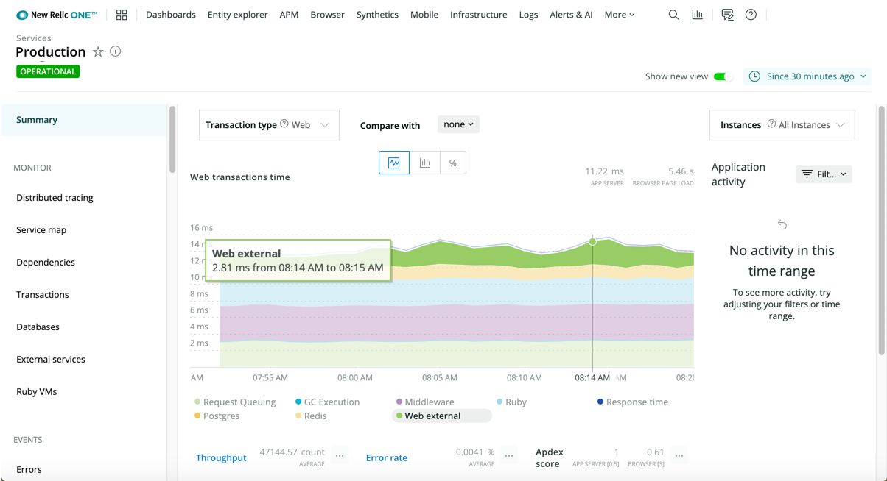

import { Link } from 'gatsby'

Your Dev/Ops teams need to know why a performance blocker comes from the application itself, CPU availability, database loads, or something else entirely unexpected. You also need to optimize app performance wherever possible.

With New Relic's [Application Performance Monitoring (APM)](/docs/apm/new-relic-apm/getting-started/introduction-new-relic-apm), you have real-time and trending data about performance for your [web apps](/docs/apm/transactions/intro-transactions/transactions-new-relic-apm) and [processes (non-web apps)](/docs/apm/transactions/intro-transactions/monitor-background-processes-other-non-web-transactions). In addition, with [New Relic One](/docs/new-relic-one/use-new-relic-one/get-started/introduction-new-relic-one), you can correlate your app's related services, alerts, logs, your infrastructure, and your corresponding mobile app experience.

Don't just monitor your data to get details about what's happening at a particular point of time. Instead, use the collective power of New Relic One to understand what to do with your detailed data, across your entire stack.

Starting from your APM summary page in New Relic One, dive into the wealth of charts showing current and historical trends about your app's performance. Then query, visualize, and act on that data in New Relic One.

<Icon
  name="check-square"
  size="3em"
/>

**Get started.**

* [Learn](/docs/apm/new-relic-apm/getting-started/introduction-new-relic-apm) about the wealth of APM data automatically available to you.
* [Install your APM language agent](/docs/agents/manage-apm-agents/installation/installing-agent) from New Relic One, then start seeing actionable performance data in the [APM UI](/docs/apm/apm-ui-pages).
* Monitor your own [business-critical key transactions](/docs/apm/transactions/key-transactions/introduction-key-transactions).

<Icon
  name="sort-desc"
  size="3em"
/>

**Analyze current state.**

* Use [real time streaming](/docs/agents/manage-apm-agents/agent-data/real-time-streaming) to query and visualize data in near real time.
* Monitor your apps and related hosts as a color-coded [health map](/docs/using-new-relic/cross-product-functions/troubleshooting/introduction-health-maps).
* Review [deployment impacts](/docs/apm/applications-menu/events/deployments-page-view-impact-your-app-users) in our UI or [REST API](/docs/apis/rest-api-v2/application-examples-v2).

<Icon
  name="alert-triangle"
  size="3em"
/>

**Troubleshoot and resolve problems.**

* Use [alerts](/docs/alerts/new-relic-alerts/getting-started/introduction-new-relic-alerts) and [Applied Intelligence](/docs/new-relic-one/use-new-relic-one/new-relic-ai/introduction-new-relic-ai) for key performance indicators.
* Track down abnormal app performance with [transaction traces](/docs/apm/transactions/transaction-traces/introduction-transaction-traces), [distributed tracing](/docs/apm/distributed-tracing/getting-started/introduction-distributed-tracing), and [slow database queries](/docs/apm/applications-menu/monitoring/databases-slow-queries-page).
* Find and fix errors with [error analytics](/docs/apm/applications-menu/error-analytics/introduction-error-analytics) tools and profiles of [error trends](/docs/apm/applications-menu/error-analytics/error-profiles-troubleshoot-trends).

<Icon
  name="tool"
  size="3em"
/>

**Optimize your apps.**

* Improve [user satisfaction levels (Apdex)](/docs/apm/new-relic-apm/apdex/apdex-measuring-user-satisfaction) on your app's frontend and backend.
* Get comparative data about app performance with your summary page's **Compare with** option.
* Compare your app's performance to the [webpage lifecycle](/docs/apm/applications-menu/monitoring/apm-overview-page#browser_details), [browser-side traces](/docs/synthetics/new-relic-synthetics/using-monitors/collect-synthetics-transaction-traces), or [host and server resources](/docs/apm/applications-menu/monitoring/apm-overview-page#infra-server).

<Icon
  name="bar-chart"
  size="3em"
/>

**Get actionable data.**

* [Query](/docs/using-new-relic/data/understand-data/query-new-relic-data) any data type (including [metrics, events, logs, and traces](/docs/using-new-relic/data/understand-data/new-relic-data-types)) via UI or API.
* Add [custom values](/docs/insights/insights-data-sources/custom-data/insert-custom-events-new-relic-apm-agents) to query the exact data you need.
* Review service level agreement [(SLA) reports and other performance reports](/docs/apm/reports) to find areas for improvement.

<Icon
  name="bar-chart-2"
  size="3em"
/>

**Visualize your data.**

* Create and share a variety of [charts and dashboards](/docs/dashboards/new-relic-one-dashboards/get-started/introduction-new-relic-one-dashboards) that include customer context with business priorities and expected outcomes.
* Add [custom values](/docs/insights/insights-data-sources/custom-data/insert-custom-events-new-relic-apm-agents) to your queries.
* Examine architectural connections and dependencies with [service maps](/docs/data-analysis/service-maps/get-started/introduction-service-maps).

<Button
  role="button"
  as={Link}
  to="/docs/apm?toc=true"
  variant="primary"
>
  View all APM docs
</Button>
