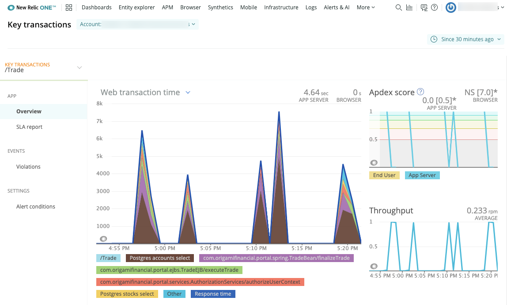

In APM, you can make a transaction a **key transaction** when you want it to have a custom level of monitoring, or when you want it to have its own [alert policy](/docs/apm/transactions/key-transactions/view-key-transactions-alert-information). These may be [web transactions](/docs/using-new-relic/welcome-new-relic/getting-started/glossary#transaction) or [non-web transactions](/docs/using-new-relic/welcome-new-relic/getting-started/glossary#non-web-transaction) that are important to your business.

For most New Relic agents, a key transaction can be any type of transaction. For the PHP, Node.js, and Go agents, only **web transactions** can be turned into key transactions.

## What are key transactions? [#overview]

In APM, making a [transaction](/docs/apm/transactions/intro-transactions/transactions-new-relic-apm) a **key transaction** gives you the following benefits:

* Key transactions are grouped together in the New Relic UI, so they are easy to find and examine.
* You can [set a custom Apdex threshold](/docs/apm/transactions/key-transactions/create-key-transactions#apdex) for a key transaction.
* You can set an [alert policy](/docs/apm/transactions/key-transactions/view-key-transactions-alert-information) for a key transaction.

Key transactions are useful for:

* **Important transactions.** For your app's most important transactions, making them key transactions means you can quickly find and examine them. You can set stricter Apdex requirements for them, and you can create alert policies for them.
* **Slow transactions.** If a transaction is regularly slower than other transactions, it can bring down the Apdex score of the entire application. When you make a transaction a key transaction, you can set a longer-duration Apdex threshold for it so it won't bring down your app's Apdex score.

## Create key transactions [#create]

To create key transactions, see [Create and update key transactions](/docs/apm/transactions/key-transactions/create-update-key-transactions).

## View key transactions in UI [#find]

<figcaption>
  The key transaction's page includes response time and throughput charts, service-level agreement information, a cross application tracing map (if available), and links to alert policy options.
</figcaption>

The **key transaction index** is a list of your key transactions:

1. Go to **[one.newrelic.com](https://one.newrelic.com) > More > Key transactions > (select a transaction)**.
2. Select a **Key transaction** from the index.
3. View the selected key transaction's [**Summary** page](/docs/apm/transactions/key-transactions/viewing-key-transactions), including charts and drilldown options.
