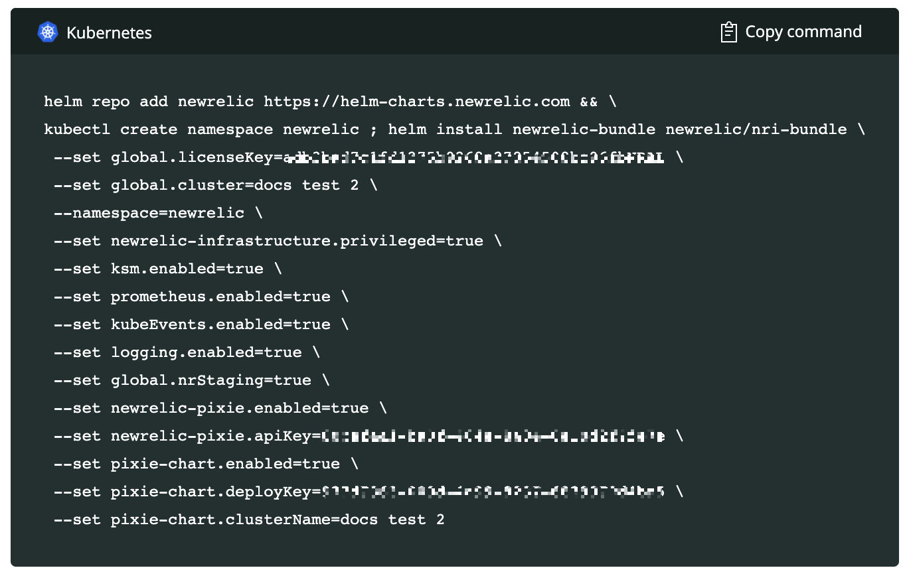

When we say auto-telemetry, we’re not talking about cars &mdash; we're talking about instant baseline visibility into your Kubernetes clusters. With the New Relic One integration with [Pixie](https://pixielabs.ai/), you get similar data to traditional language agents, but without manually instrumenting your code or redeploying your application. 

Pixie auto-telemetry is powered by [eBPF](https://ebpf.io/), a virtual machine-like construct that enables Pixie to seamlessly collect fine-grained telemetry data &mdash; service-level metrics, unsampled requests, and more. With one install command, you get deeper insight into your Kubernetes clusters and workloads. No language agents required.

<figcaption>
   **Live debugging with Pixie** shows a service graph listing the namespaces and the node that are available on the current cluster. 
</figcaption>

Simply put, Auto-telemetry with Pixie offers the quickest option for getting observability into your Kubernetes services.

## Why it matters 

Our Pixie integration gives you the best of both worlds: Pixie’s fast and simple Kubernetes observability coupled with New Relic One’s incident correlation, intelligent alerting, and long-term retention. 

You’ll get visibility into HTTP services using golden signals, HTTP transactions, database transactions, distributed tracing, and JVM metrics. You can operate, debug, and scale your Kubernetes clusters based on the information you learn about how your clusters and services are running. Using the New Relic [Explorer](/docs/new-relic-one/use-new-relic-one/core-concepts/new-relic-explorer-view-performance-across-apps-services-hosts/), you can see key metrics and events at every level, starting with the cluster, and diving down into namespaces, deployments, and pods. You can quickly spot anomalous behavior, and where it’s happening. 

And then dive deeper using embedded visualizations of your Pixie data. Quickly identify hot spots with [Flamegraph](#flamegraph). On the [Live debugging with Pixie tab](#live-debugging), answer questions like what SQL requests your app is making or which services are talking to each other. 

<Callout variant="important">
Auto-Telemetry with Pixie leverages [Community Cloud with Pixie](http://pixielabs.ai/), a separate platform from New Relic One. Use of Community Cloud with Pixie is subject to separate [terms of service](https://pixielabs.ai/terms).
</Callout>

## Install Auto-telemetry with Pixie

Use our [guided installation](/docs/full-stack-observability/observe-everything/get-started/new-relic-guided-install-overview/) process to install Auto-telemetry with Pixie. This deploys Pixie with New Relic's Kubernetes integration on your cluster. You don't need to do any further configuration or installation to start using Pixie.

If you want to install Auto-telemetry with Pixie on multiple clusters, re-run the guided install for each additional cluster.

### Before you begin

* Review this [Pixie data security overview](/docs/auto-telemetry-pixie/pixie-data-security-overview) for actions to take to secure your data.
* Make sure you have sufficient memory: Pixie requires 2Gb of memory per node in your cluster.

<Callout variant="important">
If you are already a Pixie user, you must still install using the guided installation steps described below. This will provide the API keys that you need.
</Callout>

### Install from the beginning of the guided install process

1. Open our [New Relic One guided install](https://one.newrelic.com/launcher/nr1-core.home?pane=eyJuZXJkbGV0SWQiOiJucjEtY29yZS5ob21lLXNjcmVlbiJ9&cards[0]=eyJuZXJkbGV0SWQiOiJucjEtaW5zdGFsbC1uZXdyZWxpYy5ucjEtaW5zdGFsbC1uZXdyZWxpYyIsImFjdGlvbkluZGV4IjoxLCJpc0xvYWRpbmdUcmVhdG1lbnRzIjpmYWxzZSwicHJldkFjdGl2ZUNvbXBvbmVudCI6bnVsbCwiYWN0aXZlQ29tcG9uZW50IjoiVlRTT1NlbGVjdEFjY291bnQiLCJhY3RpdmVFbnZpcm9ubWVudCI6bnVsbCwidXNlckhhc011bHRpcGxlQWNjb3VudHMiOnRydWUsInNob3duRXhwZXJpbWVudCI6dHJ1ZSwicGF0aCI6Imd1aWRlZCJ9).
2. Select the account you want to use for the guided install, and click **Continue**.
   Note: if you have a single account, you won't see this option.
3. Select **Kubernetes** and then continue with step one in the next section.

### Install from the Configure the HELM command/manifest (yaml) file 

If you arrived in the guided installation process by following a link from Pixie or from within New Relic, your steps begin here. 

1. Select the account and cluster for the install. If needed, select a namespace.

    <Callout variant="important">
    Currently, Pixie performs best on clusters with up to 100 nodes (exceeding 100 nodes can lead to excessive memory usage and scripts failing to run). Friendly reminder: autoscaling can quickly drive up your node numbers.
    </Callout>

2. Click **Continue**.
3. Select the data you want to gather, observe, and debug, and click **Continue**.
4. On the **Choose install method** page, copy the Helm command that's provided, and then run it on your command line. See [this page about installing the Kubernetes integration using Helm](/docs/integrations/kubernetes-integration/installation/install-kubernetes-integration-using-helm/#h2-compatibility-and-requirements) to learn more about the process.

  Helm installs a bundle containing the New Relic infrastructure agent, an integration to gather Prometheus metrics and Kubernetes events, and the Pixie integration. The deployment takes a few minutes to complete. 

    

    To see the status of the install to the cluster, run `kubectl get pods -n newrelic`. 

5. Click **Continue** to open the **Listening for data** page. 
6. When you get the message, **See your data**, click **Kubernetes Cluster Explorer** to see your cluster. 

  Auto-telemetry with Pixie might restart after installation. This is caused by the auto update feature.

## Explore your cluster

In the cluster explorer, you can get a quick overview of the nodes in your cluster, including CPU, memory, and storage, as well as the status of each pod (**healthy**, **warning**, or **critical**). You can also find out what services are running in each container, their latency, throughput, and error rate. 

For more information about using the cluster explorer, see [Navigate the Kubernetes cluster explorer](https://docs.newrelic.com/docs/integrations/kubernetes-integration/understand-use-data/kubernetes-cluster-explorer/).

<Callout variant="tip">
Containers might be listed for up to four hours after they get decommissioned. 
</Callout>

You can query the Pixie data in New Relic One and create dashboards for at-a-glance monitoring. Find the data model and sample queries [here](/docs/integrations/kubernetes-integration/understand-use-data/auto-telemetry-pixie-data-model).

## Investigate usage spikes with Flamegraph [#flamegraph]

Debugging is orders of magnitude easier when you can quickly see what your application is doing. Flamegraph, a Pixie always-on visualization, requires no instrumentation, redeploying, or recompiling. It works for compiled languages like Go, C+, Rust, to name a few. And at a glance, Flamegraph tells you what functions your application is spending time on and where you have hot spots. Flamegraph is especially useful for hierarchical resource use, like disk usage and CPU utilization. For more information on how to read Flamegraph, see [the Pixie documentation](https://docs.pixielabs.ai/tutorials/profiler#reading-the-flamegraph). 

## Debug live [#live-debugging]

On the **Live debugging with Pixie** tab, run PxL scripts &mdash; scripts written in Pixie's PxL language &mdash; to view live data captured through eBPF. Select the **script** drop-down and then select a script to run in the tab. (For best results, select a time range that is recent in the time picker.) 

Scripts enable you to debug: 

* Traffic in multiple formats: HTTP and HTTPs (including encrypted), DNS, Postgres, MySQL, Cassandra, Redis (currently supporting SQL and HTTP in beta)
* Kubernetes services and their throughput, error rate, and latency statistics
* Service maps to learn which services are talking to each other
* Network traffic maps to learn which nodes are talking to each other
* JVM data

If you don't find the script you need, you can [write your own PxL scripts](https://docs.pixielabs.ai/tutorials/pxl-scripts/).
Find more information about available scripts in [Pixie's open source repo](https://github.com/pixie-labs/pixie/tree/main/src/pxl_scripts/px).

