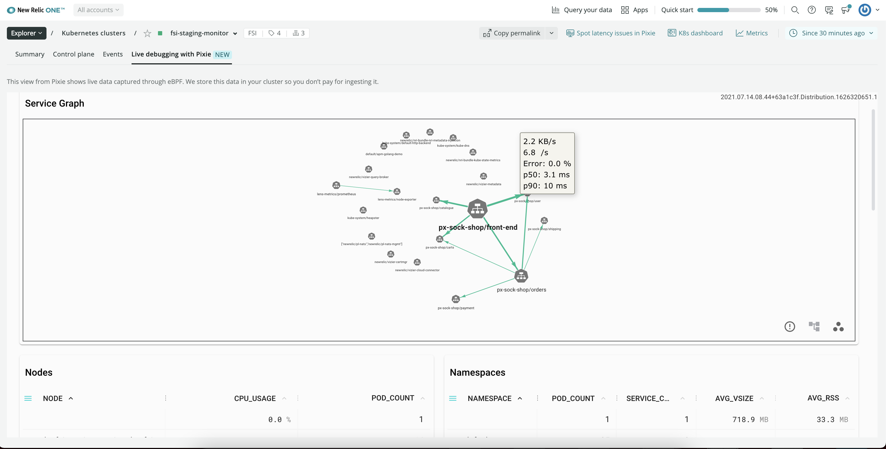

When we say auto-telemetry, we’re not talking about cars &mdash; we're talking about instant baseline visibility into your Kubernetes clusters. With the New Relic One integration with [Pixie](https://pixielabs.ai/), you get similar data to traditional language agents, but without manually instrumenting your code or redeploying your application. 

Pixie auto-telemetry is powered by [eBPF](https://ebpf.io/), a virtual machine-like construct that enables Pixie to seamlessly collect fine-grained telemetry data &mdash; service-level metrics, unsampled requests, and more. With one install command, you get deeper insight into your Kubernetes clusters and workloads. No language agents required.

<figcaption>
   **Live debugging with Pixie** shows a service graph listing the namespaces and the node that are available on the current cluster. 
</figcaption>

Simply put, Auto-telemetry with Pixie offers the quickest option for getting observability into your Kubernetes services.

## Quickly start observing and debugging Kubernetes clusters 

Our Pixie integration gives you the best of both worlds: Pixie’s fast and simple Kubernetes observability coupled with New Relic One’s incident correlation, intelligent alerting, and long-term retention. 

You’ll get visibility into HTTP services using golden signals, HTTP transactions, database transactions, distributed tracing, and JVM metrics. You can operate, debug, and scale your Kubernetes clusters based on the information you learn about how your clusters and services are running. Using the New Relic [Explorer](/docs/new-relic-one/use-new-relic-one/core-concepts/new-relic-explorer-view-performance-across-apps-services-hosts/), you can see key metrics and events at every level, starting with the cluster, and diving down into namespaces, deployments, and pods. You can quickly spot anomalous behavior, and where it’s happening. 

And then dive deeper using embedded visualizations of your Pixie data. Quickly identify hot spots with [Flamegraph](#flamegraph). On the [Live debugging with Pixie tab](#live-debugging), answer questions like what SQL requests your app is making or which services are talking to each other. 

<Callout variant="important">
Auto-Telemetry with Pixie leverages [Community Cloud with Pixie](http://pixielabs.ai/), a separate platform from New Relic One. Use of Community Cloud with Pixie is subject to separate [terms of service](https://pixielabs.ai/terms).
</Callout>

## Explore your cluster

Access the Pixie UI via New Relic's **Live debugging with Pixie** area of your Kubernetes clusters. The cluster explorer provides a quick overview of the nodes in your cluster, including CPU, memory, and storage, as well as the status of each pod (**healthy**, **warning**, or **critical**). You can also find out what services are running in each container, their latency, throughput, and error rate. 

For more information about using the cluster explorer, see [Navigate the Kubernetes cluster explorer](/docs/integrations/kubernetes-integration/understand-use-data/kubernetes-cluster-explorer/). Note that you cannot log directly into the Pixie UI unless you have created a separate Pixie login. 

<Callout variant="tip">
Containers might be listed for up to four hours after they get decommissioned. 
</Callout>

You can query the Pixie data in New Relic One and create dashboards for at-a-glance monitoring. Find the data model and sample queries [here](/docs/integrations/kubernetes-integration/understand-use-data/auto-telemetry-pixie-data-model).

## Investigate usage spikes with Flamegraph [#flamegraph]

Debugging is orders of magnitude easier when you can quickly see what your application is doing. Flamegraph, a Pixie always-on visualization, requires no instrumentation, redeploying, or recompiling. It works for compiled languages like Go, C+, Rust, to name a few. And at a glance, Flamegraph tells you what functions your application is spending time on and where you have hot spots. Flamegraph is especially useful for hierarchical resource use, like disk usage and CPU utilization. For more information on how to read Flamegraph, see [the Pixie documentation](https://docs.pixielabs.ai/tutorials/profiler#reading-the-flamegraph). 

## Debug live [#live-debugging]

On the **Live debugging with Pixie** tab, run PxL scripts &mdash; scripts written in Pixie's PxL language &mdash; to view live data captured through eBPF. Select the **script** drop-down and then select a script to run in the tab. (For best results, select a time range that is recent in the time picker.) 

Scripts enable you to debug: 

* Traffic in multiple formats: HTTP and HTTPs (including encrypted), DNS, Postgres, MySQL, Cassandra, Redis (currently supporting SQL and HTTP in beta). Learn more: [Request tracing tutorial](https://docs.px.dev/tutorials/pixie-101/request-tracing/).
* Database request performance. Learn more: [Database Query Profiling tutorial](https://docs.px.dev/tutorials/pixie-101/database-query-profiling/).
* Service maps to learn which services are talking to each other. Learn more: [Service Performance tutorial](https://docs.px.dev/tutorials/pixie-101/service-performance/). 
* Network traffic maps to learn which nodes are talking to each other. Learn more: [Network Monitoring tutorial](https://docs.px.dev/tutorials/pixie-101/network-monitoring/). 
* Monitor resource usage by Node and Pod. Learn more: [Infra health tutorial](https://docs.px.dev/tutorials/pixie-101/infra-health/).

