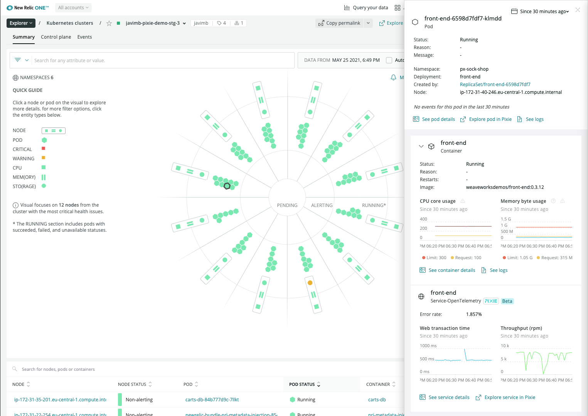

When we say auto-telemetry, we’re not talking about cars &mdash; we’re talking about automatically collecting telemetry data for your Kubernetes clusters. With our [Pixie](https://pixielabs.ai/) integration, you no longer have to manually instrument your clusters or change code. With one install command, you get observability into your Kubernetes clusters and workloads. No language agents required. 

Pixie, an open source observability tool for Kubernetes applications, collects telemetry data using [eBPF](https://ebpf.io/), a virtual machine-like construct in the Linux kernel. eBPF makes it easy to collect similar data about your clusters and workloads as with traditional New Relic language agents, but now without needing to update your code.

Simply put, Auto-telemetry with Pixie offers the quickest option for getting observability into your Kubernetes services.

## Why it matters 

Our Pixie integration gives you the best of both worlds: Pixie’s fast and simple Kubernetes observability coupled with New Relic One’s incident correlation, intelligent alerting, and long-term retention. 

You’ll get visibility into HTTP services using golden signals, HTTP transactions, database transactions, distributed tracing, and JVM metrics. You can operate, debug, and scale your Kubernetes clusters based on the information you learn about how your clusters and services are running. Using the New Relic [Explorer](/docs/new-relic-one/use-new-relic-one/core-concepts/new-relic-explorer-view-performance-across-apps-services-hosts/), you can see key metrics and events at every level, starting with the cluster, and diving down into namespaces, deployments, and pods. You can quickly spot anomalous behavior, and where it’s happening. If you need further insight, you can easily link over to Pixie's native UI for advanced debugging with PXL scripts. 

## Install Auto-telemetry with Pixie

Use our [guided installation](/docs/full-stack-observability/observe-everything/get-started/new-relic-guided-install-overview/) process to install Auto-telemetry with Pixie. This deploys Pixie with New Relic's Kubernetes integration on your cluster. You don't need to do any further configuration or installation to start using Pixie.

If you want to install Auto-telemetry with Pixie on multiple clusters, re-run the guided install for each additional cluster.

### Limitations

The following are not currently supported in Auto-telemetry with Pixie:
* OpenShift. While our New Relic infrastructure agent supports OpenShift, Pixie does not.
* RBAC. New Relic RBAC controls cannot be used to gate access to Pixie. This means the following:
		* Auto-telemetry with Pixie creates one project for all of your Kubernetes clusters
		* users from the same email domain are automatically allowed access to the project
		* all users have full permissions on the project

### Before you begin

Review this [Pixie data security overview](/docs/auto-telemetry-pixie/pixie-data-security-overview) for actions to take to secure your data.

The guided install requires the following (you can get these set up before you begin, or during the install steps):

* a [Pixie account](https://work.withpixie.ai/admin/api-keys)
  You need a Google account to sign up for Pixie.
* a Pixie API key 
* Sufficient memory: Pixie requires 2Gb of memory per node.

### Start the guided installation

1. Open our [New Relic One guided install](https://one.newrelic.com/launcher/nr1-core.home?pane=eyJuZXJkbGV0SWQiOiJucjEtY29yZS5ob21lLXNjcmVlbiJ9&cards[0]=eyJuZXJkbGV0SWQiOiJucjEtaW5zdGFsbC1uZXdyZWxpYy5ucjEtaW5zdGFsbC1uZXdyZWxpYyIsImFjdGlvbkluZGV4IjoxLCJpc0xvYWRpbmdUcmVhdG1lbnRzIjpmYWxzZSwicHJldkFjdGl2ZUNvbXBvbmVudCI6bnVsbCwiYWN0aXZlQ29tcG9uZW50IjoiVlRTT1NlbGVjdEFjY291bnQiLCJhY3RpdmVFbnZpcm9ubWVudCI6bnVsbCwidXNlckhhc011bHRpcGxlQWNjb3VudHMiOnRydWUsInNob3duRXhwZXJpbWVudCI6dHJ1ZSwicGF0aCI6Imd1aWRlZCJ9).
2. Select the account you want to use for the guided install, and click **Continue**.
   Note: if you have a single account, you won't see this option.
3. Select **Kubernetes**.
4. Type in a name for your cluster, and select the check box to **Gather telemetry automatically with Pixie**.

    <Callout variant="important">
    Currently, Pixie performs best on clusters with up to 100 nodes (exceeding 100 nodes can lead to excessive memory usage and scripts failing to run). Friendly reminder: autoscaling can quickly drive up your node numbers.
    </Callout>

    If Pixie is already running on your cluster, expand the **Advanced options** section and select the appropriate check box. We strongly recommend enabling Pixie auto update to maintain the latest Pixie version. 

5. Click **Continue**.

6. Provide your Pixie API key. If you already have a key, simply paste it in the **API key** box, and click **Continue**. 

    If you don't have an account and existing API key, click the link to [create a Pixie account](https://work.withpixie.ai/admin/api-keys). Then, on the [API key page](https://work.withpixie.ai/admin/api-keys), click **New key** to add a new key. In the **Actions** column, click the ellipsis, and then click **Copy value**. Switch back to the guided install UI, paste the value into the **API key** box, and click **Continue**.

    When you click **Continue**, the API key is added to your New Relic account, and a deploy key is created for Pixie. Your Pixie account information is now stored on your New Relic account; if you follow the install steps again, you won't be asked for this information. 

7. On the **Choose install method** page, copy the Helm command that's provided, and then run it on your command line. Helm installs a bundle containing the New Relic infrastructure agent, an integration to gather Prometheus metrics and Kubernetes events, and the Pixie integration. The deployment takes a few minutes to complete. 

    

    To see the status of the install to the cluster, run `kubectl get pods -n newrelic`. 

8. In the New Relic install UI, click **Continue** to open the **Listening for data** page. 
9. When you get the message, **See your data**, click **Kubernetes Cluster Explorer** to see your cluster. 

  Note that Auto-telemetry with Pixie might restart after installation. This is caused by the auto update feature.

## Explore your cluster

In the cluster explorer, you can get a quick overview of the nodes in your cluster, including CPU, memory, and storage, as well as the status of each pod (healthy, warning, or critical). You can also find out what services are running in each container, their latency, throughput, and error rate. For more information about using the cluster explorer, see [Navigate the Kubernetes cluster explorer](https://docs.newrelic.com/docs/integrations/kubernetes-integration/understand-use-data/kubernetes-cluster-explorer/).

<Callout variant="tip">
Containers might be listed for up to four hours after they get decommissioned. 
</Callout>

You can query the Pixie data that's available in New Relic One and create dashboards for at-a-glance monitoring. Find the data model and sample queries [here](/docs/integrations/kubernetes-integration/understand-use-data/auto-telemetry-pixie-data-model).

In addition to analyzing the performance of your clusters in New Relic One, you might want to use Pixie's advanced debugging workflows. In Pixie's native UI, you can drill down further into header and content requests. Click **Explore service in Pixie** to see information about your service in the Pixie UI. Learn more about [writing PXL scripts in the Pixie docs](https://docs.pixielabs.ai/tutorials/pxl-scripts/).

## Live debugging [#live-debugging]