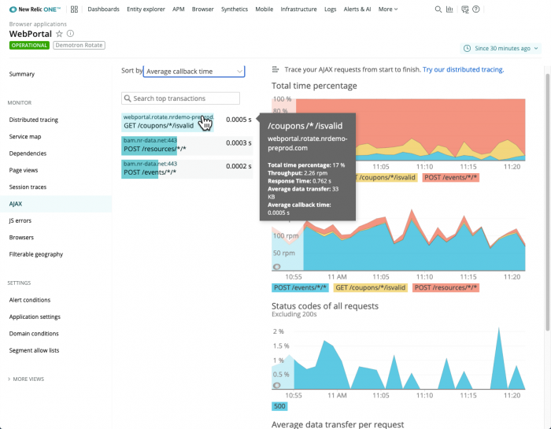
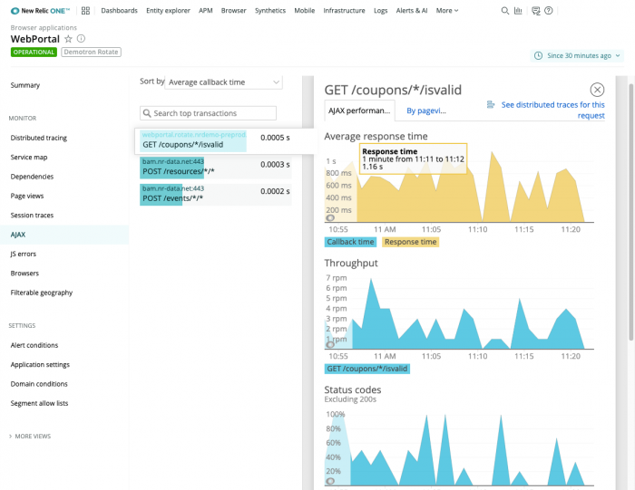

Our browser monitoring's **AJAX** UI shows recent AJAX requests from browsers to external endpoints, such as HTTP or HTTPS domains. This information helps identify problems with the end user experience when you have time-consuming or failing AJAX calls that update parts of a webpage on your site.

## What to troubleshoot [#troubleshooting]

Here are some troubleshooting tips for identifying performance problems with your app:

<table>
  <thead>
    <tr>
      <th style={{ width: "200px" }}>
        Troubleshooting AJAX calls
      </th>

      <th>
        Examples
      </th>
    </tr>
  </thead>

  <tbody>
    <tr>
      <td>
        Problems across the entire request
      </td>

      <td>
        If you're not sure where the problem is, or if you want to trace your requests from start to finish, click the [distributed tracing](/docs/browser/new-relic-browser/browser-pro-features/browser-data-distributed-tracing) link in the **AJAX** UI.
      </td>
    </tr>

    <tr>
      <td>
        Timing problems
      </td>

      <td>
        Total [time percentages](#time-percentage-example), throughput requests per minute (rpm), and average data transfer rates per request can help identify timing problems.

        * Look for large spikes in the **AJAX** summary page's **Average data transfer per request** chart.
        * From the individual call's **AJAX performance** tab, look for correlations between high callback time values and data transfer rates.
      </td>
    </tr>

    <tr>
      <td>
        Endpoint problems
      </td>

      <td>
        Look for any outlier endpoints, and investigate individual requests made from them.

        The **Status codes** chart on the **AJAX** summary page provides information about the return behavior from the call. If you see a large number of status codes outside the `200` range, this may indicate a problem with your AJAX endpoints.
      </td>
    </tr>

    <tr>
      <td>
        Specific webpage location problems
      </td>

      <td>
        Examine potential AJAX problems within the context of the page where they load. Select an AJAX transaction, then select any trace from the [**Session traces with AJAX**](/docs/browser/browser-monitoring/browser-pro-features/session-traces-explore-webpages-life-cycle) table.
      </td>
    </tr>
  </tbody>
</table>

## How to do it [#ajax-dashboard]

To troubleshoot problems with AJAX requests for your app:

* Go to **[one.newrelic.com](https://one.newrelic.com) > Browser > (select an app) > AJAX**.

  OR
* Go directly to the selected app's [**Browser summary** page](/docs/browser/browser-monitoring/getting-started/browser-summary-page), then click the **AJAX response time** chart's title.

<figcaption>
  **[one.newrelic.com](https://one.newrelic.com) > Browser > (select an app) > AJAX**: Identify problems due to time-consuming or failing AJAX calls that update parts of a webpage on your site.
</figcaption>

<CollapserGroup>
  <Collapser
    id="ajax-summary"
    title="Start with AJAX summary charts"
  >
    The summary page provides several charts to help you troubleshoot AJAX calls.

    <table>
      <thead>
        <tr>
          <th style={{ width: "200px" }}>
            AJAX summary page
          </th>

          <th>
            Comments
          </th>
        </tr>
      </thead>

      <tbody>
        <tr>
          <td>
            Groups and filters
          </td>

          <td>
            Use any of the available **Sort by** or filter options in the UI. All AJAX requests that take longer than two minutes are filtered out automatically.

            You can also [group your browser metrics by URLs](/docs/browser/new-relic-browser/configuration/group-browser-metrics-urls). For example, this is useful with allow lists and deny lists.
          </td>
        </tr>

        <tr>
          <td>
            Endpoints
          </td>

          <td>
            The **Throughput** chart shows the five endpoints with the highest throughput. If the call has more than five endpoints, they are consolidated on the chart as **Other**.
          </td>
        </tr>

        <tr>
          <td>
            Calls from New Relic
          </td>

          <td>
            You may see our own browser monitoring AJAX calls to your app. This is normal, because all activity is captured during the browser session.
          </td>
        </tr>

        <tr>
          <td>
            Missing browser data
          </td>

          <td>
            AJAX timing details are not available from IE 7, IE 8, or Chrome for iOS browsers. If you do not see expected data from other browsers, follow our [AJAX troubleshooting procedures](/docs/browser/new-relic-browser/troubleshooting/troubleshoot-ajax-data-collection).
          </td>
        </tr>
      </tbody>
    </table>
  </Collapser>

  <Collapser
    id="ajax-performancex"
    title="Get details by calls or page views"
  >
    After selecting a specific call from the **AJAX** summary page, you can drill down into detailed information with the **AJAX performance** tab. This includes a direct link to [session trace details](/docs/browser/browser-monitoring/browser-pro-features/session-traces-explore-webpages-life-cycle).

    From here you can also select the tab to get performance data by page views. (If your app server requests greatly outnumber your browser `PageView` transactions, this is because some requests to your back end are made through AJAX. For more information, see our [troubleshooting procedures](/docs/browser/new-relic-browser/troubleshooting/app-server-requests-greatly-outnumber-browser-pageview-transactions).)

    

    <figcaption>
      **[one.newrelic.com](https://one.newrelic.com) > Browser > (select an app) > AJAX > (select an AJAX call)**: This example shows performance details for a specific AJAX call. You can also view performance details by page views.
    </figcaption>

    AJAX endpoints on the **Average response time** chart appear either as four or two time periods. This depends on whether there are [cross application tracing headers](/docs/apm/transactions/cross-application-traces/cross-application-tracing#security).

    * Four time periods (**Application time**, **Queue time**, **Network time**, and **Callback time**): These AJAX calls are made against apps monitored by APM agents that provide cross application tracing headers.
    * Two time periods (**Response time** and **Callback time**): These AJAX calls are made against apps that either are not monitored by APM agents, or they are monitored by agents that do not provide cross application tracing headers.
  </Collapser>

  <Collapser
    id="distributed tracing"
    title="Trace your requests from start to finish"
  >
    To trace your requests from start to finish, you can also click the [distributed tracing](/docs/browser/new-relic-browser/browser-pro-features/browser-data-distributed-tracing) link in the **AJAX** UI.

    * To view a list of distributed traces, click the link in the **AJAX** UI at the AJAX summary level.
    * To view all traces filtered by your application and a specific request type, click the distributed tracing link for the request you select in the **AJAX** UI.
  </Collapser>

  <Collapser
    id="time-percentage-example"
    title="Time percentage example"
  >
    When you sort the AJAX category list by **Total time percentage**, the list shows the percentage for each AJAX category. Also, the chart shows the top requests with the highest time percentages.

    To present this information, browser takes the cumulative request time for each AJAX category and divides it by the cumulative request time for all AJAX requests. This helps identify where to optimize response times, because high throughput requests will be favored over low throughput requests.

    **Example: Calculating time percentages for two AJAX categories**

    This example uses two AJAX categories: `api1.example.com` and `api2.example.com`.

    * Your `api1.example.com` is hit 1 time, and it takes 1 second (1000ms) to respond (1 x 1 second = 1 second).
    * Your `api2.example.com` is hit 500 times, and it takes 1ms to respond (500 x 1ms = 500ms, or 0.5 second).

    The cumulative request time for all of your AJAX categories is 1500 ms, or 1.5 seconds. To get the time percentages, divide each AJAX category by the cumulative request time, and then multiply by 100 for the percentage.

    So `api1.example.com` is 67% (1000 divided by 1500, times 100) and `api2.example.com` is 33% (500 divided by 1500, times 100) of the total time percentage.

    <table>
      <thead>
        <tr>
          <th>
            **Time calculations**
          </th>

          <th>
            **api1**
          </th>

          <th>
            **api2**
          </th>
        </tr>
      </thead>

      <tbody>
        <tr>
          <td>
            Number of hits
          </td>

          <td>
            1
          </td>

          <td>
            500
          </td>
        </tr>

        <tr>
          <td>
            Time to respond
          </td>

          <td>
            1 second (1000ms)

            1 hit x 1000ms = 1000ms (1 second)
          </td>

          <td>
            1 millisecond (1ms)

            500 hits x 1ms = 500ms (.5 second)
          </td>
        </tr>

        <tr>
          <td>
            Cumulative request time for all AJAX categories
          </td>

          <td>
            1000ms + 500ms = 1500ms (1.5 seconds)
          </td>

          <td>
            1000ms + 500ms = 1500ms (1.5 seconds)
          </td>
        </tr>

        <tr>
          <td>
            Time percentage = Category / 1500ms cumulative request time x 100 for percentage
          </td>

          <td>
            1000ms / 1500 x 100 = 67%
          </td>

          <td>
            500ms / 1500 x 100 = 33%
          </td>
        </tr>
      </tbody>
    </table>
  </Collapser>
</CollapserGroup>

## What's next [#next]

In addition to the **AJAX** UI, you can also use these resources:

* Help prevent problems from occurring by using [alerts](/docs/alerts-applied-intelligence/new-relic-alerts/get-started/introduction-alerts) and [Applied Intelligence](/docs/alerts-applied-intelligence/new-relic-alerts/get-started/introduction-applied-intelligence) for your key performance indicators.
* Use [single-page app (SPA) monitoring](/docs/browser/single-page-app-monitoring/get-started/introduction-single-page-app-monitoring). This is valuable for any app that uses AJAX requests to pull content dynamically and create a fluid user experience.
* [Query your data](/docs/query-your-data/explore-query-data/explore-data/introduction-querying-new-relic-data) in the UI or by API. For example, you can query with [default browser events](/docs/insights/insights-data-sources/default-data/browser-default-events-insights), use [SPA `AjaxRequest`](/attribute-dictionary/?event=AjaxRequest) for geographic and browser data, or get your own [custom data](/docs/telemetry-data-platform/get-data-new-relic/getting-started/introduction-new-relic-data-ingest-apis-sdks) into New Relic.
* Visualize and share your data with [charts](/docs/insights/use-insights-ui/manage-dashboards/chart-types) and [dashboards](/docs/query-your-data/explore-query-data/dashboards/introduction-new-relic-one-dashboards).
