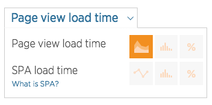

[Browser monitoring](/docs/browser/new-relic-browser/getting-started/new-relic-browser)'s **Summary** page summarizes the real-user browser performance of your app. Use the Summary page to:

* View trends in an app's browser-side performance
* Quickly troubleshoot page load timing issues
* Navigate to other Browser UI pages

## View the Summary page

To view a summary of browser performance for an app:

1. Go to [one.newrelic.com](https://one.newrelic.com), click Browser, and select an app from the [Browser index](/docs/browser/new-relic-browser/getting-started/browser-apps-index).
2. From the app's **Summary** page, use [standard New Relic page functions](/docs/data-analysis/user-interface-functions/view-your-data/standard-page-functions) to drill down into detailed information.

**[one.newrelic.com](https://one.newrelic.com) > Browser > (select an app) > Summary:** After you select an application from the New Relic Browser apps index, the **Summary** page shows a summary of browser performance for that app.

The Summary page includes:

* [Web transactions chart](#page_load)
* [Apdex score chart](#apdex-chart)
* [Throughput chart](#throughput-chart)
* For Browser Pro: Charts for [JavaScript errors, AJAX response time, and browser session traces](#other-charts)

## Web transactions chart

The **Web transactions** chart is the main chart on the Summary page. It shows a breakdown of users' browser load time, with average values for the selected time period displayed in the upper right corner of the chart. This chart appears with more detail about the [page load timing process](/docs/browser/new-relic-browser/page-load-timing-resources/page-load-timing-process) on the [**Page views** page](/docs/browser/new-relic-browser/dashboard-details/page-views-dashboard).

<CollapserGroup>
  <Collapser
    id="segments"
    title="Web transactions chart segments"
  >
    The **Web transactions** chart includes into these segments:

    <Table>
      <thead>
        <tr>
          <th style={{ width: "200px" }}>
            **Page load timing segments**
          </th>

          <th>
            **Comments**
          </th>
        </tr>
      </thead>

      <tbody>
        <tr>
          <td>
            Web application
          </td>

          <td>
            This is the time spent in the app code.
          </td>
        </tr>

        <tr>
          <td>
            Network
          </td>

          <td>
            This is the time it takes for a request to make a round trip over the Internet (network latency). For apps that have been [deployed using the copy/paste method](/docs/browser/new-relic-browser/installation-configuration/adding-apps-new-relic-browser), the **Network** measurement includes web application time.
          </td>
        </tr>

        <tr>
          <td>
            Request queuing
          </td>

          <td>
            This measures the time between the request entering your production environment and the application processing it.
          </td>
        </tr>

        <tr>
          <td>
            DOM processing
          </td>

          <td>
            This is the time the browser spent parsing and interpreting the page HTML. It is measured by the browser's `DOMContent` event.
          </td>
        </tr>

        <tr>
          <td>
            Page rendering
          </td>

          <td>
            This is the time the browser spent displaying the HTML, running in-line JavaScript, and loading images. It is measured by the browser's `Load` event.
          </td>
        </tr>
      </tbody>
    </Table>
  </Collapser>

  <Collapser
    id="spa-load-time"
    title="Single page app (SPA) monitoring load time"
  >
    If you enabled [SPA monitoring](/docs/browser/single-page-app-monitoring/get-started/welcome-single-page-app-monitoring), the **Web transactions** chart will display SPA data by default. The SPA chart breaks down load time into these segments:

    * **Initial page load**: A traditional URL change stemming from a load or reload of a URL.
    * **Route change**: A view change or update that doesn't require a URL reload.
    * **Custom**: A custom event created using the Browser API.

    Page load timing for SPA monitoring is [handled differently](/docs/browser/single-page-app-monitoring/use-spa-data/understand-spa-data-collection#page-load-timing-diff) than standard page load timing. To switch back to the standard page load timing chart: Select the chart title's dropdown, then select **Page view load time**.
  </Collapser>

  <Collapser
    id="load-chart-functions"
    title="Web transactions chart functions"
  >
    Web transactions charts also have the following functions:

    <Table>
      <thead>
        <tr>
          <th width={200}>
            **If you want to...**
          </th>

          <th>
            **Do this...**
          </th>
        </tr>
      </thead>

      <tbody>
        <tr>
          <td>
            Find deployments, outages, Apdex settings changes
          </td>

          <td>
            Review the areas on the chart that indicate events and changes:

            * Black vertical bar: Apdex settings have changed
            * Blue vertical bar: Deployment
            * Yellow or red area: This indicates alert thresholds have been violated.

            To view additional details, mouse over the vertical bar.
          </td>
        </tr>

        <tr>
          <td>
            Change chart data format
          </td>

          <td>
            

            To switch to [histogram and percentage displays](/docs/apm/applications-menu/features/selecting-dashboard-views): From the chart title's dropdown, select from the available options.
          </td>
        </tr>

        <tr>
          <td>
            Compare with past data
          </td>

          <td>
            Select the **Compare with yesterday and last week** checkbox to see an overlay comparing these measurements. This option is **not** available for SPA charts.
          </td>
        </tr>

        <tr>
          <td>
            Switch between Browser and APM
          </td>

          <td>
            For Browser apps also monitored by [APM](/docs/apm/new-relic-apm/getting-started/welcome-new-relic-apm):

            * To view the app's **Summary** page: Select the **App server** link.
            * To return to the Browser **Summary** page: From the APM **Summary** page, select the **Browser** link.
          </td>
        </tr>
      </tbody>
    </Table>
  </Collapser>
</CollapserGroup>

## Apdex chart

The **Apdex** chart displays the end-user [Apdex](/docs/apm/new-relic-apm/apdex/apdex-measuring-user-satisfaction) for the selected time range and the average values for that period. For Browser apps also monitored by [APM](/docs/apm/new-relic-apm/getting-started/welcome-new-relic-apm), the chart also includes app server Apdex data.

<Callout variant="tip">
  The Apdex chart does not use SPA data: it only uses standard page view timing.
</Callout>

Other functions of this chart include:

<Table>
  <thead>
    <tr>
      <th width={200}>
        **If you want to...**
      </th>

      <th>
        **Do this...**
      </th>
    </tr>
  </thead>

  <tbody>
    <tr>
      <td>
        Switch between Browser and APM
      </td>

      <td>
        For Browser apps also monitored by [APM](/docs/apm/new-relic-apm/getting-started/welcome-new-relic-apm):

        * To view the app's **Summary** page: Select the **App server** link.
        * To return to the Browser **Summary** page: From the APM **Summary** page, select the **Browser** link.
      </td>
    </tr>

    <tr>
      <td>
        View [Apdex](/docs/apm/new-relic-apm/apdex/viewing-your-apdex-score) thresholds
      </td>

      <td>
        Mouse over the <Icon name="help-circle"/>
        icon beside the **Apdex** chart title to see what Apdex thresholds you have set for both Browser and (if applicable) APM.
      </td>
    </tr>
  </tbody>
</Table>

## Throughput chart

The **Throughput** chart displays browser throughput as pages per minute (ppm). The value in the upper right of the chart is the average value for the selected time range.

If you have enabled [SPA monitoring](/docs/browser/single-page-app-monitoring/get-started/welcome-single-page-app-monitoring) enabled and the **Summary** page shows the **SPA load time** chart, the **Throughput** chart will also use SPA data.

<Callout variant="tip">
  App server requests per minute (rpm) may show a different measurement than the browser [page load timing](/docs/browser/new-relic-browser/page-load-timing/page-load-timing-process)'s pages per minute (ppm).
</Callout>

## Session traces, JavaScript errors, and AJAX

Depending on your subscription level, the following tables and charts may also be on your Summary page:

* **Recent session traces**: Summarizes the [Session traces page](/docs/browser/new-relic-browser/browser-pro-features/session-traces-exploring-webpages-life-cycle).
* **JavaScript errors**: Summarizes the [JS errors page](/docs/browser/new-relic-browser/browser-pro-features/javascript-errors-page-examining-errors-over-time).
* **AJAX response time**: Summarizes the [AJAX page](/docs/browser/new-relic-browser/browser-pro-features/ajax-page-identifying-time-consuming-calls).

## Response time charts

For response time charts, you can choose a time-based chart view, a histogram view, or a percentile graph view. For details on these, see [Response time chart types](/docs/using-new-relic/user-interface-functions/view-your-data/select-chart-views).
