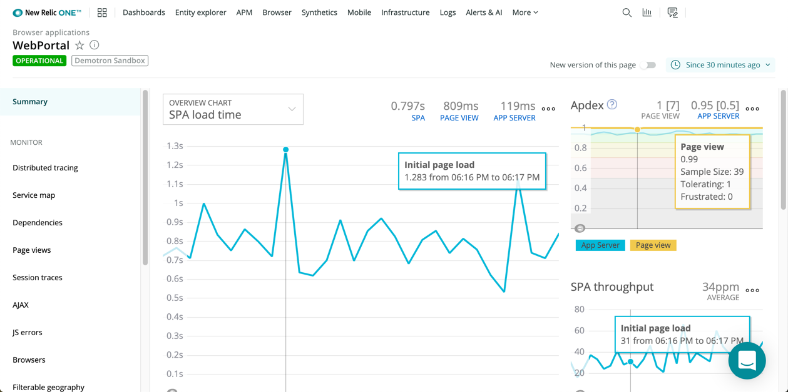

<LandingPageHero>
  <HeroContent>
    If you run a business on the internet, our [blog post about browser performance](https://newrelic.com/resources/articles/most-popular-rum-monitoring-tool) makes it clear:

    > Here’s a fact: Your users spend 90% of their time waiting for their web browsers to load data from your servers. Here’s another: 100% of your end-user experience depends on your entire technology stack. From your infrastructure to your application to the browsers that ultimately render your application, you need the ability to identify, diagnose, and resolve issues quickly across all of your backend and frontend services. 

    With New Relic One's browser monitoring solution, you get full visibility into the complete webpage life cycle of your application or website. Browser measures page load timing, also known as Real User Monitoring (RUM). But it goes far beyond that to measure:

    * Actual performance data, such as by [page view popularity](/docs/browser/new-relic-browser/additional-standard-features/page-views-examine-page-performance), filtered by [geographical regions](/docs/browser/new-relic-browser/browser-pro-features/filterable-geography-webpage-metrics-location) important to your business, or by [user satisfaction (Apdex)](/docs/apm/new-relic-apm/apdex/apdex-measure-user-satisfaction) scores
    * Perceived performance data that measures how quickly your [async or dynamic visuals and interactive page contents](/docs/browser/new-relic-browser/page-load-timing-resources/pageviewtiming-async-or-dynamic-page-details) display
    * [JavaScript error analytics](/docs/browser/new-relic-browser/browser-pro-features/javascript-errors-page-examining-errors-over-time), stack traces, and [source maps](/docs/browser/new-relic-browser/browser-pro-features/upload-source-maps-un-minify-js-errors) with line-of-code visibility, to show you the end-user steps leading up to an error itself
    * [Session performance](/docs/browser/new-relic-browser/browser-pro-features/session-traces-explore-webpages-life-cycle) with a detailed timeline and heat map of the load and interaction events during a webpage's full life cycle
    * [AJAX requests](/docs/browser/new-relic-browser/browser-pro-features/ajax-page-identifying-time-consuming-calls) indicating problems with timing, end points, and specific locations in the webpage
    * Hash-based route changes in apps with [single-page application (SPA) architectures](/docs/browser/single-page-app-monitoring/get-started/introduction-single-page-app-monitoring)

    By incorporating these tools (and more!) in [New Relic One](/docs/new-relic-one/use-new-relic-one/get-started/introduction-new-relic-one), you can help your teams optimize your end user’s page load experience, eliminate bugs, and troubleshoot faster across your full stack.
  </HeroContent>

  

  <figcaption>
    With browser monitoring in New Relic One, you see actionable data about your end users' experience with your app.
  </figcaption>
</LandingPageHero>

<LandingPageTileGrid>
  <LandingPageTile
    title="Get started."
    icon="fe-check-square"
  >

    * [Learn](/docs/browser/new-relic-browser/getting-started/introduction-new-relic-browser) about the monitoring and analysis features available with browser monitoring.
    * [Install](/docs/browser/new-relic-browser/installation/install-new-relic-browser-agent) our browser monitoring agent, then start seeing actionable performance data in the [Browser Monitoring UI](/docs/browser/new-relic-browser/getting-started/browser-overview-page-website-performance-summary), including [page load timing details](/docs/browser/new-relic-browser/page-load-timing-resources/page-load-timing-process).
    * Report custom browser and SPA data via [API](/docs/browser/new-relic-browser/browser-agent-spa-api).
  </LandingPageTile>

  <LandingPageTile
    title="Troubleshoot and resolve problems."
    icon="fe-alert-triangle"
  >

    * Use [alerts](/docs/alerts/new-relic-alerts/getting-started/introduction-new-relic-alerts) and [Applied Intelligence](/docs/new-relic-one/use-new-relic-one/new-relic-ai/introduction-new-relic-ai) for key performance indicators.
    * Isolate latency from the web browser through backend services with [distributed tracing](/docs/browser/new-relic-browser/browser-pro-features/browser-data-distributed-tracing).
    * Get a [direct page load time comparison](/docs/synthetics/new-relic-synthetics/administration/compare-page-load-performance-browser-synthetics) between real user interactions and your [synthetic monitors](/docs/synthetics/new-relic-synthetics/getting-started/introduction-new-relic-synthetics).
  </LandingPageTile>

  <LandingPageTile
    title="Visualize your data."
    icon="fe-bar-chart-2"
  >

    * [Query](/docs/using-new-relic/data/understand-data/query-new-relic-data) any data type (including [metrics, events, logs, and traces](/docs/using-new-relic/data/understand-data/new-relic-data-types)) via UI or API.
    * Create and share a variety of [charts and dashboards](/docs/dashboards/new-relic-one-dashboards/get-started/introduction-new-relic-one-dashboards) that include customer context with business priorities and expected outcomes.
    * Correlate your apps, related services, alerts, logs, and overall digital customer experience with [New Relic One](/docs/new-relic-one/use-new-relic-one/get-started/introduction-new-relic-one).
  </LandingPageTile>
</LandingPageTileGrid>

<ButtonLink
  role="button"
  to="/docs/browser/table-of-contents"
  variant="primary"
>
  View all Browser docs
</ButtonLink>
