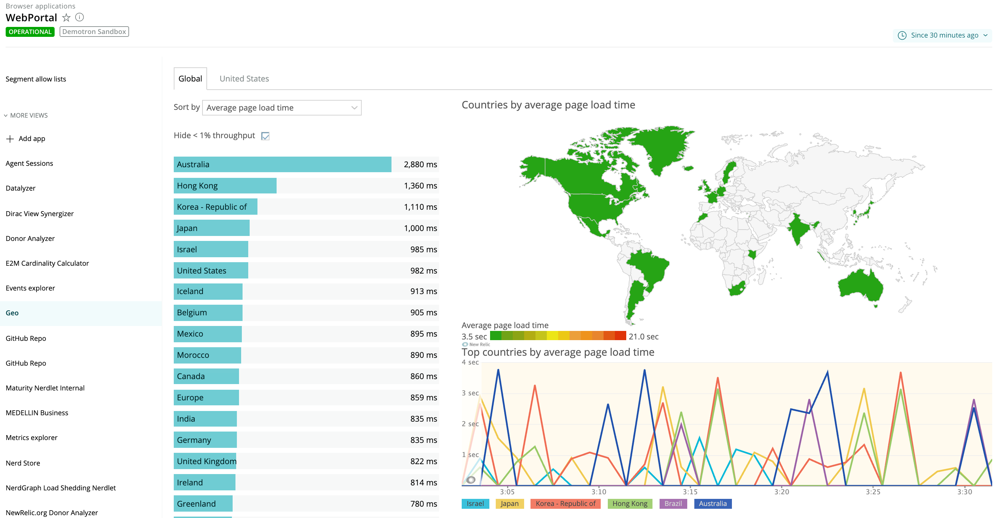
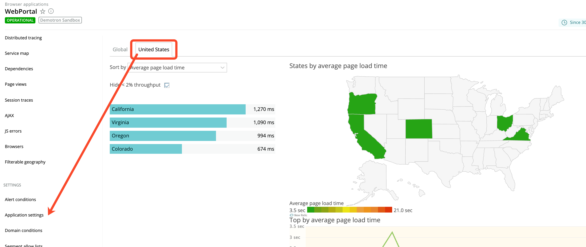
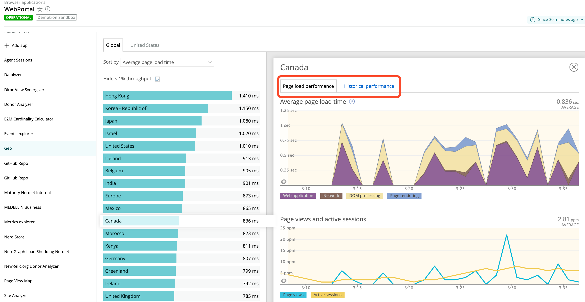

Browser monitoring's Geography page provides a world view with color-coded [Apdex](/docs/apm/new-relic-apm/apdex/apdex-measuring-user-satisfaction) scores and other performance information about your end users' experience. You can [select specific geographic regions](/docs/browser/new-relic-browser/getting-started/browser-settings), such as countries or states, and then you can drill down to detailed information about page load performance and historical performance.

## Contents [#qiklinks]

## View performance data by region [#apdex-by-region]

<Callout variant="important">
  Firewalls may have an impact on the geographical data collected about your end users.
</Callout>

To view or sort the performance information by location:

<figcaption>
  **[one.newrelic.com](https://one.newrelic.com) > Browser > (select an app) > Geo:** This page provides a world view and drill-down details of color-coded performance information for geographic locations.
</figcaption>

1. Go to **[one.newrelic.com](https://one.newrelic.com) > Browser > (select an app) > Geo > Global** (for a world view).

   OR

   Go to **[one.newrelic.com](https://one.newrelic.com) > Browser > (select an app) > Geo > (select a location)** (for a specific location you [identified in the **Browser application settings**](/docs/browser/new-relic-browser/getting-started/browser-settings)).
2. To drill down to a [specific area](#drilldown), select a location from the list, or select any area on the geographical map.
3. To view additional details about the selected location, select the **Page load performance** or **Historical performance** links.
4. To return to the main **Geography** page, select **X** (Close).

<figcaption>
  **[one.newrelic.com](https://one.newrelic.com) > B\*\***rowser > (select an app) > Geo > (select a location):** If you selected specific locations from **Settings > Application settings\*\*, the Geography page includes tabs to view their performance data directly.
</figcaption>

## Use page functions [#option]

Use any of our standard [user interface functions](/docs/accounts-partnerships/education/getting-started-new-relic/new-relic-user-interface) and [page functions](/docs/accounts-partnerships/education/getting-started-new-relic/standard-dashboard-features) to drill down into detailed information.

Here is a summary of additional options with the Geography page:

<table>
  <thead>
    <tr>
      <th width={250}>
        **If you want to...**
      </th>

      <th>
        **Do this...**
      </th>
    </tr>
  </thead>

  <tbody>
    <tr>
      <td>
        Change how the performance data appears
      </td>

      <td>
        Select your choice from the **Sort by** menu.
      </td>
    </tr>

    <tr>
      <td>
        Adjust the amount of information that appears
      </td>

      <td>
        Select or clear the **Hide &lt;% throughput** checkbox (&lt;1% for global view, &lt;2% for selected locations).
      </td>
    </tr>

    <tr>
      <td>
        View a map of a specific location
      </td>

      <td>
        Do any of these as applicable:

        * Select the location's name from the **Geo > Global** list.
        * Select its physical location on the map.
        * If you have [pre-selected the location from **Application settings**](/docs/browser/new-relic-browser/getting-started/browser-settings), select its tab.
      </td>
    </tr>

    <tr>
      <td>
        View summary performance information about a specific location
      </td>

      <td>
        Mouse over any colored area.
      </td>
    </tr>
  </tbody>
</table>

## View drill-down details [#drilldown]

After you select a specific location, the **Page load performance** page shows:

* Average [page load time](/docs/browser/new-relic-browser/page-load-timing/page-load-timing-process) in seconds
* Number of page views and [active sessions](/docs/browser/new-relic-browser/page-load-timing/session-tracking) as pages per minute (**ppm**)
* Recent [browser traces](/docs/apm/traces/browser-traces/browser-traces) if applicable

<figcaption>
  **[one.newrelic.com](https://one.newrelic.com) > Browser > (select an app) > Geo > (select a location):** After you select a specific location, you can view specific details about **Page load performance** and **Historical performance**.
</figcaption>

In addition, the **Historical performance** page shows comparison data for the selected [time period](/docs/apm/new-relic-apm/ui-functions/time-picker-setting-time-periods-view-data), yesterday, and last week for the selected location. This includes:

* Response time
* Apdex
* Throughput in pages per minute (**ppm**)