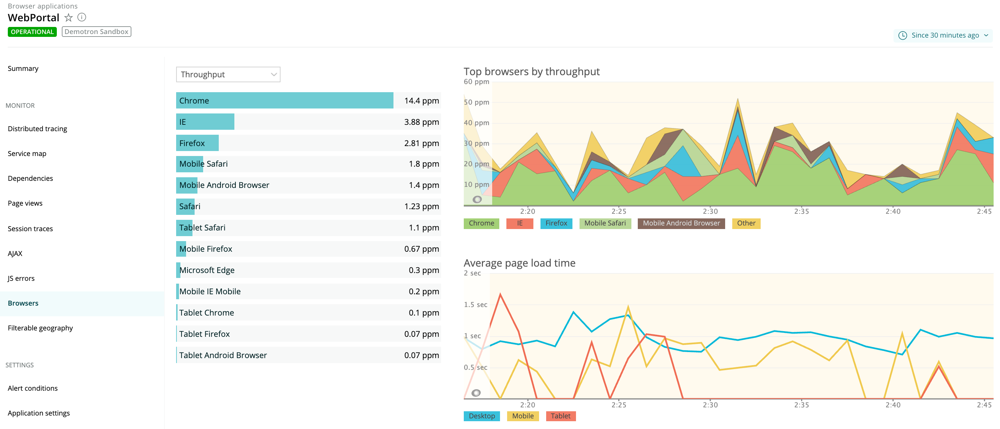
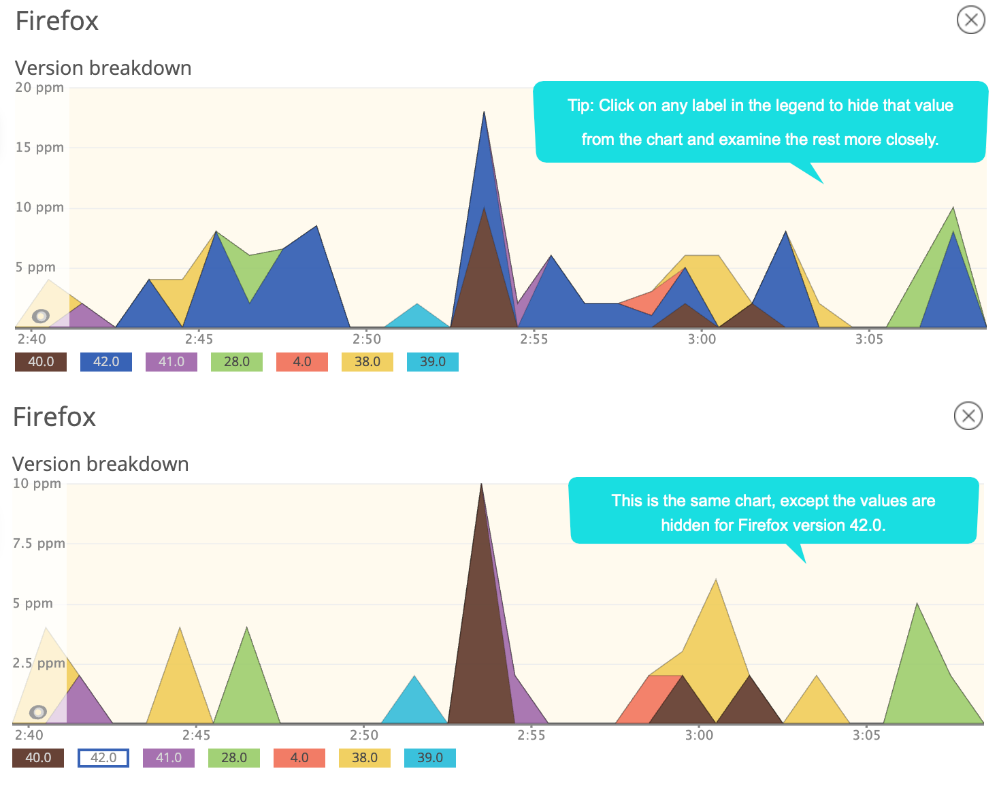

The **Browsers** page in browser monitoring provides information about your end users' experience with your app based on which browser they use, such as Google Chrome, Mozilla Firefox, Microsoft Internet Explorer, and Apple Safari. This page includes:

* Top browsers by throughput (pages per minute or **ppm**)
* Average page load time by platform type (mobile, tablet, desktop)

Drill-down charts also segment the selected browser type by version; for example, Chrome 31, 32, 33, etc. This helps you quickly determine whether problems with page load timing may be related to a specific browser type or platform, or whether the problem is more widespread.

## Viewing browsers by type [#browser_procedures]

To view browser information: Go to **[one.newrelic.com](https://one.newrelic.com), click Browser > (select an app) > Browsers**.

<figcaption>
  **[one.newrelic.com](https://one.newrelic.com) > Browser > (select an app) > Browsers:** This page provides information about throughput (pages per minute) and average page load time for your end users' browser types.
</figcaption>

Use any of our standard [user interface functions](/docs/accounts-partnerships/education/getting-started-new-relic/new-relic-user-interface) and [page functions](/docs/data-analysis/user-interface-functions/standard-page-functions) to drill down into detailed information. Here is a summary of additional options with the **Browsers** page:

<table>
  <thead>
    <tr>
      <th width={200}>
        **If you want to...**
      </th>

      <th>
        **Do this...**
      </th>
    </tr>
  </thead>

  <tbody>
    <tr>
      <td>
        View summary browser information for a specific time
      </td>

      <td>
        Mouse over any area on the chart.
      </td>
    </tr>

    <tr>
      <td>
        Hide (or return) data on the chart
      </td>

      <td>
        Select the corresponding color or title on the chart's legend.
      </td>
    </tr>

    <tr>
      <td>
        View detailed information about the browser
      </td>

      <td>
        Select its name on the list or a place on the chart.
      </td>
    </tr>

    <tr>
      <td>
        Close the detail window and return to the **Browsers** page
      </td>

      <td>
        Select **X** (Close).
      </td>
    </tr>
  </tbody>
</table>

## Viewing specific browser details [#browser_details]

The drill-down details include a breakdown by version and the average page load time.

<figcaption>
  **[one.newrelic.com](https://one.newrelic.com) > Browser > (select an app) > Browsers > (select a browser type):** This example shows a specific browser type selected (Firefox). The largest number of users have version 42.0, so by hiding this label (or any others) in the legend, you can easily examine details about other versions.
</figcaption>

Color-coded segments for [Average page load time](/docs/browser/new-relic-browser/page-load-timing/page-load-timing-process) include:

* **Request queuing** (black): Wait time between the web server and the application code. Large numbers indicate a busy application server.
* **Web application** (purple): Time spent in the application code.
* **Network** (brown): The network latency, or time it takes for a request to make a round trip over the Internet.
* **DOM processing** (yellow): In the browser, parsing and interpreting the HTML and retrieving assets. Measured by the browser's DOMContentLoaded event.
* **Page rendering** (blue): In the browser, displaying the HTML, running in-line JavaScript, and loading images. Measured by the browser's Load event.

**Note:** For apps that have been [deployed using the copy/paste method](/docs/browser/new-relic-browser/installation-configuration/adding-apps-new-relic-browser), browser includes web app and queue time in [Network](/docs/browser/new-relic-browser/page-load-timing-resources/page-load-timing-process#h3-network) time.