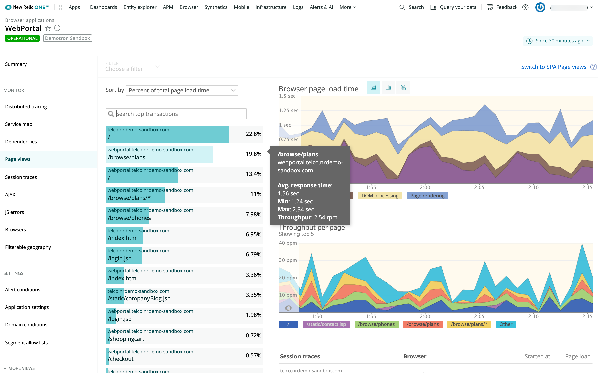
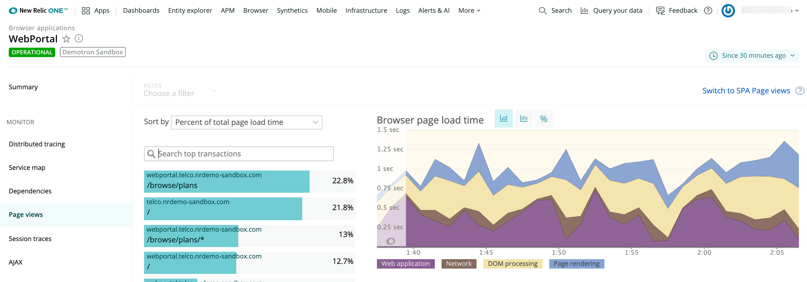
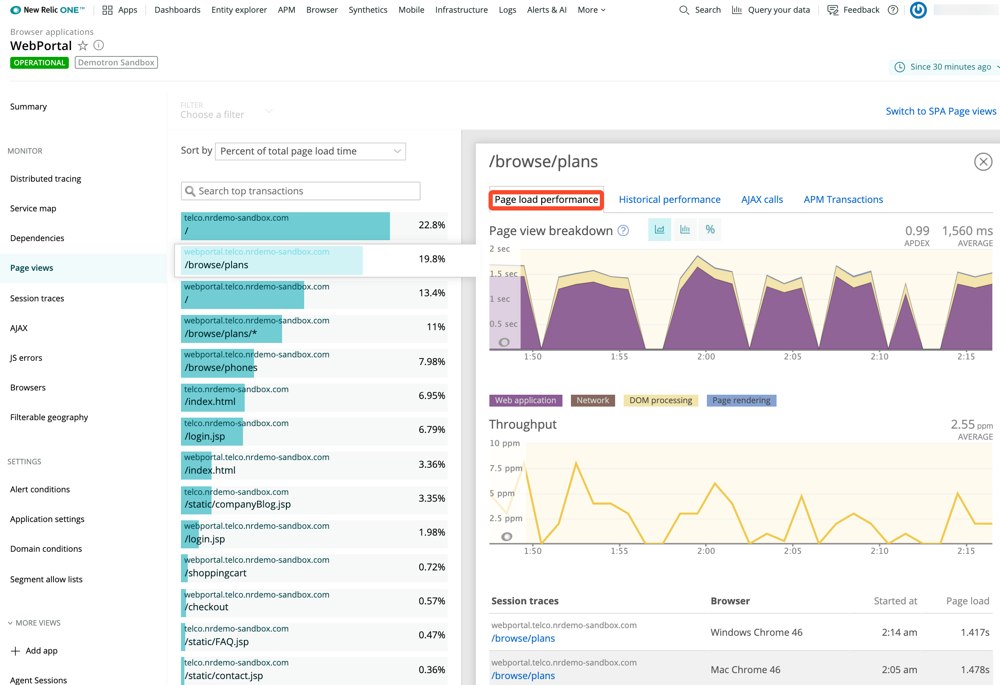

The **Page views** page in browser monitoring provides insight into the performance of your site's pages. Sort options allow you to view details by percentage of page load time, average page load time, or throughput. Detailed information about the top webpages viewed, timing and throughput details, and links to browser traces or session traces also are available as applicable.

Browser also offers [single-page app (SPA) monitoring](/docs/browser/single-page-app-monitoring/get-started/welcome-single-page-app-monitoring). If you have opted in to SPA monitoring, your [SPA **Page views** page](/docs/browser/single-page-app-monitoring/use-spa-data/view-spa-data-new-relic-browser) will be different.

## View summary information [#dashboard]

Browser monitoring lists page views as [URLs](/docs/browser/new-relic-browser/getting-started/url-whitelists-grouping-browser-metrics). This makes it easy to identify specific front-end page views; for example, `/browse/plans`. In addition:

* For browser apps that are also [monitored by APM](#other-apm-options), you can view the back-end transactions associated with the page view; for example, `ApplicationsController#Show`.
* For URLs that are also [monitored by Synthetics](/docs/synthetics/new-relic-synthetics/getting-started/introduction-new-relic-synthetics), you can use New Relic's [comparative charting feature](/docs/synthetics/new-relic-synthetics/administration/compare-page-load-performance-browser-synthetics). This provides a direct page load time comparison between real user (browser) interactions and trends appearing in Synthetics monitors.

<figcaption>
  **[one.newrelic.com](https://one.newrelic.com) > Browser > (select an app) > Page views**: This page provides detailed information about page load time, throughput, top transactions, and traces.
</figcaption>

To view detailed information about which pages the end users are viewing for your app:

1. Go to **[one.newrelic.com](https://one.newrelic.com) > Browser > (select an app) > Page views**.
2. Select the [time period](/docs/apm/new-relic-apm/ui-functions/time-picker-setting-time-periods-view-data) or sort order, or keep the defaults.
3. If available, select the [type of view](/docs/apm/applications-menu/features/selecting-dashboard-views) for page load timing information as a chart (default), histogram, or percentile.
4. To view summary information about a specific transaction, mouse over the transaction's name on the list.
5. To compare page load time between real user (browser) interactions and trends appearing in [Synthetic](/docs/synthetics/new-relic-synthetics/getting-started/introduction-new-relic-synthetics) monitors, select a page monitored by Synthetics, then examine additional [comparative charting](/docs/synthetics/new-relic-synthetics/administration/compare-page-load-performance-browser-synthetics) details.

## Examine timing details for page loads [#page_load_timing]

The **Browser page load time** [chart view](/docs/apm/applications-menu/features/selecting-dashboard-views) shows the average page load time broken down into segments. This chart also appears on the [**Summary** page](/docs/browser/new-relic-browser/getting-started/browser-overview-website-performance-glance) and [**Browsers** detail page](/docs/browser/new-relic-browser/additional-standard-features/browsers-problem-patterns-type-or-location).

<figcaption>
  **[one.newrelic.com](https://one.newrelic.com) > Browser > (select an app) > Page views:** The Browser page load time chart shows the average page load time broken down into segments indicating the end users' experience (sometimes referred to as real user monitoring or RUM).
</figcaption>

The [page load timing process](/docs/browser/new-relic-browser/page-load-timing-resources/page-load-timing-process) shows colored-coded details:

<table>
  <thead>
    <tr>
      <th style={{ width: "200px" }}>
        Page load timing process
      </th>

      <th>
        Description
      </th>
    </tr>
  </thead>

  <tbody>
    <tr>
      <td>
        Request queuing (black)
      </td>

      <td>
        Wait time between the web server and the application code. Large numbers indicate a busy application server.
      </td>
    </tr>

    <tr>
      <td>
        Web application (purple)
      </td>

      <td>
        Time spent in the application code.
      </td>
    </tr>

    <tr>
      <td>
        Network (brown)
      </td>

      <td>
        The network latency, or the time it takes for a request to make a round trip over the Internet.

        For apps that have been [deployed using the copy/paste method](/docs/browser/new-relic-browser/installation-configuration/adding-apps-new-relic-browser), Browser includes web app and queue time in [Network](/docs/browser/new-relic-browser/page-load-timing-resources/page-load-timing-process#h3-network) time.
      </td>
    </tr>

    <tr>
      <td>
        DOM processing (yellow)
      </td>

      <td>
        In the browser, parsing and interpreting the HTML. Measured by the browser's `DOMContent` event.
      </td>
    </tr>

    <tr>
      <td>
        Page rendering (blue)
      </td>

      <td>
        In the browser, the time to display the HTML, run the inline JavaScript, and load images. Measured by the browser's `Load` event.
      </td>
    </tr>

    <tr>
      <td>
        "Additional" timing data
      </td>

      <td>
        If you are using the [JavaScript API](/docs/browser/new-relic-browser/browser-agent-apis/manually-reporting-page-load-timing-data), your "additional" timing data appears in this chart.
      </td>
    </tr>
  </tbody>
</table>

## Examine page view details [#view_details]

Use any of New Relic's standard [user interface functions](/docs/accounts-partnerships/education/getting-started-new-relic/new-relic-user-interface) to drill down into detailed information. In addition, to view details about a specific page view, select its name from the list. To close an individual page view and return to the **Page views** page, select **X** (Close).

Each page view listed in the list may include links to additional drill-down details:

<table>
  <thead>
    <tr>
      <th style={{ width: "200px" }}>
        Page view details
      </th>

      <th>
        Comments
      </th>
    </tr>
  </thead>

  <tbody>
    <tr>
      <td>
        Page load performance
      </td>

      <td>
        This includes [page load timing](#page_load_timing) breakdown data, throughput, [session traces](/docs/browser/new-relic-browser/browser-pro-features/session-traces-exploring-webpages-life-cycle), and [browser traces](#other-apm-options) (if available).
      </td>
    </tr>

    <tr>
      <td>
        Historical performance
      </td>

      <td>
        This shows response time, Apdex comparisons, and throughput for the last [selected time period](/docs/apm/new-relic-apm/ui-functions/time-picker-setting-time-periods-view-data), yesterday, and last week.
      </td>
    </tr>

    <tr>
      <td>
        [AJAX](/docs/browser/new-relic-browser/browser-pro-features/ajax-dashboard-identifying-time-consuming-calls) calls
      </td>

      <td>
        Table with links to detailed information about endpoints, as well as sortable columns by endpoint, average response time, throughput, and total calls.
      </td>
    </tr>

    <tr>
      <td>
        [APM transactions](#other-apm-options)
      </td>

      <td>
        For browser apps that are also monitored by APM, this table shows the total call time, average response time, call count, and link to the [APM **Transactions** page](/docs/apm/applications-menu/monitoring/transactions-dashboard).
      </td>
    </tr>
  </tbody>
</table>

<figcaption>
  **[one.newrelic.com](https://one.newrelic.com) > Browser > (select an app) > Page views > (select a transaction):** Depending on the app, individual transactions may have links to additional drill-down details, including **Page load performance**, **Historical performance**, **AJAX calls**, and **APM transactions**.
</figcaption>

## Use additional APM-monitored app options [#other-apm-options]

Browser apps that are also monitored by APM may have access to additional functions. To use these functions (if available): From the selected transaction's APM Transactions tab, select an APM transaction from the list. Then select any of these options (from APM):

* **Track as key transaction** ([create](/docs/apm/selected-transactions/key-transactions/creating-key-transactions) a new [key transaction](/docs/apm/selected-transactions/key-transactions/key-transactions-tracking-important-transactions-or-events))
* **Key transaction** ([view existing](/docs/apm/selected-transactions/key-transactions/viewing-key-transactions))
* **Transaction traces > (selected trace)** ([view](/docs/apm/traces/transaction-traces/transaction-traces))
