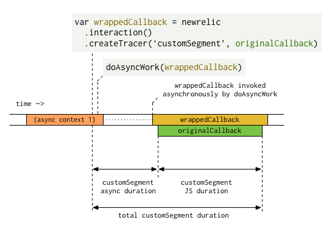

## Syntax

```
newrelic.interaction().createTracer(string $name[, function $callback])
```

Times sub-components of a SPA interaction separately, including wait time and JS execution time.

## Requirements

Agent version [nr-963](/docs/release-notes/new-relic-browser-release-notes/browser-agent-release-notes) or higher.

## Description

This method provides a way to time sub-components of a SPA interaction separately in browser. Each sub-component will measure:

* Wait time until callback is executed
* JS execution time of callback once it is invoked

This method also can be used to bridge the asynchronous gap created by uninstrumented async methods.

If the current interaction is saved, New Relic will create a [`BrowserTiming` event](/docs/insights/explore-data/attributes/browser-default-attributes-insights#browsertiming-attributes) in New Relic One. To view this timing information in browser:

1. Go to **[one.newrelic.com](https://one.newrelic.com), click on Browser > (select a SPA app) > Page views**.
2. From **Page views**, select a browser interaction, then select the **Breakdowns** tab.

The `createTracer()` method returns a wrapped callback method, which you must invoke from your code. The returned wrapped callback will do three things when invoked:

1. Records the end of the async portion of the custom tracer.
2. Runs the original callback passed to `createTracer()` with the same arguments and context.
3. Times the execution of the original callback.

A [`BrowserInteraction`](/docs/insights/explore-data/attributes/browser-default-attributes-insights#browserinteraction-attributes) that runs `createTracer()` will create a [`BrowserTiming` event](/docs/insights/explore-data/attributes/browser-default-attributes-insights#browsertiming-attributes). Any new XHRs or custom traces created during the callback will be included as part of the interaction.

An interaction will not be considered complete until all of its tracers finish. This is what allows tracers to wrap async functions that the browser agent does not handle by default.

## Parameters

<table>
  <thead>
    <tr>
      <th width="25%">
        Parameter
      </th>

      <th>
        Description
      </th>
    </tr>
  </thead>

  <tbody>
    <tr>
      <td>
        `$name`

        _string_
      </td>

      <td>
        Required. This will be used as the name of the tracer.

        If you do not include a name, browser does not add a node to the interaction tree. The callback time will be attributed to the parent node.
      </td>
    </tr>

    <tr>
      <td>
        `$callback`

        _function_
      </td>

      <td>
        Optional. A callback that contains the synchronous work to run at the end of the async work. To execute this callback, call the wrapper function returned using `createTracer()`.
      </td>
    </tr>
  </tbody>
</table>

## Return values

Returns a method that wraps the original callback. When this method is invoked, it calls the original callback and ends the async timing.

## Examples

### Create tracer [#tracer-example]

If you simply want to measure how long a particular JavaScript function call takes, you can pass the function to `createTracer()` as a callback. This immediately invokes the returned wrapper callback:

```
newrelic
  .interaction()
  .createTracer('customSegment', function myCallback () {
    // ... do your work ...
  })()
```

In this scenario, the resulting custom tracer will have a negligible async wait duration, as well as a synchronous duration equal to the execution time of `myCallback()`.

### Trace an uninstrumented asynchronous API [#asynch-api-tracer]

By default, the browser agent wraps many of the most common asynchronous functions (such as `setTimeout()`). However, there are some functions that are not handled automatically (for example, `requestAnimationFrame()`). In addition, some cases occur where causality cannot easily be determined (for example, a custom RPC implementation over websockets). For these cases, you can use `createTracer()` to make sure callbacks to these uninstrumented functions are considered part of the interaction.

Using `createTracer()` is not necessary for any async scheduling system based on async APIs that are wrapped natively by the browser agent, such as `setTimeout()`, `setImmediate()`, `Promise()`, `fetch()`, and `XMLHttpRequest()`. The async boundaries created by these APIs will be bridged automatically by the browser agent.

In the example code below, you have a function, `doAsyncWork()`, that accepts a callback and executes it asynchronously at some point in the future. You want to measure both the time between when you invoke `doAsyncWork()` and when the callback begins executing (the async wait time), and the time taken to run the callback (the synchronous callback time).

```
var wrappedCallback = newrelic
  .interaction()
  .createTracer('customSegment', doTheWork)

doAsyncWork(wrappedCallback)

function doTheWork() {
  // ... do your work ...
}
```

Here is a timeline of events for tracer timing:


