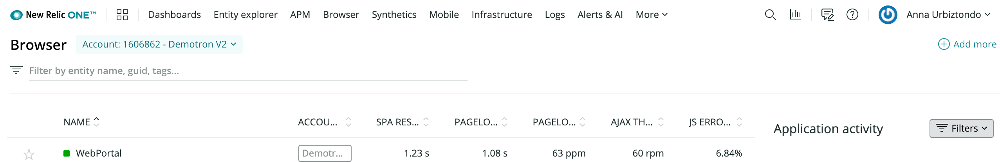
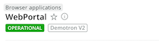

To get started with [browser monitoring](/docs/browser/new-relic-browser/getting-started/introduction-new-relic-browser), go to [one.newrelic.com](http://one.newrelic.com) and select browser at the top of the page. If you have already added apps, the browser applications index automatically appears.

The browser index page provides a list of your existing apps being monitored by browser. It is also the starting point to [install the browser agent](/docs/browser/new-relic-browser/installation/install-new-relic-browser-agent) for additional apps.

## Browser apps index features [#index]

<figcaption>
  The browser applications index shows your app names, their health status, and summary information, with direct links to additional pages.
</figcaption>

The index shows a list of your application names, their color-coded health status, and user experience summaries based on the current time frame selected in the time picker. This includes:

* [Page load time](/docs/browser/new-relic-browser/dashboard-details/page-views-dashboard), [SPA response time](/docs/browser/single-page-app-monitoring/use-spa-data/view-spa-data-new-relic-browser), and throughput (pages per minute)
* [AJAX response time](/docs/browser/new-relic-browser/dashboard-details/ajax-dashboard) and throughput (requests per minute)
* [JavaScript errors](/docs/browser/new-relic-browser/dashboard-details/javascript-errors-dashboard)

## Browser app name [#app-name]

Apps that are also monitored by [APM](/docs/apm/new-relic-apm/getting-started/welcome-new-relic-apm) take their name from the [app's settings in APM](/docs/apm/new-relic-apm/installation-configuration/naming-your-application). For apps monitored by browser and not APM, their name is the one provided when you [installed browser](/docs/browser/new-relic-browser/installation/install-new-relic-browser-agent).

* To view a browser app's [Summary page](/docs/browser/new-relic-browser/dashboard-details/browser-overview-dashboard): From the browser app index, select its name.
* To change a browser app's name: Follow the procedures to [rename your app](/docs/browser/new-relic-browser/installation-configuration/rename-browser-apps) based on your original deployment method.

## App status [#status]

The color-coded [health indicator](/docs/accounts-partnerships/education/getting-started-new-relic/glossary#health-status) shows each app's current status:

* **Green:** Browser monitoring has been enabled and the app is fine.
* **Yellow:** A Warning alert indicates the app is experiencing some non-critical issues; for example, the end user [Apdex score](/docs/apm/new-relic-apm/apdex/apdex-measuring-user-satisfaction) or error rate crossed a defined threshold for the associated alert policy.
* **Red:** A Critical warning indicates an issue has escalated with the app.
* **Gray:** No data is being reported for the app at this time.

For a quick summary of current conditions, mouse over the app's colored status bar.

## List functions [#list_functions]

Here are some tips for using the browserbrowser applications index.

<table>
  <thead>
    <tr>
      <th width={200}>
        **If you want to...**
      </th>

      <th>
        **Do this...**
      </th>
    </tr>
  </thead>

  <tbody>
    <tr>
      <td>
        Change the sort order
      </td>

      <td>
        Select any column heading to sort the list in ascending or descending order.
      </td>
    </tr>

    <tr>
      <td>
        View a summary of an app's browser monitoring
      </td>

      <td>
        Select the application's name to go to the [browser **Summary** page](/docs/browser/new-relic-browser/dashboard-details/browser-overview-dashboard) for that app.
      </td>
    </tr>

    <tr>
      <td>
        Search for specific apps
      </td>

      <td>
        To narrow the search, type one or more characters in the **Search** filter. To broaden the search, clear the filter.
      </td>
    </tr>

    <tr>
      <td>
        View browser performance details for an app
      </td>

      <td>
        Select any of the corresponding links. For example, select the app's **Page load time** or **Page load throughput** link to go directly to the [**Page views** page](/docs/browser/new-relic-browser/dashboard-details/page-views-dashboard).

        If page load timing has been enabled (the app's health status is green) but the browser apps index does not show any summary data (0 ppm), this means there has been no traffic recently (up to six minutes).
      </td>
    </tr>

    <tr>
      <td>
        Return to the browser apps index
      </td>

      <td>
        From any page in browser, select **Browser applications**, located above the name of your application**.**

        
      </td>
    </tr>
  </tbody>
</table>
