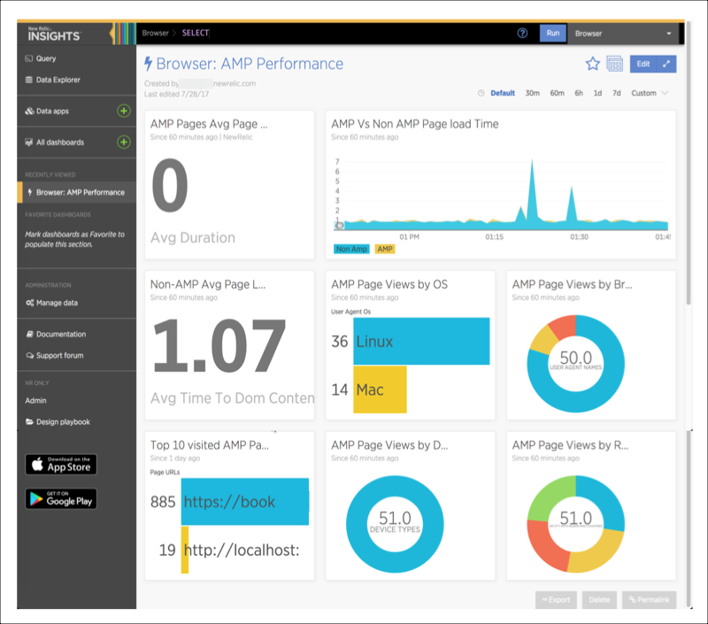

BETA

To collect performance data from HTML pages formatted for [Google's Accelerated Mobile Pages (AMP) project](https://www.ampproject.org/learn/overview/), you must add New Relic Browser's AMP agent to your AMP pages. This agent leverages the [`amp-analytics` agent](https://www.ampproject.org/docs/reference/components/amp-analytics) to define the relevant New Relic events and send them to New Relic to be captured for reporting.

## Compatibility and requirements [#requirements]

Browser's AMP agent is currently available as a private beta. In addition to New Relic Browser's [installation requirements](/docs/browser/new-relic-browser/getting-started/compatibility-requirements-new-relic-browser), Browser's AMP agent requires:

<Table>
  <thead>
    <tr>
      <th style={{ width: "200px" }}>
        **Browser AMP requirements**
      </th>

      <th>
        **Comments**
      </th>
    </tr>
  </thead>

  <tbody>
    <tr>
      <td id="version">
        New Relic Browser
      </td>

      <td>
        New Relic Browser requirements include Browser Pro account, which includes access to New Relic Insights data depending on your [Browser subscription level](https://newrelic.com/browser-monitoring/pricing).
      </td>
    </tr>

    <tr>
      <td id="app-id">
        Browser app ID
      </td>

      <td>
        To capture AMP throughput, New Relic Browser needs the `app ID` for each app:

        1. Go to [rpm.newrelic.com/browser](https://rpm.newrelic.com/browser) and select an application from the index.
        2. Copy the numeric value that follows `/browser/1234567890` in the URL.
      </td>
    </tr>

    <tr>
      <td id="key">
        Browser monitoring license key
      </td>

      <td>
        To obtain only the browser monitoring [license key](https://docs.newrelic.com/docs/browser/new-relic-browser/configuration/copy-browser-monitoring-license-key-app-id):

        1. Go to **[rpm.newrelic.com/browser](https://rpm.newrelic.com/browser "Link opens in a new window.") > Settings**.
        2. Select and copy the generated JavaScript, and paste it into a text file.
        3. Delete everything in the text file except the browser monitoring license key (just above the ending `</script>` tag), and save.
      </td>
    </tr>
  </tbody>
</Table>

## Install Browser's AMP agent [#deploy-amp-agent]

New Relic has partnered with The Amp Project to incorporate New Relic Browser's AMP agent in with the AMP Analytics repo.

To install the Browser AMP agent into your AMP app:

1. Add the attribute `newrelic` to your AMP analytics code. For more information, see the [AMP site](https://www.ampproject.org/docs/ads_analytics/analytics-vendors#new-relic).
2. Add the browser [`app ID`](#app-id) and [`license key`](#key). To send data from one AMP page to multiple Browser apps, include quote marks and a comma to separate each Browser `app ID`. For example: `"appId": ["123", "124", "125"]`

```
<amp-analytics type="newrelic" id="newrelic">
<script type="application/json">
  {
    "vars": {
      "appId": "",
      "licenseKey": ""
    }
  }
</script>
</amp-analytics>
```

## View reported AMP events in Insights [#view-amp-events]

Currently, your AMP data will not appear in the New Relic Browser UI. This is intentional; any AMP data sent to the New Relic collector will be removed automatically from your Browser metrics.

In the meantime, use New Relic Insights to compare your AMP page to non-AMP pages. The dashboard data provides standard performance key metrics.

New Relic stores AMP events in the `PageView` and `BrowserInteraction` schemas. To [view the AMP events](/docs/insights/use-insights-ui/explore-data/event-explorer-query-chart-your-event-data), run the following Insights queries:

* `SELECT * FROM BrowserInteraction WHERE mobileOptimized = 'amp'`
* `SELECT * FROM PageView WHERE mobileOptimized = 'amp'`



**[insights.newrelic.com](https://insights.newrelic.com) > Event explorer**: Here is an example of an Insights dashboard showing AMP event data after you install New Relic Browser's AMP JavaScript snippet into the body of your AMP pages.

## AMP data dictionary [#amp-data]

Here is a summary of the AMP data available in `BrowserInteraction` and `PageView`.

<Table>
  <thead>
    <tr>
      <th style={{ width: "400px" }}>
        Insights variable
      </th>

      <th>
        [AMP parameter](https://github.com/ampproject/amphtml/blob/master/spec/amp-var-substitutions.md)
      </th>
    </tr>
  </thead>

  <tbody>
    <tr>
      <td>
        `appId`

        The New Relic application ID.
      </td>

      <td>
        Populated by NR AMP agent
      </td>
    </tr>

    <tr>
      <td>
        `asn`

        Autonomous System Number: A unique number identifying a group of IP networks that serves the content to the end user.
      </td>

      <td>
        Derived from IP
      </td>
    </tr>

    <tr>
      <td>
        `asnLatitude`

        The latitude of the geographic center of the postal code where the Autonomous System Network is registered. This is not the end user's latitude.
      </td>

      <td>
        Derived from IP
      </td>
    </tr>

    <tr>
      <td>
        `asnLongitude`

        The longitude of the geographic center of the postal code where the Autonomous System Network is registered. This is not the end user's longitude.
      </td>

      <td>
        Derived from IP
      </td>
    </tr>

    <tr>
      <td>
        `asnOrganization`

        The organization that owns the Autonomous System Number. Often an ISP, sometimes a private company or institution.
      </td>

      <td>
        Derived from IP
      </td>
    </tr>

    <tr>
      <td>
        `category`

        The type of interaction: Either initial page load, route change, or custom.
      </td>

      <td>
        Value: Always page load
      </td>
    </tr>

    <tr>
      <td>
        `city`

        The city in which the event occurred; for example, Portland or Seattle.
      </td>

      <td>
        From request
      </td>
    </tr>

    <tr>
      <td>
        `countryCode`

        The country from which the browser initiated the interaction. For a list of country codes, see [ISO 3166-1 alpha-2](http://en.wikipedia.org/wiki/ISO_3166-1_alpha-2#Current_codes).
      </td>

      <td>
        From request
      </td>
    </tr>

    <tr>
      <td>
        `deviceType`

        The type of device that loaded the page: Either mobile, tablet, or desktop.
      </td>

      <td>
        Value: Always `mobile`. Looking to derive device
      </td>
    </tr>

    <tr>
      <td>
        `duration`

        The total duration, in seconds, of the interaction event.
      </td>

      <td>
        `pageLoadTime`
      </td>
    </tr>

    <tr>
      <td>
        `previousURL`

        The ungrouped URL in the browser at the start of the interaction.
      </td>

      <td>
        Always blank (`previousUrl` is for route changes)
      </td>
    </tr>

    <tr>
      <td>
        `session`

        The unique ID for the session in which the event occurred.
      </td>

      <td>
        `clientId`
      </td>
    </tr>

    <tr>
      <td>
        `targetUrl`

        The ungrouped URL in the browser at the end of the interaction.
      </td>

      <td>
        `ampdocUrl`
      </td>
    </tr>

    <tr>
      <td>
        `timeToConnectStart`

        The time, in seconds, from the start of the interaction to the connectStart, as defined by the Navigation Timing API. This attribute exists for initial page load events, not route changes.
      </td>

      <td>
        `$navTiming(connectStart)`
      </td>
    </tr>

    <tr>
      <td>
        `timeToConnectEnd`

        The time, in seconds, from the start of the interaction to the connectEnd, as defined by the Navigation Timing API. This attribute exists for initial page load events, not route changes.
      </td>

      <td>
        `$navTiming(connectEnd)`
      </td>
    </tr>

    <tr>
      <td>
        `timeToDomComplete`

        The time, in seconds, from the start of the interaction to the domComplete, as defined by the Navigation Timing API. This attribute exists for initial page load events, not route changes.
      </td>

      <td>
        $navTiming(domComplete)
      </td>
    </tr>

    <tr>
      <td>
        `timeToDomContentLoadedEventStart`

        The time, in seconds, from the start of the interaction to the domContentLoadedEventStart, as defined by the Navigation Timing API. This attribute exists for initial page load events, not route changes.
      </td>

      <td>
        `$navTiming(domContentLoadedEventStart)`
      </td>
    </tr>

    <tr>
      <td>
        `timeToDomContentLoadedEventEnd`

        The time, in seconds, from the start of the interaction to the domContentLoadedEventEnd, as defined by the Navigation Timing API. This attribute exists for initial page load events, not route changes.
      </td>

      <td>
        `$navTiming(domContentLoadedEventEnd)`
      </td>
    </tr>

    <tr>
      <td>
        `timeToDomInteractive`

        The time, in seconds, from the start of the interaction to the domInteractive, as defined by the Navigation Timing API. This attribute exists for initial page load events, not route changes.
      </td>

      <td>
        `$navTiming(domInteractive)`
      </td>
    </tr>

    <tr>
      <td>
        `timeToDomLoading`

        The time, in seconds, from the start of the interaction to the domLoading, as defined by the Navigation Timing API. This attribute exists for initial page load events, not route changes.
      </td>

      <td>
        $navTiming(domLoading)
      </td>
    </tr>

    <tr>
      <td>
        `timeToDomainLookupStart`

        The time, in seconds, from the start of the interaction to the domainLookupStart, as defined by the Navigation Timing API. This attribute exists for initial page load events, not route changes.
      </td>

      <td>
        `$navTiming(domainLookupStart)`
      </td>
    </tr>

    <tr>
      <td>
        `timeToDomainLookupEnd`

        The time, in seconds, from the start of the interaction to the domainLookupEnd, as defined by the Navigation Timing API. This attribute exists for initial page load events, not route changes.
      </td>

      <td>
        `$navTiming(domainLookupEnd)`
      </td>
    </tr>

    <tr>
      <td>
        `timeToFetchStart`

        The time, in seconds, from the start of the interaction to the fetchStart, as defined by the Navigation Timing API. This attribute exists for initial page load events, not route changes.
      </td>

      <td>
        `$navTiming(fetchStart)`
      </td>
    </tr>

    <tr>
      <td>
        `timeToLoadEventStart`

        The time, in seconds, from the start of the interaction to the loadEventStart, as defined by the Navigation Timing API. This attribute exists for initial page load events, not route changes.
      </td>

      <td>
        `$navTiming(loadEventStart)`
      </td>
    </tr>

    <tr>
      <td>
        `timeToLoadEventEnd`

        The time, in seconds, from the start of the interaction to the loadEventEnd, as defined by the Navigation Timing API. This attribute exists for initial page load events, not route changes.
      </td>

      <td>
        `$navTiming(loadEventEnd)`
      </td>
    </tr>

    <tr>
      <td>
        `timeToRequestStart`

        The time, in seconds, from the start of the interaction to the requestStart, as defined by the Navigation Timing API. This attribute exists for initial page load events, not route changes.
      </td>

      <td>
        `$navTiming(requestStart)`
      </td>
    </tr>

    <tr>
      <td>
        `timeToResponseStart`

        The time, in seconds, from the start of the interaction to the responseStart, as defined by the Navigation Timing API. This attribute exists for initial page load events, not route changes.
      </td>

      <td>
        `$navTiming(responseStart)`
      </td>
    </tr>

    <tr>
      <td>
        `timeToResponseEnd`

        The time, in seconds, from the start of the interaction to the responseEnd, as defined by the Navigation Timing API. This attribute exists for initial page load events, not route changes.
      </td>

      <td>
        `$navTiming(responseEnd)`
      </td>
    </tr>

    <tr>
      <td>
        `timeToSecureConnection`

        The time, in seconds, from the start of the interaction to the secureConnectionStart, as defined by the Navigation Timing API. This attribute exists for initial page load events, not route changes.
      </td>

      <td>
        `${navTiming(secureConnectionStart)`
      </td>
    </tr>

    <tr>
      <td>
        `timeToUnloadEventStart`

        The time, in seconds, from the start of the interaction to the unloadEventStart, as defined by the Navigation Timing API. This attribute exists for initial page load events, not route changes.
      </td>

      <td>
        `$navTiming(unloadEventStart)`
      </td>
    </tr>

    <tr>
      <td>
        `timeToUnloadEventEnd`

        The time, in seconds, from the start of the interaction to the unloadEventEnd, as defined by the Navigation Timing API. This attribute exists for initial page load events, not route changes.
      </td>

      <td>
        `$navTiming(unloadEventEnd)`
      </td>
    </tr>

    <tr>
      <td>
        `timestamp`

        The time (date, hour, minute, second) at which the interaction occurred.
      </td>

      <td>
        `timestamp`
      </td>
    </tr>

    <tr>
      <td>
        `trigger`

        The cause of the route change or page load. The default values are click, submit, popstate, or initial page load. For a custom event created with the API, the default value for trigger will be api. This value can also be set via the API.
      </td>

      <td>
        Possible values: Initial page load, click
      </td>
    </tr>

    <tr>
      <td>
        `userAgentName`

        The end user's browser type.
      </td>

      <td>
        From request
      </td>
    </tr>

    <tr>
      <td>
        `userAgentVersion`

        The end user's browser version.
      </td>

      <td>
        From request
      </td>
    </tr>

    <tr>
      <td>
        `userAgentOS`

        The end user's operating system.
      </td>

      <td>
        From request
      </td>
    </tr>
  </tbody>
</Table>

## Replace copy/pasted agent with library reference [#replace]

If you previously copy/pasted New Relic Browser's AMP agent JS Snippet onto your AMP pages, you can now pull the snippet from AMP Analytics instead. Remove New Relic Browser's AMP agent JS snippet from your AMP pages, and then follow the [instructions to install Browser's AMP agent](#deploy-amp-agent).

## For more help [#more_help]

During the beta period, [email your AMP feedback](mailto:ampbeta@newrelic.com) to the New Relic Browser team.
