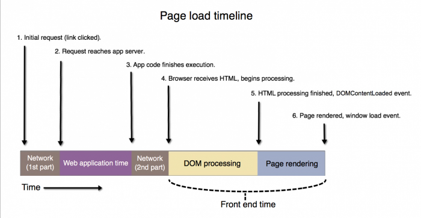
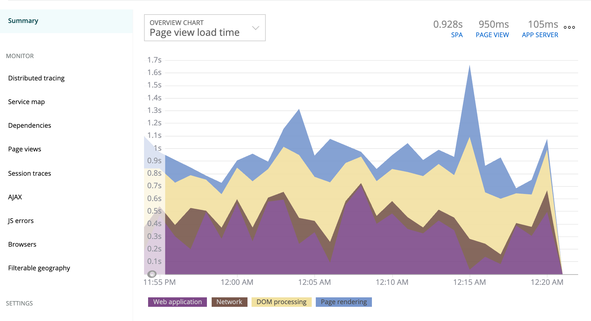

This document explains:

* How a web page loads
* How [browser monitoring](/docs/browser/new-relic-browser/getting-started/new-relic-browser) measures page load timing, also known as real user monitoring (RUM)

<Callout variant="tip">
  This is a description of traditional, synchronous page load timing. Browser can also monitor [asynchronous page load timing](/docs/browser/single-page-app-monitoring/get-started/welcome-single-page-app-monitoring).
</Callout>

## Page load process [#process]

Here are the major steps in the loading of most web pages. The numbers 1-6 in the diagram correspond to the numbered steps below.

<figcaption>
  **Page load timeline:** The steps involved in a web page load. Browser monitoring charts display the following segments of that process: **[Network](#h3-network)**, **[Web application](#h3-app-time)**, **[DOM processing](#h3-dom)**, and **[Page rendering](#h3-page)**.
</figcaption>

1. A page load begins when a user selects a hyperlink, submits a form, or types a URL in a browser. This is also referred to as the **initial request** or the **navigation start**. The user's action sends a **request** across the network to the web application server.
2. The request reaches the application for processing. (The request may take some time to start being processed. This could be the result of **request queuing** or it could be other factors.)
3. The app finishes processing and sends an HTML **response** back across the network to the user's browser. This is sometimes referred to as **response start** or **first byte**.
4. (Time To First Byte) The user's browser begins receiving the HTML response, and starts to process the Document Object Model, or **DOM**.
5. The DOM finishes loading; this point is known as **DOM ready**. Using the DOM, the user's browser starts to render the page.
6. The page finishes rendering in the user's browser and the **window load event** fires. (For pages that use [asynchronous loading](/docs/browser/single-page-app-monitoring/get-started/welcome-single-page-app-monitoring), some elements may continue to load after the window load event occurs.)

## Page load time charts in browser monitoring [#page-load-charts]

Browser monitoring captures the major page load timing segments in the [browser **Summary** page](/docs/browser/new-relic-browser/getting-started/browser-overview-website-performance-glance) and the [**Page views** page](/docs/browser/new-relic-browser/additional-standard-features/page-views-understanding-your-sites-popularity). If you have SPA monitoring enabled, you will have access to both this chart and [SPA-specific charts](/docs/browser/single-page-app-monitoring/use-spa-data/view-spa-data-new-relic-browser). The charts show:

* Network
* Web application time
* DOM processing
* Page rendering
* Other segments as applicable, such as request queuing

The chart colors match the colors in the [page load timing diagram](#process).

<figcaption>
  **[one.newrelic.com](https://one.newrelic.com) > Browser > (select an app) > Summary**: The load time chart appears on the **Summary** and **Page views** page.
</figcaption>

The way browser collects these times depends on the browser's capability to use the [Navigation Timing Specification API](/docs/browser/new-relic-browser/page-load-timing-resources/instrumentation-browser-monitoring). You can add custom page load timing events with the [browser agent API](/docs/browser/new-relic-browser/browser-agent-apis/reporting-data-events-browser-agent-api).

Here are descriptions of the activity included in the browser load time chart segments:

<CollapserGroup>
  <Collapser
    id="h3-app-time"
    title="Web application"
  >
    The web application time includes the time spent on the application server. This can only be determined if the browser instrumentation for page load timing was provided by an APM agent.
  </Collapser>

  <Collapser
    id="h3-network"
    title="Network"
  >
    The Network layer includes time spent in redirects as well as in requesting and receiving HTML. It does not include time on the server or for static assets.

    Network time measurement starts from the initial click on a link. Network time includes DNS and may include more than one lookup if you have redirects on your site, TCP (including the firewall, unless you have configured [request queue time monitoring](/docs/apm/other-features/request-queueing/request-queuing-tracking-front-end-time)), and SSL connect time.

    * If you **have** configured request queue time monitoring, then the network time **does not** include any of the request queue time that occurs after the X-Request header.
    * If you **have not** configured request queue time monitoring, then the network time **does** include all of the request queue time.

    The [Navigation Timing Specification API](/docs/browser/new-relic-browser/page-load-timing-resources/instrumentation-browser-monitoring) provides a detailed breakdown of network time. (For old browsers, the timer starts on the "before unload event.")

    For apps that have been [deployed using the copy/paste method](/docs/browser/new-relic-browser/installation-configuration/adding-apps-new-relic-browser), Browser includes web app and queue time in Network time. This is because browser relies on the server-side agent to pass the application values to the browser agent through auto-injection.

    For more information about how this back-end time breaks down from the browser's point of view, use the [**Session traces** page](/docs/browser/new-relic-browser/browser-pro-features/session-traces-exploring-webpages-life-cycle). The session traces report on all the network related events available, so you can see on a case-by-case basis how the browser is spending time on DNS lookups and other network events.

    <Callout variant="important">
      Even with request queuing configured, the front-end server's setup can still affect network time. This is because the front-end server does not add the queueing time header until after it actually accepts and processes the request. If the front-end server is configured in some way that causes requests to start backlogging and to queue up in the listener socket that the front-end server uses to accept connections, then you will see network time increase for browser monitoring. The queueing time headers can never account for backlog in this listener socket.
    </Callout>
  </Collapser>

  <Collapser
    id="h3-dom"
    title="DOM processing"
  >
    DOM processing is the time it takes to parse the HTML into a DOM and retrieve or execute synchronous scripts. If the browser starts to download images in this phase, page load timing will capture the image load time.

    The DOM processing and page rendering layers include network time for static assets (assets that are not explicitly retrieved after page load). However, if a script on the page dynamically inserts image tags and loads images after the server or content delivery system (CDN) finishes, page load timing cannot capture the image load time.
  </Collapser>

  <Collapser
    id="h3-page"
    title="Page rendering"
  >
    The Page rendering phase is the time between the DOM being complete and the window load event. This phase measures browser-side processing of the page content, and often includes time for scripts and static assets to load.
  </Collapser>

  <Collapser
    id="h3-request"
    title="Request queuing"
  >
    **Request queuing** will be displayed in the load time chart if your account has both browser and APM linked. In New Relic, [request queuing](/docs/apm/applications-menu/features/request-queuing-tracking-front-end-time) refers to the time between a request entering your production systems and it reaching your application. Depending on the specifics of your production infrastructure, this time may include an actual queue that requests enter, or it may represent other functions that take time (such as load balancing or internal network latency).
  </Collapser>
</CollapserGroup>

## App server requests vs. browser transactions [#rpm-vs-ppm]

Often the number of app server transactions (requests per minute or **rpm**) is larger than the number of browser transactions (pages per minute or **ppm**) for the same application. For more information, see the [troubleshooting procedures](/docs/browser/new-relic-browser/troubleshooting/app-server-requests-greatly-outnumber-browser-transactions).

## Outliers

No matter how well your application performs, there will be some slow browsers, platforms, and networks that make your overall aggregate response times appear slower. To minimize the skew caused by outliers, page load timing clamps and scales the end user response times that are greater than 4.5 times your application's browser Apdex T setting to 4.5 times the Apdex T, or to 13.5 seconds, whichever is greater. ([Histogram outliers](/docs/data-analysis/user-interface-functions/histograms-viewing-data-distribution#outliers) are cut off at 95%.)

For example, if your application's [end user Apdex T threshold](/docs/browser/new-relic-browser/installation-configuration/browser-settings-ui-options-browser-monitoring#apdex) is 8 seconds, those response times will be clamped at 36 seconds. This minimizes the impact of these response times on your overall application but still provides accounting for "frustrated" Apdex scores.

For [SPA monitoring](/docs/browser/single-page-app-monitoring/get-started/welcome-single-page-app-monitoring), outliers are handled differently. When the duration of an initial page load or route change reaches 30 minutes, that event is treated as invalid data and is discarded.
