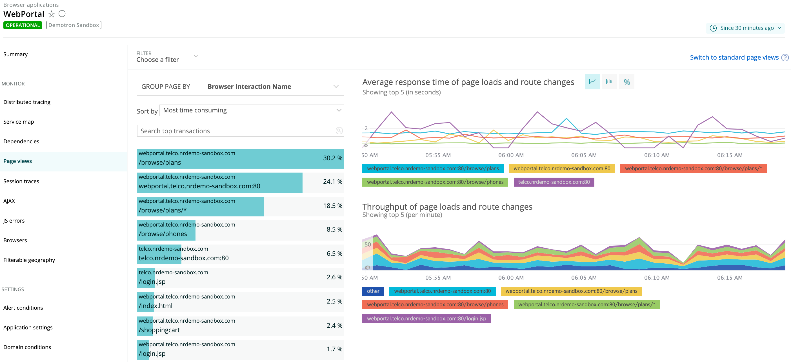

New Relic browser monitoring has a single-page application (SPA) monitoring feature that provides deeper visibility and actionable insights into real user interactions with single-page apps, and for any app that uses AJAX requests. 

In addition to monitoring route changes automatically, our SPA API allows you to monitor virtually anything that executes inside the browser. This allows developers and their team to:

* Create faster, more responsive, highly interactive apps.
* Monitor the throughput and performance that real users are experiencing.
* Troubleshoot and resolve problems within the context of the page load.
* [Query your data](/docs/using-new-relic/data/understand-data/query-new-relic-data) to assist with business decisions.
* Bring better apps to the marketplace more quickly.

## Enable SPA monitoring [#enable]

SPA monitoring is enabled by default for new browser agent installations. The SPA-enabled version of the agent gives access to other powerful New Relic features, like distributed tracing. For more information, see [Enable browser monitoring](/docs/browser/new-relic-browser/installation/update-browser-agent/#agent-types). 

For compatability information for SPA-related features, see [SPA requirements](/docs/browser/single-page-app-monitoring/get-started/spa-compatibility-requirements/). 

## Analyze throughput and performance data [#spa-data]

Improving on traditional industry standards for measuring page load timing, we give you a complete picture of the activity, both synchronous and asynchronous, associated with page loads and route changes.

<figcaption>
  **[one.newrelic.com](https://one.newrelic.com) > Browser > (select an app) > Page views:** Use browser monitoring's SPA monitoring to examine the throughput and performance of your SPA-architecture app.
</figcaption>

SPA data monitored by browser monitoring includes:

* Performance data and throughput for page loads and route changes
* AJAX request data
* JavaScript activity, both synchronous and asynchronous
* Dynamic page updates, monitored using the [SPA API](/docs/browser/new-relic-browser/browser-agent-spa-api)

With this data, you will gain a clear understanding of how your users experience your app's page loads and route changes, and be able to solve bottlenecks and troubleshoot errors. For more about how New Relic handles SPA data, see [Understand SPA data collection](/docs/browser/single-page-app-monitoring/use-spa-data/understand-spa-data-collection).

## Browser SPA features [#features]

Here is a summary of SPA monitoring features:

<table>
  <thead>
    <tr>
      <th style={{ width: "200px" }}>
        **Single-page app monitoring**
      </th>

      <th>
        **Take advantage of these features**
      </th>
    </tr>
  </thead>

  <tbody>
    <tr>
      <td>
        Robust views in browser's UI
      </td>

      <td>
        When a user initiates a page load or route change, New Relic begins to monitor all subsequent JavaScript, and ends the timing once all AJAX events are complete. This provides a more accurate view of when a page is actually ready for a user compared to the traditional method of ending the timing when the window load event is fired.

        When SPA monitoring is enabled, the [**Page views** page](/docs/browser/single-page-app-monitoring/browser-ui/view-spa-data-new-relic-browser) in browser shows event-driven data about application usage levels (throughput) and user experience (performance), including:

        * Charts with drill-down details about initial page load performance, route changes, and historical performance
        * Sort, search, and filter options, including custom attributes
        * Additional AJAX breakdown data for all initial page loads and route changes

        For an explanation of how SPA monitoring will impact your existing browser account's data usage, see [SPA and browser data usage](/docs/browser/single-page-app-monitoring/get-started/spa-monitoring-new-relic-data-usage).
      </td>
    </tr>

    <tr>
      <td>
        Data analysis with data explorer
      </td>

      <td>
        The [data explorer](/docs/query-your-data/explore-query-data/data-explorer/introduction-data-explorer) supports three SPA-specific event types: [`BrowserInteraction`](/docs/insights/new-relic-insights/decorating-events/browser-default-attributes-insights#browserinteraction-attributes), [`AjaxRequest`](/docs/insights/new-relic-insights/decorating-events/browser-default-attributes-insights#ajaxrequest-attributes), and [`BrowserTiming`](/docs/insights/insights-data-sources/default-events-attributes/browser-default-events-attributes-insights#browsertiming-attributes). You can query these events in the [query builder](/docs/query-your-data/explore-query-data/query-builder/use-advanced-nrql-mode-specify-data) to analyze your app's performance and make business decisions.
      </td>
    </tr>

    <tr>
      <td>
        Customized data from API
      </td>

      <td>
        Use [SPA API](/docs/browser/new-relic-browser/browser-agent-spa-api) to obtain the specific data you need, such as custom naming, custom timing, `finishline` API, or other custom attributes.
      </td>
    </tr>
  </tbody>
</table>
