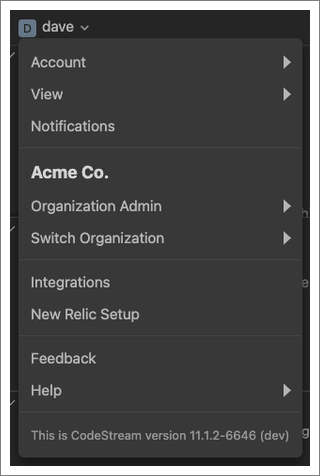

The CodeStream sidebar surfaces all the items you need to see, and do, in a
customizable tree-based view that is always available. 

<figcaption>The main sidebar sections are: Pull requests, Feedback requests, Codemarks, Observability, and Issues.</figcaption>

## Sidebar overview [#overview]

Here's a quick overview of the sidebar sections:

* [Pull requests](/docs/codestream/codestream-ui-overview/pull-requests-section) - If your team uses GitHub or GitHub Enterprise to host your code, you'll see all of your open pull requests listed here. Click a specific pull request to start reviewing or editing it.
* [Feedback requests](/docs/codestream/codestream-ui-overview/feedback-requests-section) - If you've been assigned a feedback request or you've requested feedback from someone else, find those listed here.
* [Codemarks](/docs/codestream/codestream-ui-overview/codemarks-section) - Codemarks are the discussions that annotate your codebase. Codemarks are created pull requests, feedback requests, or through ad hoc code comments/issues. All of the codemarks in your current repository are listed for reference.
* [Observability](/docs/codestream/codestream-ui-overview/observability-section) - Track errors assigned to you in New Relic One and discover recent errors in the repositories you have open in your IDE.
* [Issues](/docs/codestream/codestream-ui-overview/issues-section) - See all of your open issues, across multiple services, in one place. Click a specific issue to update its status, create a feature branch to do your work, and update your status on Slack.

The CodeStream sidebar is completely customizable: 

* Drag and drop the sections to reorder them. 
* Click and drag a section divider to resize the sections on either side. 
* Expand or collapse each section as needed. 
* Click the maximize button in each section to fill the whole screen. This is useful when you're looking at a longer list. Click it again to return to your previous view.

## The username menu [#username]

<figcaption>The username menu gives you options for managing your account, your organization, how you receive notifications, and what sections are visible.</figcaption>

Here are descriptions of each menu item:

* **Account**: View your profile. Includes various options for customizing the profile photo, email, username, and full name for your account.
* **View**: Uncheck sections you're not interested in seeing.
* **Notifications**: Manage how and what notifications you receive.
* **Organization admin**: Manage your organization settings. Also, export your data and delete your organization.
* **Switch organization**: Use this if you're a member of more than one organization.
* **Integrations**: Connect CodeStream to the code host, issue, and messaging providers you use.
* **New Relic setup**: Connect your New Relic account to CodeStream to get the most out of New Relic CodeStream's observability tools.
* **Feedback**: Got feedback for us? Write a GitHub issue.
* **Help**: Links to documentation, our video library, keybindings, the CodeStream workflow, what's new, and reporting an issue.

## Header menu items [#header-menu]

<figcaption>The header menu items provide different options for creating and discovering content in your organization. From left to right: **Create**, **Activity feed**, **My organization**, and **Filter & search**.</figcaption>

* **+** (Compose) - Click to create a code comment/issue, request feedback on changes, or to create a pull request.
* [Activity feed](/docs/codestream/codestream-ui-overview/activity-feed) - The activity feed will let you know about new code comments/issues and feedback requests, as well as replies to existing ones.
* [My organization](/docs/codestream/codestream-ui-overview/myorganization) - See who is in your CodeStream organization, invite new members, and create blame maps.
* [Filter & search](/docs/codestream/codestream-ui-overview/filter-and-search) - Filter & search allows you to slice and dice your team’s collection of code comments/issues and feature requests however you see fit.

