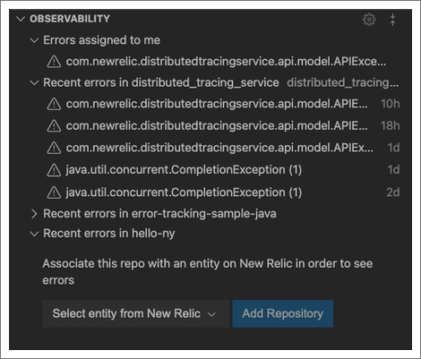

In order to get the most out of CodeStream and New Relic, connect CodeStream to New Relic via your [New Relic user key](/docs/apis/intro-apis/new-relic-api-keys/#user-api-key).

Once that's done, for entities you're monitoring with New Relic, you'll see your errors directly in CodeStream. 

## Connect CodeStream and New Relic One [#connect]

<figcaption>Before you can start seeing errors in your IDE and take advantage of other New Relic and CodeStream features, you'll need to enter your New Relic user key.</figcaption>

Go here to get or create your [New Relic user key](https://one.newrelic.com/launcher/api-keys-ui.api-keys-launcher).

Once you have your user key, in **Observability** click **Connect to New Relic One**, then paste your user key and click **Connect**.

## See your errors in CodeStream [#errors]

<figcaption>Once you've connected New Relic to CodeStream, you'll see observed errors directly in CodeStream.</figcaption>

These sections help you and your team manage and see your errors in different ways:
* **Errors assigned to me**: If an error has been assigned to you, you'll see it here.
* **Recent errors in**: Each repository you have open in your IDE will have its own grouping of errors. If your repository URL is mapped to more than one entity you're observing in New Relic, a dropdown lets you filter by entity.
* **Select entity from New Relic**: Use this to connect a repository in your IDE with an entity you're observing with New Relic.

<Callout variant="tip">
If your project isn't monitored by New Relic, you can use CodeStream to get that started.

In the CodeStream extension, in the **Observability** section, click the gear icon, and then click **Instrument my App**. Follow the instructions to instrument your code.
</Callout>

