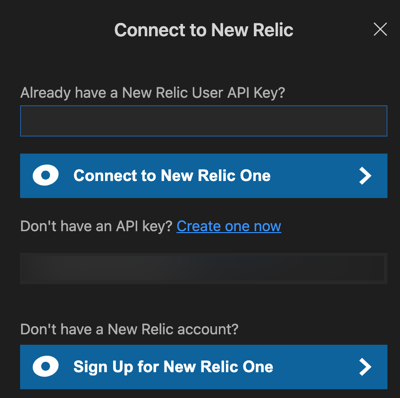

In order to get the most out of CodeStream and New Relic, connect CodeStream to New Relic via your [New Relic user key](/docs/apis/intro-apis/new-relic-api-keys/#user-api-key).

Once that's done, for entities you're monitoring with New Relic, you'll see your errors directly in CodeStream. 

## Connect CodeStream and New Relic [#connect]

<figcaption>Before you can start seeing errors in your IDE and take advantage of other New Relic and CodeStream features, you'll need to enter your New Relic user key.</figcaption>

Go here to get or create your [New Relic user key](https://one.newrelic.com/launcher/api-keys-ui.api-keys-launcher).

Once you have your user key, in **Observability** click **Connect to New Relic One**, then paste your user key and click **Connect**.

## See your errors in CodeStream [#errors]

<figcaption>Once you've connected New Relic to CodeStream, you'll see observed errors directly in CodeStream.</figcaption>

