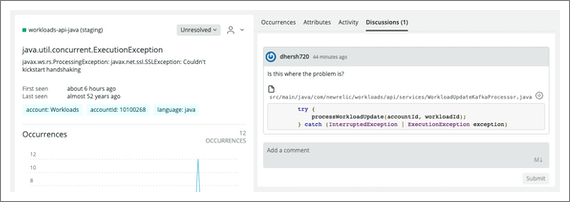
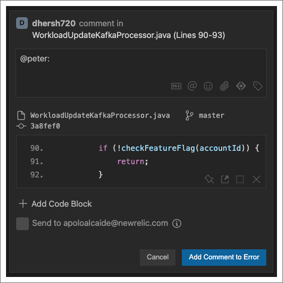
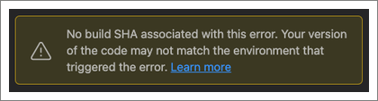
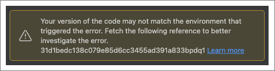

It's important to know how your code is performing in production and whether or not it's generating errors. To help you with this, New Relic CodeStream brings performance monitoring right into your IDE.

## Connect CodeStream and New Relic One [#connect]

In order to get the most out of New Relic CodeStream, connect CodeStream to New Relic One via your [New Relic user key](/docs/apis/intro-apis/new-relic-api-keys/#user-api-key). Once done, for entities you're monitoring with New Relic One, you'll see your errors directly in CodeStream. 

<figcaption>Before you can start seeing errors in your IDE and take advantage of other New Relic and CodeStream features, you'll need to enter your New Relic user key.</figcaption>

Go here to get or create your [New Relic user key](https://one.newrelic.com/launcher/api-keys-ui.api-keys-launcher).

Once you have your user key, in **Observability** click **Connect to New Relic One**, then paste your user key and click **Connect**.

## Discover errors on New Relic One [#discover-on-NR1]

Once you've [connected CodeStream to your New Relic One account](/docs/codestream/start-here/codestream-new-relic), and you've created one or more workloads with [errors inbox](/docs/errors-inbox/errors-inbox/) on New Relic One, use **Open in IDE** to see APM errors with stack traces directly in your IDE.

Once connected, all of your collaboration work in CodeStream (such as the discussion, assignee, and error status) syncs with New Relic One, where you can continue to collaborate. 

A typical collaboration session could include  developers commenting on code in their IDEs, a DevOps engineer assigning errors in errors inbox, and a development manager following along in Slack. By meeting people in the tools they're already using, New Relic CodeStream shortens the amount of time between error discovery and error resolution.

For a look at using CodeStream to discover errors, watch this short YouTube video (approx. 2:27 minutes).

<Video id="LfH7p76Cvro" type="youtube" />

## Discover errors via CodeStream [#discover-via-CS]

In addition to errors inbox, discover errors in your IDE in the CodeStream observability section. See recent errors in your repos, and any specific errors assigned to you.

<figcaption>Once you've connected New Relic to CodeStream, you'll see observed errors directly in CodeStream.</figcaption>

These sections help you and your team manage and see your errors in different ways:

* **Errors assigned to me**: If an error has been assigned to you, you'll see it here.
* **Recent errors in**: Each repository you have open in your IDE will have its own grouping of errors. If your repository URL is mapped to more than one entity you're observing in New Relic, a dropdown lets you filter by entity.
* **Select entity from New Relic**: Use this to connect a repository in your IDE with an entity you're observing with New Relic.

<Callout variant="tip">
If your project isn't monitored by New Relic, you can use CodeStream to get that started.

In the CodeStream extension, in the **Observability** section, click the gear icon, and then click **Instrument my App**. Follow the instructions to instrument your code.
</Callout>

### Error details [#error-details]

No matter how you've arrived at an error in your IDE, CodeStream presents all of the error's details, including the stack trace, and you can collaborate with your teammates to resolve the error.

<figcaption>Navigate the stack trace to investigate the issue.</figcaption>

Click any frame in the stack trace to jump straight to the corresponding file and line number in your IDE. As you navigate the stack trace, if you come across code that seems like the source of your problem, select it and click the comment icon to start collaborating.

## Collaborate with CodeStream [#collaborate]

With CodeStream open, once you've identified the problematic code, select it in your editor and click the comment icon that appears next to it in the CodeStream pane. CodeStream automatically mentions the most recent person to touch the code related to the error, making it easy for you to bring the right people into the discussion.

<figcaption>Select code in your editor to add a comment.</figcaption>

* Once you've identified the problem you can assign the error, either to an existing teammate on CodeStream or to a person suggested based on the repository's Git commit history. 
* You can update the error status from unresolved to resolved or ignored.

### Use build SHAs or release tags with CodeStream [#sha]

You may see this warning if there's no git reference, either a build SHA or release tag, associated with a specific error. CodeStream uses the git reference to match the specific stack trace error with the version of the code running in the environment that triggered the error.

<figcaption>The git reference not configured warning message reads: Assocaite a build SHA or release tag with your errors so that CodeStream can help make sure you're looking at the right version of the code.</figcaption>

To configure a git reference [set the environment variables for your APM agent](/docs/codestream/start-here/codestream-new-relic/#buildsha).

Even without the git reference configured, you can still investigate the error, but you may not be looking at the version of the code that caused it.

<figcaption>The git reference not found warning message reads: Your version of the code doesn't match the environment that triggered the error. Fetch the following reference to better investigate the error.</figcaption>

If you do have git references configured, but the version of the code you're on locally doesn't contain that reference, CodeStream will let you know so that you can more effectively investigate and resolve the error.

CodeStream will also let you know if the error doesn't have a stack trace associated with it. This happens with older errors when the stack trace has aged out on New Relic One.

### Other collaboration tools [#other-tools]

In an error discussion, use the `...` **More actions** dropdown to share the discussion on Slack or Microsoft Teams.

## Associate your repository [#repo]

All of the repositories you currently have open in your IDE are listed in the **select a repo** dropdown. If there's no repository associated with CodeStream when you click **Open in IDE** on an error, CodeStream prompts you to do so.

If you don't see the repository you want listed, open it in your IDE and it will automatically get added to the list. If you're working with a fork, make sure you select the upstream remote.

To avoid having to do this manual association every time you open an error, you can [make these associations via your APM agent's environment variables](/docs/codestream/start-here/codestream-new-relic/#repo-url).
