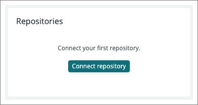

CodeStream and New Relic One work together to give you insight into your code's errors, as well as making it easier to get started instrumenting your code with our APM agents.

With CodeStream connected to New Relic One, you can jump from a stack trace error directly to the offending line of code in your IDE. Once in your IDE, you can navigate the stack trace and [collaborate with your teammates to resolve the issue](/docs/codestream/how-use-codestream/performance-monitoring).

<Callout title="Preview release">
CodeStream's integration with New Relic One is a preview release limited to New Relic One accounts on our US data center, and your use is subject to the pre-release policy. (This does not apply to all other CodeStream functionality.)
</Callout>

## Connect CodeStream and New Relic [#connect]

Before you can take advantage of New Relic's observability features in CodeStream, you'll need to connect them.

Requirements for connecting CodeStream and New Relic:

* [New Relic account](https://newrelic.com/signup) (If you don't have a New Relic account, sign up at [newrelic.com/signup](https://newrelic.com/signup). It's free, forever!)
* [New Relic user key](https://one.newrelic.com/launcher/api-keys-ui.api-keys-launcher)

If you don't have a user key or want to learn more about how you can use and manage them, see our doc on the [New Relic user key](/docs/apis/intro-apis/new-relic-api-keys/#user-api-key).

Once you have your New Relic user key, in CodeStream's **Observability** section click **Connect to New Relic One**, then paste your API key and click **Connect to New Relic One**.

<Callout variant="caution">
New Relic users can share stacktrace errors on CodeStream. Once you've connected CodeStream to New Relic, any new users you add to your CodeStream organization can see those errors.
</Callout>

## See your errors and what's causing them [#errors]

After you connect CodeStream and New Relic, use workloads and errors inbox to jump to the offending code in your IDE.

Requirements for opening stack trace errors in your IDE:

* [New Relic account](https://newrelic.com/signup) (If you don't have a New Relic account, sign up at [newrelic.com/signup](https://newrelic.com/signup). It's free, forever!)
* [New Relic user key](https://one.newrelic.com/launcher/api-keys-ui.api-keys-launcher)
* [CodeStream and New Relic connection](#connect)
* [Data being reported to New Relic via APM monitoring](https://one.newrelic.com/launcher/nr1-core.explorer?pane=eyJuZXJkbGV0SWQiOiJucjEtY29yZS5saXN0aW5nIn0=&cards[0]=eyJuZXJkbGV0SWQiOiJucjEtaW5zdGFsbC1uZXdyZWxpYy5ucjEtaW5zdGFsbC1uZXdyZWxpYyIsImFjdGl2ZUNvbXBvbmVudCI6IlZUU09FbnZpcm9ubWVudCIsInBhdGgiOiJndWlkZWQifQ==)
* [A workload for errors inbox](/docs/new-relic-one/use-new-relic-one/workloads/use-workloads/#create)
* [An error](/docs/apm/apm-ui-pages/errors-inbox/errors-inbox/#error-details)
* [For APM errors, your repository's commit hash and release tag](#apm)

New Relic errors inbox is a single place to proactively detect, prioritize, and take action on your errors before they impact customers. With CodeStream, you can jump from an error directly to the offending code in your IDE.

<Callout variant="tip">
    Limited to APM errors.
</Callout>

### How to go from errors inbox to your IDE

From **[one.newrelic.com/](https://one.newrelic.com/)**, go to **Errors Inbox**, click a stack trace error, then click **Open in IDE**.

## APM errors and CodeStream [#apm]

In order to view stack trace errors in your IDE, CodeStream needs to know what repository the error is associated with and, ideally, which version of the code generated the error.

## Associate repositories with errors [#repo-url]

Once you've started monitoring for APM, mobile, browser, or Lambda, you should create repository entities and associate them with entities for all of your services. In order to create a repository entity you'll need to provide the repository's remote URL. For example, the remote URL can be in either the SSH or HTTPS format:

* `git@github.com:newrelic/beta-docs-site.git`
* `https://github.com/newrelic/beta-docs-site.git`

<Callout variant="caution">
It's possible to add the same GitHub repository more than once, if you're using different protocols to do so. The UI warns you about this, but won't prevent you from doing so.

For example, `https://github.com/tuna/repo` and `git@github.com:tuna/repo` are the same repo, with different protocols.
</Callout>

If you try to open an error in your IDE and there isn't an associated repository, CodeStream will prompt you to make an association and save that association for all errors from the given entity on New Relic. However, it would be preferably to use one of the following methods since they require less ongoing manual effort and eliminate the possibility of end-user mistakes, such as misconfigured remote URLs.

<CollapserGroup>
  <Collapser
    className="freq-link"
    id="env-var"
    title="Use environment variable with APM (recommended)"
  >
  Set the environment variable `NEW_RELIC_METADATA_REPOSITORY_URL`. New Relic APM agents create the repository entity and associate it to your application entity automatically.   
  
  This requires the SSH or HTTPS URL format.  We recommend that these be set as part of your build pipeline.

  </Collapser>

  <Collapser
    className="freq-link" id="repo-ui" title="Use the UI" > Once you've started sending data to New Relic, use the UI to connect your related repository. Go to the APM Summary page via **[one.newrelic.com](https://one.newrelic.com) > Explorer > Services - APM > (select an app)**, then look for the **Repositories** section at the bottom-right.

     

     Click **Connect repository** to find an existing repository or add a new one.
  </Collapser>
    <Collapser
    className="freq-link"
    id="nerdgraph"
    title="Use the NerdGraph API"
  >

Use New Relic's [NerdGraph APIs](/docs/apis/nerdgraph/get-started/introduction-new-relic-nerdgraph/)to create a repository and associate it with your application entities.

**Step 1: Create a repository entity**

To create a repository entity, use the `referenceEntityCreateOrUpdateRepository` API and make sure to save the GUID that's produced.  The API takes the following parameters:
* `accountId` - the integer account ID for the account you want to add the repository to
* `url` - example `https://github.com/newrelic/beta-docs-site.git`
* `name` - example: `newrelic/beta-docs-site`
```
mutation {
  referenceEntityCreateOrUpdateRepository(repositories: [{accountId: [YOUR_ACCOUNT_ID], name: "[REPO_NAME]", url: "[REPO_URL]"}]) {
    created
    failures {
      guid
      message
      type
    }
  }
}
```

In order to find the entity you create, you can use a query like the following.  Note that the URL you provided to `referenceEntityCreateOrUpdateRepository` gets saved as an entity tag.

```
{
  actor {
    entitySearch(query: "name = 'a name' OR tags.url = 'a url'") {
      count
      query
      results {
        entities {
          guid
          name
          tags {
            key
            values
          }
        }
      }
    }
  }
}

```

**Step 2: Associate the repository entity to your application entity**

First, find the GUID for the application you want to associate your repository to.  

Parameters:

* `sourceEntityGuid` - the entity GUID of the application
* `targetEntityGuid` - the entity GUID of your repository
* `type` - always `BUILT_FROM`

```
mutation {
  entityRelationshipUserDefinedCreateOrReplace(sourceEntityGuid: "", targetEntityGuid: "", type: BUILT_FROM) {
    errors {
      message
      type
    }
  }
}
```

To see all entities related to your repository you can do a query like this:
```
{
  actor {
    entity(guid: "[YOUR_REPOSITORY_GUID]]") {
      relatedEntities(filter: {direction: BOTH, relationshipTypes: {include: BUILT_FROM}}) {
        results {
          target {
            entity {
              name
              guid
              type
            }
          }
          type
        }
      }
      name
      type
      tags {
        values
        key
      }
    }
  }
}
```

**Step 3: Cleanup (if needed)**

Delete a repository with the following query:

```
mutation DeleteRepository {
  entityDelete(guids: "[ENTITY_GUID_HERE]]") {
    deletedEntities
    failures {
      message
      guid
    }
  }
}
```

  </Collapser>

</CollapserGroup>

## Associate build SHAs or release tags with errors [#buildsha]

To use CodeStream's **Open in IDE** with your APM stack trace errors, use environment variables to configure your APM agent with your application's [commit sha](https://git-scm.com/book/en/v2/Git-Tools-Revision-Selection) and/or your [release tag](https://git-scm.com/book/en/v2/Git-Basics-Tagging) associated with the running version of your software.  

CodeStream only needs the first seven characters of your commit sha (for example, `734713b`) to make this connection, but you can include the entire sha.  

Alternately, you can use a release tag (such as `v0.1.209` or `release-209`) for CodeStream to find the correct version of your code.

For New Relic APM, the commit and/or release tag (`tags.commit` and `tags.releaseTag`) are added as attributes on `Transaction` and `TransactionError` events. You can use APM environment variables to set these attributes.  

We recommend setting one or both of these variables as part of your build pipeline.

* `NEW_RELIC_METADATA_COMMIT` - The commit sha. You can include the whole thing or only the first seven characters.
* `NEW_RELIC_METADATA_RELEASE_TAG` - A release tag (such as `v0.1.209` or `release-209`). This has the advantage of being human readable.

For more on how to set these variables, here are specific configuration details for each language:

* [Go](/docs/agents/go-agent/configuration/go-agent-configuration/)
* [Java](/docs/agents/java-agent/configuration/java-agent-configuration-config-file/)
* [.NET](/docs/agents/net-agent/configuration/net-agent-configuration/)
* [Node.js](/docs/agents/nodejs-agent/installation-configuration/nodejs-agent-configuration/)
* [PHP](/docs/agents/php-agent/configuration/php-agent-configuration/)
* [Python](/docs/agents/python-agent/configuration/python-agent-configuration/)
* [Ruby](/docs/agents/ruby-agent/configuration/ruby-agent-configuration/)

## Install APM agents with CodeStream [#install-agents]

Requirements for installing New Relic APM agents via CodeStream:
* [New Relic account](https://newrelic.com/signup)
* [New Relic user key](https://one.newrelic.com/launcher/api-keys-ui.api-keys-launcher)
* [CodeStream and New Relic connection](#connect)
* A supported language application codebase
    * .NET Core
    * Java
    * Node.JS

When you first connect CodeStream to New Relic, if you're working on an application's codebase that's not being monitored by New Relic, CodeStream will offer to instrument that application for you.

Like [New Relic's guided install](/docs/full-stack-observability/observe-everything/get-started/new-relic-guided-install-overview/), CodeStream will walk you through and automate all of the steps to installing the APM agent to start sending data to New Relic.

This check only happens automatically when the initial connection is made. To do so later, in the CodeStream extension, click your username, then click **New Relic Setup**.

## Dynamic logging with Go and Pixie

 * [New Relic account](https://newrelic.com/signup)
 * [New Relic user API key](https://one.newrelic.com/launcher/api-keys-ui.api-keys-launcher)
 * [CodeStream and New Relic connection](#connect)
 * [A Kubernetes cluster monitored by Pixie](/docs/auto-telemetry-pixie/install-auto-telemetry-pixie/)
 * An application written in Go

 You can use CodeStream to enable dynamic logging for your Pixie-monitored Go applications. Just right-click on any method name and select **Dynamic Logging Using Pixie**.
