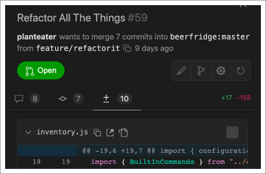

New Relic CodeStream is a developer collaboration platform that makes it easy to discuss and review code in a more natural and contextual way. Once connected to New Relic, collaborate on your application errors directly in your IDE.

If you haven't already, [sign up for a free New Relic account](https://newrelic.com/signup) so that you can get the most out of New Relic CodeStream.

## Install CodeStream [#install]

You can install CodeStream for your specific IDE or install it through our Instant Observability (I/O) quickstart.

<CollapserGroup>
  
    <Collapser
    className="freq-link"
    id="io"
    title="Instant Observability (I/O) quickstart"
  >
  Install CodeStream with its [Instant Observability (I/O) quickstart](https://developer.newrelic.com/instant-observability/codestream/29bd9a4a-1c19-4219-9694-0942f6411ce7) to connect CodeStream to your New Relic account via your user key.

  </Collapser>
  <Collapser
    className="freq-link"
    id="vscode"
    title="Visual Studio Code"
  >
    Download and install CodeStream for [Visual Studio Code](https://marketplace.visualstudio.com/items?itemName=CodeStream.codestream). You can also install it directly in Visual Studio Code via the extensions marketplace.
  </Collapser>
    <Collapser
    className="freq-link"
    id="visual-studio"
    title="Visual Studio"
  >

  Download and install CodeStream for [Visual Studio](https://marketplace.visualstudio.com/items?itemName=CodeStream.codestream-vs). You can also install it directly in Visual Studio via the extensions marketplace.

  </Collapser>
    <Collapser
    className="freq-link"
    id="jetbrains"
    title="JetBrains"
  >

  Download and install CodeStream for [JetBrains](https://plugins.jetbrains.com/plugin/12206-codestream). You can also install it from the JetBrains plugins menu.

  </Collapser>
</CollapserGroup>

## Connect your tools [#connect-tools]

Create and review pull requests on GitHub, GitLab, or Bitbucket. Create issues on Jira, Trello, and other issue trackers. Investigate errors reported to New Relic One. Share code discussions on Slack or Microsoft Teams. CodeStream brings the tools you use every day together in your IDE. 

Click your headshot at the top of the CodeStream pane, then click **Integrations** to connect all of your tools to CodeStream.

<Callout variant="tip">
Once you've installed CodeStream, to connect to New Relic, you'll need your [New Relic user key](https://one.newrelic.com/launcher/api-keys-ui.api-keys-launcher). Go here to [learn more about finding or creating your user key](/docs/apis/intro-apis/new-relic-api-keys/#user-api-key).
</Callout>

## Discuss any block of code, at any time [#discuss-code]

Whether you're trying to understand someone else's code or getting help with some code you just wrote, select the code and click the comment button to ask your question.

[Learn more about discussing code.](/docs/codestream/how-use-codestream/discuss-code)

## Get feedback on your work in progress [#get-feedback]

Click the **+** menu then click **Request Feedback** at any time in the development cycle, whether it’s a quick look over some work in progress (even uncommitted code) or a formal review of a completed effort.

Teammates can review your changes right in their IDE, with no need to switch branches or set aside their own work. [Learn more about feedback requests.](/docs/codestream/how-use-codestream/feedback-requests)

## Create or review a pull request [#pull-request]

In the CodeStream sidebar, look for the **Pull Requests** section to review an open pull request. Select a pull request (or load one from URL) to get a complete GitHub experience right in your IDE.

You can create a pull request in GitHub, GitLab, or Bitbucket, but support for reviewing pull requests is currently only available for GitHub. [Learn more about pull requests.](/docs/codestream/how-use-codestream/pull-requests/)

## Help and feedback [#help]

* Report a bug or suggest an improvement in [GitHub issues](https://github.com/TeamCodeStream/CodeStream/issues).
* Contact us directly at [support@codestream.com](mailto:support@codestream.com).
* Follow [@teamcodestream](http://twitter.com/teamcodestream) for product updates and to share feedback and questions.