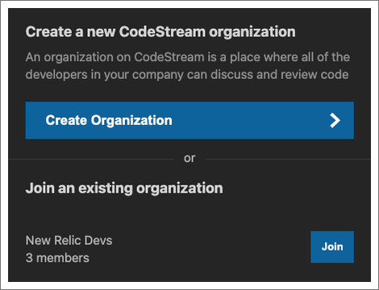
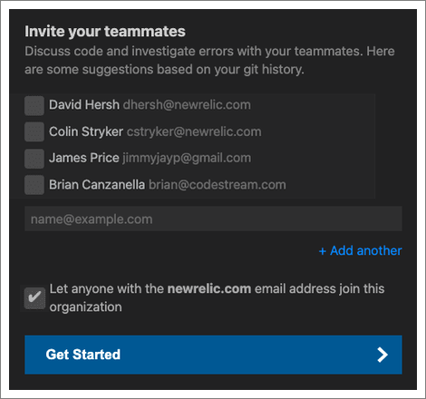

To get the most out of New Relic CodeStream's collaboration tools, create an
organization and then invite your team members to it. 

If you haven't already, [sign up for a free New Relic
account](https://newrelic.com/signup) to jump from your application's stack
trace errors in New Relic One directly to the line of code responsible in your
IDE.

## Create an account [#account]

If you already have the CodeStream extension [installed in your
IDE](/docs/codestream/start-here/install-codestream), you can start the sign up
process from the CodeStream pane.

You can sign up using your email address and a password, or you can sign up using
your GitHub, GitLab, or Bitbucket account (cloud versions only, although
CodeStream does have integrations with the on-prem versions once you've
signed up). If you're a New Relic customer, you can also sign up with a user api
key from your New Relic One account.

If the email address you're using with your code host isn't your work email, you
should sign up with your work email address instead.

If you sign up using your email address, your next step will be to confirm the
email address by entering a code sent to you via email. You can paste the code
into any of the boxes rather than typing each number individually.

## Create or join an organization [#create-org]

A CodeStream organization is where you and your teammates will discuss code.
Similar to a Slack workspace, all of the developers in your company can be in
the same CodeStream organization. 

If you're invited to join an organization on CodeStream, sign up with the same
email address the invitation was sent to and you'll automatically be added to
that organization. Alternatively, there may be existing CodeStream organizations
available for you to join based on your email domain.

If you weren't invited, and there are no existing organizations for you to join,
a new organization will be created for you.

## Invite your teammates [#invite]

Collaboration is a team sport so invite your teammates to join your CodeStream
organization.

CodeStream will offer up some suggestions based on the commit history of the
repositories you have open in your IDE. You can also indicate that anyone with
an email address on your company's domain can join your organization without
needing to be invited.

Now you're ready to start using CodeStream.