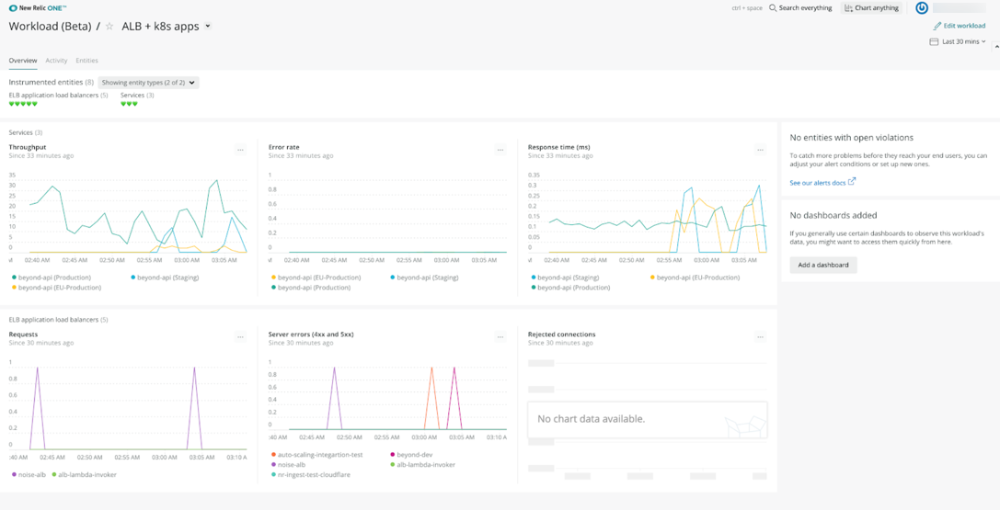

With [workloads](/docs/new-relic-one/use-new-relic-one/core-concepts/new-relic-one-workloads-observe-your-full-stack), you can see data from your AWS-hosted applications in context with load balancer data. Use workloads to combine all your relevant information in one dashboard experience.

## Create a load balancer workload [#create-workload]

To create a workload that correlates load balancer and application metrics:

1. Go to [one.newrelic.com](https://one.newrelic.com) and select the **Workloads** launcher.
2. Select **Create workload**.
3. From the **Select the account** dropdown, select the account the workload data will be attached to.
4. In the [entities](/docs/new-relic-one/use-new-relic-one/core-concepts/what-entity-new-relic) search bar, search for your load balancers to assign to the workload. You can search by entity type or [tags](/docs/new-relic-one/use-new-relic-one/core-concepts/tagging-use-tags-organize-group-what-you-monitor).

   <Callout variant="tip">
     If you use the same tags inside Kubernetes to label the app/service and in the load balancer as an AWS tag, you can use that tag to scope the workload to a specific application and its load balancer.
   </Callout>
5. You can have dynamic or non-dynamic workloads (a dynamic workload automatically contains entities that share a specific tag). Choose the entities that make up the workload. For the best experience, we recommend using 500 or fewer entities. You can add entities in two ways:
   * **Use a dynamic query.** You can construct a query by choosing entity types (including [dashboards](#add-dashboards)), [tags](#tags), and [attributes](/docs/using-new-relic/welcome-new-relic/get-started/glossary#attribute) (like app name, account ID, and AWS region). The workload dynamically updates its entities as your system changes. To save your query, construct it in the workload search bar, and then click **Save this query**.
   * **Select specific entities**. Adding specific entities is a good choice if you know those specific entities will remain useful to you. To add entities, use the search bar to return the entities you want and then click **Add**.
6. Save the workload.

## Use workloads [#use]

Once created, you can use workloads to closely monitor your load balancers. For example:

* Use the dashbaord charts to monitor load balancer status.
* Entities with violations appear in the right part of the screen in **Entity with open violations**.
* Pin other dashboards to your workload for additional context.

## For more help [#more_help]

For more information on using workloads, see [New Relic One workloads: Observe your full stack](/docs/new-relic-one/use-new-relic-one/core-concepts/new-relic-one-workloads-observe-your-full-stack).
