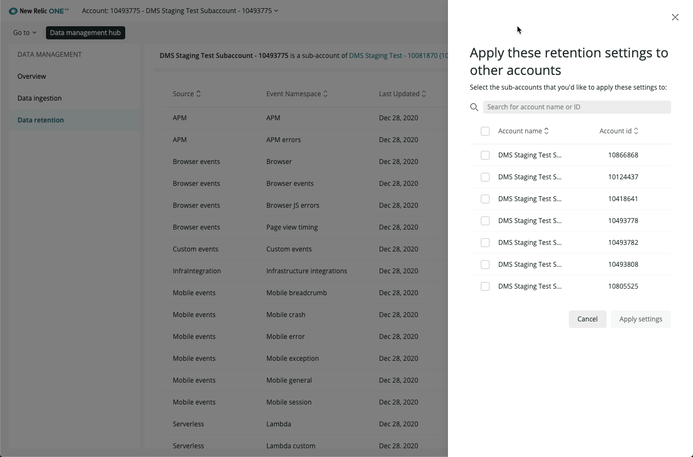

Using the **Data retention** page, review and manage how long your data will be stored in the New Relic database (NRDB). Keep data for shorter periods to protect sensitive information or for longer periods to notice trends over time. At a glance, get the sources of data that you’re storing, when they were last updated, and the length the data is stored. Retention settings range from 8 to 395 days depending on the data's `source` and `namespace` classifications in New Relic. 


<figcaption>
  From the Data retention page, which shows the source of data, you can click Edit settings to adjust the data retention for each source.
</figcaption>

<Callout variant="important">
This doc applies to organizations on our [New Relic One pricing model](/docs/accounts/accounts-billing/new-relic-one-pricing-users/pricing-billing). If you're on our original product-based pricing model, you have different data retention rules. See [Original data retention](/docs/accounts/original-accounts-billing/product-based-pricing/overview-data-retention-components). Not sure which plan you're on? See [Overview of pricing and user model](/docs/transition-guide-our-new-pricing-plan-user-model).
</Callout>

## Retention periods [#adjust-retention]

The following table shows the default retention settings for our [New Relic One pricing model](/docs/accounts/accounts-billing/new-relic-one-pricing-users/pricing-billing). To adjust retention settings, you must be on a [Pro or Enterprise](https://newrelic.com/pricing) tier.

<table>
  <thead>
    <tr>
      <th style={{ width: "250px" }}>
        Source
      </th>

      <th>
        Event namespace
      </th>

      <th>
        Days retained
      </th>
    </tr>
  </thead>

  <tbody>
    <tr>
      <td>
        APM
      </td>

      <td>
        APM
      </td>

      <td>
        8
      </td>
    </tr>

    <tr>
      <td>
        APM
      </td>

      <td>
        APM errors
      </td>

      <td>
        8
      </td>
    </tr>

    <tr>
      <td>
        Browser
      </td>

      <td>
        Browser
      </td>

      <td>
        8
      </td>
    </tr>

    <tr>
      <td>
        Browser
      </td>

      <td>
        Browser events
      </td>

      <td>
        8
      </td>
    </tr>

    <tr>
      <td>
        Browser
      </td>

      <td>
        Browser JS errors
      </td>

      <td>
        8
      </td>
    </tr>

    <tr>
      <td>
        Browser
      </td>

      <td>
        Browser page view timing
      </td>

      <td>
        8
      </td>
    </tr>

    <tr>
      <td>
        Custom events
      </td>

      <td>
        Custom events
      </td>

      <td>
        30
      </td>
    </tr>

    <tr>
      <td>
        Serverless
      </td>

      <td>
        Lambda
      </td>

      <td>
        8
      </td>
    </tr>

    <tr>
      <td>
        Serverless
      </td>

      <td>
        Lambda custom
      </td>

      <td>
        8
      </td>
    </tr>

    <tr>
      <td>
        Serverless
      </td>

      <td>
        Lambda spans
      </td>

      <td>
        8
      </td>
    </tr>

    <tr>
      <td>
        Logs
      </td>

      <td>
        Log
      </td>

      <td>
        30
      </td>
    </tr>

    <tr>
      <td>
        Infrastructure
      </td>

      <td>
        Infrastructure processes
      </td>

      <td>
        8
      </td>
    </tr>

    <tr>
      <td>
        Infrastructure
      </td>

      <td>
        Infrastructure integrations
      </td>

      <td>
        395 (13 months)
      </td>
    </tr>

    <tr>
      <td>
        Mobile
      </td>

      <td>
        Mobile crash event trails (breadcrumb)
      </td>

      <td>
        8
      </td>
    </tr>

    <tr>
      <td>
        Mobile
      </td>

      <td>
        Mobile exception
      </td>

      <td>
        8
      </td>
    </tr>

    <tr>
      <td>
        Mobile
      </td>

      <td>
        Mobile general
      </td>

      <td>
        8
      </td>
    </tr>

    <tr>
      <td>
        Mobile
      </td>

      <td>
        Mobile error
      </td>

      <td>
        8
      </td>
    </tr>

    <tr>
      <td>
        Mobile
      </td>

      <td>
        Mobile crash
      </td>

      <td>
        90
      </td>
    </tr>

    <tr>
      <td>
        Mobile
      </td>

      <td>
        Mobile session
      </td>

      <td>
        90
      </td>
    </tr>

    <tr>
      <td>
        Synthetics
      </td>
      
      <td>
        Synthetics data
      </td>
   
      <td>
        395 (13 months)
      </td>
    </tr>
    
    <tr>
      <td>
        Traces
      </td>

      <td>
        Traces
      </td>

      <td>
        8
      </td>
    </tr>
  </tbody>
</table>

## Adjust retention values [#adjust-retention]

You can adjust your retention periods to better support your data needs. For example, you might reduce your contracted retention values to optimize query performance. Conversely, you might increase retention for some data types to support more granular analysis over longer periods of time, or to meet data compliance requirements.  

The ability to edit data retention periods requires a specific [edition of New Relic](https://newrelic.com/pricing).

* Original pricing model users must have Insights Pro. 

* New Relic One pricing model users have these edition considerations:

  * Standard edition: your data retention is fixed, and falls between 8 and 395 days (about 13 months) of retention, depending on which capabilities of the New Relic platform you’re using. The prescribed retention levels ensure that you can explore your data and experience the value of New Relic. If you need to raise some of the retention limits for your particular business needs, you can purchase additional retention.
  * Pro or Enterprise: If after you finalize your contracted retention you realize you need to make changes, you can adjust your telemetry data retention settings yourself.

### User roles and retention

In order to edit retention, users need these roles:

* Users on [New Relic One user model](/docs/accounts/accounts-billing/new-relic-one-user-management/new-relic-one-user-model-understand-user-structure): the [**Billing user** role](/docs/accounts/accounts-billing/new-relic-one-user-management/user-management-concepts#standard-roles)
* Users on the [original user model](/docs/accounts/original-accounts-billing/original-users-roles/users-roles-original-user-model): the Owner or [**Data retention manager** add-on role](/docs/accounts/original-accounts-billing/original-users-roles/users-roles-original-user-model/#add-on) 

### Reduce retention values

When you reduce the number of days that specific data sources are retained, existing data of that source type won't immediately disappear. That data might be visible and returned in queries for up to several weeks. We have safeguards in place to ensure you don't accidentally delete data, but this also means that reducing retention values isn't a good strategy for quickly [removing data](#data-deletion).

That said, your change is registered in the system within 12 hours and new data of the adjusted source type will be retained for the new duration. 

Note that reducing data retention below your contracted retention values will not reduce New Relic’s data ingest charges. Conversely, increasing retention for targeted telemetry data types is likely to trigger a conversation with New Relic about adjusting your data ingest charges.


## Copy retention values

If you have permission to edit retention settings, you can also copy retention values from one child account to other child accounts under the same parent account. To do this, from within a child account, select the **Copy settings to other accounts** link, and then select the child accounts you want to apply the retention values to.



<figcaption>
  Select the child accounts you want to copy retention values to.
</figcaption>

## Data deletion

Once [telemetry data](/docs/using-new-relic/data/understand-data/new-relic-data-types) (events, metrics, logs, traces) is reported to New Relic and available for querying, that data cannot be edited or deleted. This is a purposeful design decision that optimizes New Relic's speed and performance. Data will expire after its [data retention period](#adjust-retention) ends. If you need to delete data, contact your New Relic representative.

## Manage retention via API [#api-examples]

You can change your retention settings with [NerdGraph](/docs/apis/nerdgraph/get-started/introduction-new-relic-nerdgraph/) as well as the UI. For the following examples, provide any necessary information, and run the code in the [NerdGraph GraphiQL explorer](https://api.newrelic.com/graphiql).  

Your retention changes take effect within 24 hours after updating.

<CollapserGroup>
  <Collapser
    id="api-list-namespaces"
    title="List customizable retention event namespaces"
  >
    To list the customizable retention event names spaces for your account:
    ```
    query {
     actor {
       account(id: <var>YOUR_ACCOUNT_ID</var>) {
         dataManagement {
           customizableRetention {
             eventNamespaces {
               namespace
             }
           }
         }
       }
     }
    }
    ```
  </Collapser>

  <Collapser
    id="api-list-rules"
    title="List active rules on an account"
  >
    To list active rules on an account:

    ```
    query {
     actor {
       account(id: <var>YOUR_ACCOUNT_ID</var>) {
         dataManagement {
           eventRetentionRules {
             id
             deletedAt
             deletedById
             createdAt
             createdById
             retentionInDays
             namespace
           }
         }
       }
     }
    }
    ```
  </Collapser>

  <Collapser
    id="api-show-active-rule"
    title="Show active rule on an account/namespace pair"
  >
    To show the active rule on a specific account/namespace pair:

    ```
    query {
     actor {
       account(id: <var>YOUR_ACCOUNT_ID</var>) {
         dataManagement {
           eventRetentionRule(namespace: "APM") {
             id
             deletedById
             deletedAt
             createdById
             createdAt
             retentionInDays
             namespace
           }
         }
       }
     }
    }
    ```
  </Collapser>

  <Collapser
    id="api-create-new-rule"
    title="Create a new rule"
  >
    To create a new rule:

    ```
    mutation {
     dataManagementCreateEventRetentionRule(accountId: <var>YOUR_ACCOUNT_ID</var>, namespace: "APM", retentionInDays: 8) {
       id
       deletedById
       deletedAt
       createdById
       createdAt
       retentionInDays
       namespace
     }
    }
    ```
  </Collapser>

  <Collapser
    id="api-delete-rule"
    title="Delete an existing rule"
  >
    If you delete a rule applied to a child account, that child account will adopt the current retention value of its parent account for the given namespace. If you delete a rule applied to a parent account, the default retention value will re-apply for the given namespace. To delete an existing rule:

    ```
    mutation {
     dataManagementDeleteEventRetentionRule(accountId: <var>YOUR_ACCOUNT_ID</var>, namespace: "APM") {
       id
       deletedById
       deletedAt
       createdById
       createdAt
       retentionInDays
       namespace
     }
    }
    ```
  </Collapser>

  <Collapser
    id="api-delete-rule"
    title="Copy existing child account rules to others"
  >
    You can specify a child account to be the template or source account, and have other destination child accounts adopt the same namespace retention values of the source child account. Note: all child accounts must be within the same parent account. To copy an existing set of retentions:

    ```
    mutation {
      dataManagementCopyRetentions(
        sourceAccountId: <var>SOURCE_ACCOUNT_ID</var>,
        destinationAccountIds: [<var>DESTINATION_ACCOUNT_ID_1</var>, <var>DESTINATION_ACCOUNT_ID_2</var>, <var>DESTINATION_ACCOUNT_ID_3</var>])
      {
        success
        failure
      }
    }
    ```

    Success and failure will return lists of destination account IDs that were successful (or failed) in copying rules from the source account.
  </Collapser>
</CollapserGroup>

## Metric data rollup

[Metric timeslice data](/docs/using-new-relic/data/understand-data/new-relic-data-types#timeslice-data) is generated by APM (both custom metrics and default metrics), mobile, and browser agents. A metric timeslice consists of three parts: a metric name, the segment of time the metric represents (the "timeslice"), and a numeric value (the measurement). APM, browser, and mobile agents can collect thousands of metric timeslices per minute for a variety of performance metrics, such as error rate, bandwidth usage, and garbage collection time. 

Metric timeslice data is aggregated like this:
* first to 1-minute rollups that are stored for 8 days
* the 1-minute rollups are also added to 1-hour roll-ups that are retained for 90 days

Key metric data is stored indefinitely. We meter on the size of the initial 1-minute rollup, and not on any of the subsequent rollups. Read on to learn the key metrics by product.

### Key metrics reported by APM, browser, and mobile

Here are the key metrics that are stored indefinitely.

<table>
  <thead>
    <tr>
      <th style={{ width: "200px" }}>
        **Product**
      </th>

      <th>
        **Key metrics**
      </th>
    </tr>
  </thead>

  <tbody>
    <tr>
      <td>
        APM
      </td>

      <td>
        * [Apdex](/docs/site/apdex-measuring-user-satisfaction), for app server
        * Throughput and page views
        * Response time, plus breakdown into [tiers](/docs/accounts-partnerships/education/getting-started-new-relic/glossary#tier) or categories on [your app's main **Overview** chart](/docs/apm/applications-menu/monitoring/apm-overview-page)
        * Page load time, plus breakdown into [segments](/docs/browser/new-relic-browser/page-load-timing-resources/page-load-timing-process#time-segments)
        * Error rate
        * CPU usage
        * Memory usage
      </td>
    </tr>

    <tr>
      <td>
        Browser
      </td>

      <td>
        * [Apdex](/docs/site/apdex-measuring-user-satisfaction), for browser
        * Browser page load time
        * Throughput total. After 90 days, there is no breakout by browser type, and only the combined average value is available for the time range requested.
      </td>
    </tr>

    <tr>
      <td>
        Mobile
      </td>

      <td>
        * Crash rate: For [iOS](/docs/mobile-monitoring/new-relic-mobile/getting-started/ios-agent-crash-reporting) and for [Android](/docs/mobile-monitoring/new-relic-mobile/getting-started/android-agent-crash-reporting)
        * [Network throughput](/docs/mobile-monitoring/mobile-monitoring-ui/network-pages/http-requests-page)
        * [Network response time](/docs/mobile-monitoring/mobile-monitoring-ui/network-pages/http-requests-page)
        * [Network error rates](/docs/mobile-monitoring/mobile-monitoring-ui/network-pages/errors-mobile-apps)
        * [Interaction traces](/docs/mobile-monitoring/mobile-monitoring-ui/mobile-app-pages/interactions-page)
      </td>
    </tr>
  </tbody>
</table>

### Raw metric data

Raw metric data is handled a little differently when it comes from APM, Prometheus remote-write API, metrics functionality of the Telemetry SDK, and integrations built on the Telemetry SDK. Raw sub-minute metric data is stored for 30 days. Beyond 30 days, 1-minute resolution roll-up events are created and retained for 13 months. Like with metric timeslice data, we meter and bill on the size of the raw ingest, not the subsequent rollups.

Metric retention periods are not editable.

## Account inheritance [#account-structure]

The data retention settings of a [parent account](/docs/accounts/original-accounts-billing/original-users-roles/mastersub-account-structure) are inherited by its children accounts. In this context, an organization's first account is treated as the parent account, and other accounts added to the organization inherit the settings in that account. You also have the option to override those settings and set account-specific data retention settings.

## Original pricing model differences [#original-pricing]

If you're on our original product-based pricing model, you have different data retention rules. See [Original data retention](/docs/accounts/original-accounts-billing/product-based-pricing/overview-data-retention-components).
