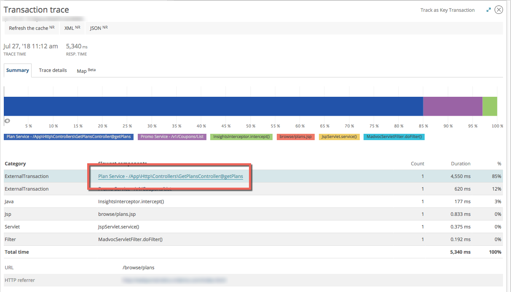
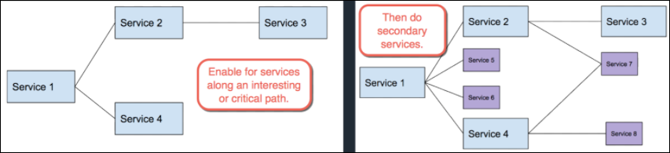

If you are new to New Relic distributed tracing, we recommend you read the following before you enable distributed tracing.

## Impact to APM features [#changes]

Our distributed tracing improves on APM's previous [cross application tracing feature](/docs/apm/transactions/cross-application-traces/introduction-cross-application-traces). Here are some key benefits:

* See more cross-service activity details and more complete end-to-end traces.
* Filter and query traces, as well as make custom charts.
* See the complete trace even when calls cross an organization's account boundaries.
* See [Introduction to distributed tracing](/docs/intro-distributed-tracing) for more features.

[Enabling distributed tracing](/docs/understand-dependencies/distributed-tracing/get-started/introduction-distributed-tracing#enable) may affect some APM features you currently use. These changes affect only applications monitored by agents that have distributed tracing enabled—they don't apply on an account-level.

We may provide backward compatibility with some or all of the affected features in future releases. For now, you should understand the following changes before enabling distributed tracing:

<CollapserGroup>
  <Collapser
    id="external-details"
    title="External services page has less detail"
  >
    When distributed tracing is enabled for an application, external calls do not have internal transaction details at **[one.newrelic.com](https://one.newrelic.com) > APM > (select an app) > Monitor > External services > (select external service)**.

    To find that information, you would instead go to the **Distributed tracing** UI page, find the external call URLs, and see what their child spans are.
  </Collapser>

  <Collapser
    id="txn-trace-changes"
    title="Transaction trace UI displays service URLs, not transaction links"
  >
    When distributed tracing is enabled for an application, the transaction trace UI will no longer have the transaction name and link for the called service (see screenshot below). This will be replaced with the called service's URL.

    

    <figcaption>
      **[one.newrelic.com](https://one.newrelic.com) > APM > (select an app) > Monitor > Transactions > (select a transaction trace)**: This shows the transaction trace UI before distributed tracing is enabled, with a link to the associated transaction. With distributed tracing enabled, it will display the service's URL.
    </figcaption>

    If you wanted to get more detail about trace activity, you would go to the **Distributed tracing** UI page and examine that trace.
  </Collapser>

  <Collapser
    id="cat-disabled"
    title="Cross-application tracing will be disabled"
  >
    Enabling distributed tracing will disable the [cross application tracing](/docs/apm/transactions/cross-application-traces/introduction-cross-application-traces) feature. Distributed tracing is an improved version of cross-application tracing and only one can be enabled at a time.
  </Collapser>

  <Collapser
    id="maps-no-browser-mobile"
    title="Impacts related to mobile monitoring"
  >
   APM-related impacts include:

    * When distributed tracing is enabled for an APM-monitored entity, legacy [service maps](/docs/understand-dependencies/understand-system-dependencies/service-maps/introduction-service-maps) will not show applications monitored by mobile.
    * The [App server drill-down](/docs/mobile-monitoring/mobile-monitoring-ui/network-pages/http-requests-page#details) feature of the legacy mobile HTTP requests UI page is not available.

  </Collapser>
</CollapserGroup>

## Plan your rollout [#rollout]

If you're enabling distributed tracing for a large, distributed system, here are some tips:

* If you are a current APM user, see [Impact to APM features](/docs/apm/distributed-tracing/getting-started/transition-guide-distributed-tracing).
* Determine the requests that are the most important for your business, or the most likely to require analysis and troubleshooting, and [enable distributed tracing](#enable) for those services. Enable tracing for services at roughly the same time so you can more easily gauge how complete your end-to-end traces are.
* When you look at traces in the [distributed tracing UI](/docs/apm/distributed-tracing/ui-data/understand-use-distributed-tracing-data), you'll see spans in the trace for external calls to other services. Then, you can [enable distributed tracing](#enable) for any of those services you want. If a service is fairly standalone and not often used in context with other services, you may not want to enable distributed tracing for it.

  Here's a visual representation of such a phased roll-out:

  
* If you are using APM for a large, monolithic service, there may be many sub-process spans per trace and [APM limits](/docs/understand-use-distributed-tracing-data#rules-limits) may result in fewer traces than expected. You can solve this by using APM agent instrumentation to disable the reporting of unimportant data.
* Distributed tracing works by [propagating header information](/docs/understand-dependencies/distributed-tracing/get-started/how-new-relic-distributed-tracing-works#headers) from service to service in a request path. Some services may communicate through a proxy or other intermediary service that does not automatically propagate the header. In that case, you will need to configure that proxy so that it allows the `newrelic` header value to be propagated from source to destination.

## Enable distributed tracing [#enable]

If you are aware of the impact to APM features and have thought about your rollout, you are ready to set up distributed tracing. See the [setup options](/docs/distributed-tracing/concepts/quick-start).
