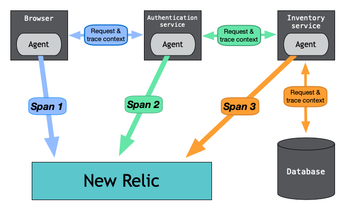

Distributed tracing tracks and observes service requests as they flow through distributed systems. Requests might pass through various services to reach completion, and these services could be in a variety of places: containers, serverless environments, virtual machines, different cloud providers, or on-premises. 

Distributed tracing provides a way for you to view the performance of the entire request across the different services so you can quickly pinpoint failures or performance issues.

Distributed tracing collects data as requests travel from one service to another, recording each segment of the journey as a span. These spans contain important details about each segment of the request and are eventually combined into one trace. The completed trace gives you a picture of the entire request.

<figcaption>
    Here is an example a web transaction where agents measure the time spent in each service. Agents then send that timing information to New Relic as spans where they are combined into one distributed trace.
</figcaption>

## Want to get started right away? [#start-now]

If you are familiar with distributed tracing and want to jump into the setup options, check out the [setup options](/docs/distributed-tracing/enable-configure/quick-start).

## Want to learn more before getting started? [#learn-more]

  If you prefer to dig into the details of distributed tracing before setting it up, check out these topics:

    * [How does distributed tracing work, and what types of distributed tracing are available?](/docs/distributed-tracing/concepts/how-new-relic-distributed-tracing-works/)
    * [How should I plan my rollout of distributed tracing?](/docs/distributed-tracing/concepts/distributed-tracing-planning-guide/)
    * [What is this advanced feature called Infinite Tracing?](/docs/understand-dependencies/distributed-tracing/infinite-tracing/introduction-infinite-tracing/)
