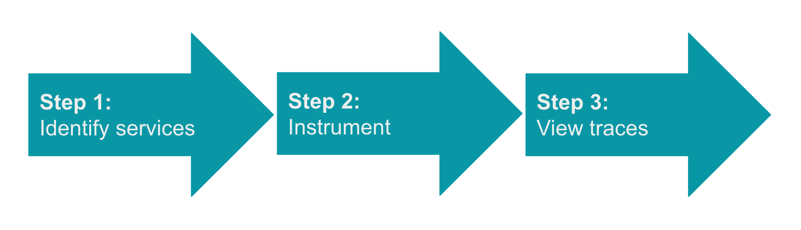

import clogo from './images/clogo.png'

import gologo from './images/gologo.png'

import javalogo from './images/javalogo.png'

import dotnetlogo from './images/dotnetlogo.png'

import nodejslogo from './images/nodejslogo.png'

import pythonlogo from './images/pythonlogo.png'

import phplogo from './images/phplogo.png'

import rubylogo from './images/rubylogo.png'

import browserlogo from './images/browserlogo.png'

import mobilelogo from './images/mobilelogo.png'

import awslambdalogo from './images/awslambdalogo.png'

import kamonlogo from './images/kamonlogo.png'

import opentelemetrylogo from './images/opentelemetrylogo.png'

import awsxraylogo from './images/awsxraylogo.png'

import zipkinlogo from './images/zipkinlogo.png'

import newreliclogo from './images/newreliclogo.png'

To set up distributed tracing, you'll complete these three general steps: 

 

1. **Identify services:** Identify and write down the endpoints, services, languages, and systems that are used to complete this request (you'll need this information in the next step). If you have an environment diagram like the following, you could use it to create a list of services handling requests:

 

2. **Instrument services:** Instrument each service you identify so it can send your trace data. Some tools, such as APM agents, instrument services automatically, while other tools require you to insert some code in the services. Click the icon below for instrumentation steps:

    <TechTileGrid>
      <TechTile
        name="APM: C"
        to="/docs/distributed-tracing/enable-configure/language-agents-enable-distributed-tracing"
        icon={}
      />
      <TechTile
        name="APM: Golang"
        to="/docs/distributed-tracing/enable-configure/language-agents-enable-distributed-tracing"
        icon={}
      />
      <TechTile
        name="APM: Java"
        to="/docs/apm/agents/java-agent/features/distributed-tracing-java-agent"
        icon={}
      />
      <TechTile
        name="APM: .NET"
        to="/docs/distributed-tracing/enable-configure/language-agents-enable-distributed-tracing"
        icon={}
      /> 
      <TechTile
        name="APM: Node.js"
        to="/docs/distributed-tracing/enable-configure/language-agents-enable-distributed-tracing"
        icon={}
      />
      <TechTile
        name="APM: PHP"
        to="/docs/distributed-tracing/enable-configure/language-agents-enable-distributed-tracing"
        icon={}
      />
      <TechTile
        name="APM: Python"
        to="/docs/distributed-tracing/enable-configure/language-agents-enable-distributed-tracing"
        icon={}
      />
      <TechTile
        name="APM: Ruby"
        to="/docs/distributed-tracing/enable-configure/language-agents-enable-distributed-tracing"
        icon={}
      />
      <TechTile
        name="Browser monitoring"
        to="/docs/browser/new-relic-browser/browser-pro-features/browser-data-distributed-tracing"
        icon={}
      />
      <TechTile
        name="Mobile monitoring"
        to="/docs/mobile-monitoring/new-relic-mobile-android/get-started/new-relic-mobile-and-dt/"
        icon={}
      />
      <TechTile
        name="AWS Lambda Functions"
        to="/docs/serverless-function-monitoring/aws-lambda-monitoring/enable-lambda-monitoring/"
        icon={}
      />
      <TechTile
        name="Kamon"
        to="/docs/integrations/open-source-telemetry-integrations/kamon/kamon-reporter"
        icon={}
      />
      <TechTile
        name="OpenTelemetry"
        to="/docs/integrations/open-source-telemetry-integrations/opentelemetry/opentelemetry-quick-start"
        icon={}
      />
      <TechTile
        name="X-Ray"
        to="/docs/integrations/amazon-integrations/aws-integrations-list/aws-x-ray-monitoring-integration"
        icon={}
      />
      <TechTile
        name="Zipkin format: custom integration"
        to="/docs/understand-dependencies/distributed-tracing/trace-api/report-zipkin-format-traces-trace-api"
        icon={}
      />
      <TechTile
        name="New Relic format: custom integration"
        to="/docs/understand-dependencies/distributed-tracing/trace-api/report-new-relic-format-traces-trace-api"
        icon={}
      />
    </TechTileGrid>

3. **View traces:** After you instrument the services, generate some traffic in your application, and then go to the [New Relic UI](https://one.newrelic.com/launcher/distributed-tracing.launcher) to see your trace data.