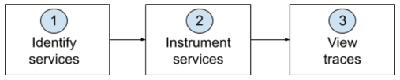

import clogo from './images/clogo.png'

import gologo from './images/gologo.png'

import javalogo from './images/javalogo.png'

import dotnetlogo from './images/dotnetlogo.png'

import nodejslogo from './images/nodejslogo.png'

import pythonlogo from './images/pythonlogo.png'

import phplogo from './images/phplogo.png'

import rubylogo from './images/rubylogo.png'

import browserlogo from './images/browserlogo.png'

import mobilelogo from './images/mobilelogo.png'

import awslambdalogo from './images/awslambdalogo.png'

import istiologo from './images/istiologo.png'

import kamonlogo from './images/kamonlogo.png'

import opentelemetrylogo from './images/opentelemetrylogo.png'

import awsxraylogo from './images/awsxraylogo.png'

import zipkinlogo from './images/zipkinlogo.png'

import newreliclogo from './images/newreliclogo.png'

To set up distributed tracing, you'll complete these three general steps: 

   

1. **Identify services:** Identify the endpoints, services, languages, and systems that are used to complete this request. Here's an example of how you might identify services in a request:
 
2. **Instrument services:** Instrument each service you identify so it can send your trace data. Some tools, such as New Relic APM agents, instrument services automatically, while other tools require you to insert some code in the services. Click the icon below for instrumentation steps:

    <TechTileGrid>
      <TechTile
        name="New Relic APM: C"
        to="/docs/distributed-tracing/enable-configure/language-agents-enable-distributed-tracing"
        icon={}
      />
      <TechTile
        name="New Relic APM: Golang"
        to="/docs/distributed-tracing/enable-configure/language-agents-enable-distributed-tracing"
        icon={}
      />
      <TechTile
        name="New Relic APM: Java"
        to="/docs/distributed-tracing/enable-configure/language-agents-enable-distributed-tracing"
        icon={}
      />
      <TechTile
        name="New Relic APM: .NET"
        to="/docs/distributed-tracing/enable-configure/language-agents-enable-distributed-tracing"
        icon={}
      /> 
      <TechTile
        name="New Relic APM: Node.js"
        to="/docs/distributed-tracing/enable-configure/language-agents-enable-distributed-tracing"
        icon={}
      />
      <TechTile
        name="New Relic APM: Python"
        to="/docs/distributed-tracing/enable-configure/language-agents-enable-distributed-tracing"
        icon={}
      />
      <TechTile
        name="New Relic APM: PHP"
        to="/docs/distributed-tracing/enable-configure/language-agents-enable-distributed-tracing"
        icon={}
      />
      <TechTile
        name="New Relic APM: Ruby"
        to="/docs/distributed-tracing/enable-configure/language-agents-enable-distributed-tracing"
        icon={}
      />
      <TechTile
        name="New Relic Browser"
        to="/docs/browser/new-relic-browser/browser-pro-features/browser-data-distributed-tracing"
        icon={}
      />
      <TechTile
        name="New Relic Mobile"
        to="/docs/mobile-monitoring/new-relic-mobile-android/get-started/new-relic-mobile-and-dt/"
        icon={}
      />
      <TechTile
        name="AWS Lambda Functions"
        to="/docs/serverless-function-monitoring/aws-lambda-monitoring/get-started/enable-new-relic-monitoring-aws-lambda"
        icon={}
      />
      <TechTile
        name="Istio"
        to="/docs/integrations/open-source-telemetry-integrations/istio/istio-adapter"
        icon={}
      />
      <TechTile
        name="Kamon"
        to="/docs/integrations/open-source-telemetry-integrations/kamon/kamon-reporter"
        icon={}
      />
      <TechTile
        name="OpenTelemetry"
        to="/docs/integrations/open-source-telemetry-integrations/opentelemetry/opentelemetry-quick-start"
        icon={}
      />
      <TechTile
        name="X-Ray"
        to="https://one.newrelic.com/launcher/nr1-core.settings?pane=eyJuZXJkbGV0SWQiOiJzZXR1cC1uZXJkbGV0LnNldHVwLW9zIiwiZGF0YVNvdXJjZSI6IkFNQVpPTl9MSU5VWCJ9"
        icon={}
      />
      <TechTile
        name="Zipkin format: use your own integration"
        to="/docs/understand-dependencies/distributed-tracing/trace-api/report-zipkin-format-traces-trace-api"
        icon={}
      />
      <TechTile
        name="New Relic format: use your own integration"
        to="/docs/understand-dependencies/distributed-tracing/trace-api/report-new-relic-format-traces-trace-api"
        icon={}
      />
    </TechTileGrid>

3. **View traces:** After you instrument the services, generate some traffic in your application, and then go to the [New Relic UI](https://one.newrelic.com/launcher/distributed-tracing.launcher) to see your trace data.