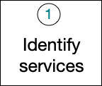
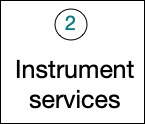
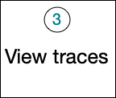

  

Here's an overview of what you'll be doing to set up distributed tracing. 

<Callout variant="tip">
If you are already confident about the planning, you can jump right into instrumentation.
</Callout>

## 1: Plan your monitoring strategy: Identify the important requests. [#step-one]

As you get started, you need to decide which services you want to keep track of in your traces: the more services you include, the better picture you'll get. 

* What things are needed to complete your request?
* Identify the endpoints, services, and systems that are included to complete this request.
* Identify the languages so we can identify the New Relic agents (This is pretty APM specific)

## 2: Instrument your service [#step-two]

Instrumentation is the process that allows services to participate in traces. For New Relic agents where automatic instrumentation is available, it's just a matter of setting an agent configuration for each service. For other tools, you may have to insert some code.

* Select the window that you need to monitor your platform - links to each agent type.
* Call out how to enable DT prior to sending them to each agent's page.
* Group otel - link to the type they want to select.
* Once the agents are deployed, let’s validate the data.

## 3: View your traces in our UI [#step-three]

Navigate to the distributed tracing view and validate that data is being collected.
If you are not seeing traces after x minutes, look here for additional troubleshooting options.
