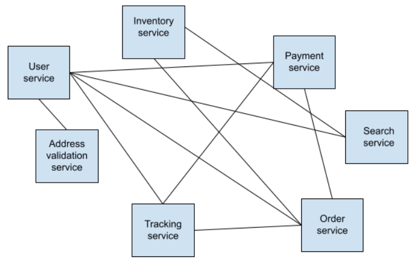

<LandingPageHero>
  <HeroContent>
    Distributed traces are essential for software teams who are moving to the cloud and adopting a distributed architecture. That’s because distributed tracing is the best way to quickly understand what happens to requests as they travel through various services.

    As part of an end-to-end observability strategy, distributed tracing addresses the challenges of modern application environments. By deeply understanding the performance of every service—both upstream and downstream—your software teams can:

      * Identify and resolve issues to minimize the impact on the customer experience and business outcomes
      * Measure overall system health and understand the effect of changes on the customer experience
      * Prioritize high-value areas for improvement to optimize digital customer experiences
  </HeroContent>

  

  <figcaption>
    Distributed tracing helps you track requests across services in a variety of environments. 
  </figcaption>
</LandingPageHero>

<LandingPageTileGrid>
  <LandingPageTile
    title="Quick start"
    icon="fe-check-square"
  >

If you want to go directly to the setup options, check out the [quick-start overview](/docs/distributed-tracing/enable-configure/quick-start).

  </LandingPageTile>

  <LandingPageTile
    title="Learn more"
    icon="fe-list"
  >

  If you prefer to dig into the details of distributed tracing before setting it up, check out these topics:

    * [What can I do with distributed tracing?](/docs/distributed-tracing/concepts/introduction-distributed-tracing/)
    * [What is trace sampling, and what options are available?](/docs/distributed-tracing/concepts/how-new-relic-distributed-tracing-works/)
    * [How should I plan my rollout of distributed tracing?](/docs/distributed-tracing/concepts/distributed-tracing-planning-guide/)
    * [What is this advanced feature called Infinite Tracing?](/docs/understand-dependencies/distributed-tracing/infinite-tracing/introduction-infinite-tracing/)
  </LandingPageTile>
 </LandingPageTileGrid>

<ButtonLink
  role="button"
  to="/docs/distributed-tracing/table-of-contents"
  variant="normal"
>
  View main distributed tracing docs
</ButtonLink>