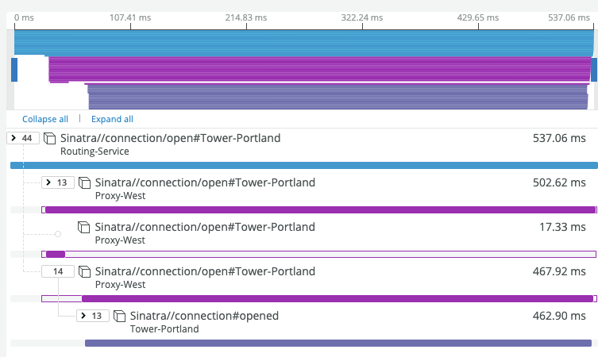

<LandingPageHero>
  <HeroContent>
    Distributed tracing is a tool that shows your software requests as they travel across different services and systems. Distributed tracing not only shows the calls inside a service–which you see in APM application tracing–it also shows the route requests take as they touch other services.
  </HeroContent>

  

  <figcaption>
    Here's an example of a distributed tracing waterfall showing the path of a request.
  </figcaption>
</LandingPageHero>

<LandingPageTileGrid>
  <LandingPageTile
    title="Quick start"
    icon="fe-life-buoy"
  >
    This is a good place to start if you're just getting acquainted with distributed tracing. We'll show you your options for setting up distributed tracing with New Relic.

    Go to [Quick-start overview](/docs/distributed-tracing/get-started/quick-start).

  </LandingPageTile>

  <LandingPageTile
    title="Overview"
    icon="fe-list"
  >

  If perfer to dig into the details of distributed tracing before setting it up, check out these topics:

    * [What can I do with distributed tracing?](/docs/distributed-tracing/get-started/introduction-distributed-tracing/)
    * [What is trace sampling, and what options are available?](/docs/distributed-tracing/get-started/how-new-relic-distributed-tracing-works/)
    * [How should I plan my rollout of distributed tracing?](/docs/distributed-tracing/get-started/distributed-tracing-planning-guide/)
  </LandingPageTile>
 </LandingPageTileGrid>

<ButtonLink
  role="button"
  to="/docs/distributed-tracing"
  variant="normal"
>
  View main distributed tracing docs
</ButtonLink>