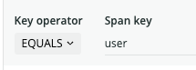
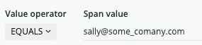

In addition to duration and random filters, trace observers use a span attribute trace filter to find useful traces. You can customize the filter rules to keep or discard traces that have spans with specific attributes.

## Overview

Filter rules are key/value pairs specific to individual trace observers. You use the New Relic Edge app to define and view them.

The span attribute trace filter allows a total of three rules, and by default, two rules are provided to capture errors. While you can remove the two default error rules, we recommend you keep the two default error rules and add an additional rule, if you need one.

## Add a custom rule [#add-custom-rule]

Here's an example of how to add a rule to keep all traces that have spans with attributes containing the user `sally@some_company.com`:

1. Go to [one.newrelic.com](one.newrelic.com) **> Apps > Your apps > New Relic Edge**.
2. For the trace observer you want to modify, click the gear icon to open the filters.
3. Under **Create new rule**, enter `user` below **Span key**, and then in the **Key operator** dropdown, select the value **Equals**:

   
4. Under **Span value**, enter `sally@some_company.com`, and then in the **Value operator** dropdown, select **Equals**.

   
5. In the **Observer action** dropdown, select **Keep**.

   <Callout variant="tip">
     If you have any traces that match this rule, you'll see them listed below the rule.
   </Callout>
6. Click **Add rule** to save your custom rule.

When you add a custom rule, it takes effect immediately for that trace observer.

## Rule Priority

When a trace has spans with attributes that match both **Keep** and **Discard** filter rules, the trace is discarded.

For example, suppose you do not want to save some expected errors that have a certain phrase in the error message. You could create a **Discard** filter rule that targets the error message while still retaining all other traces with an error.
